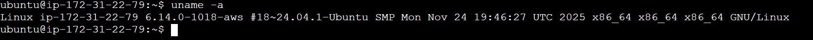
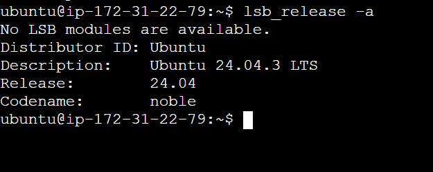
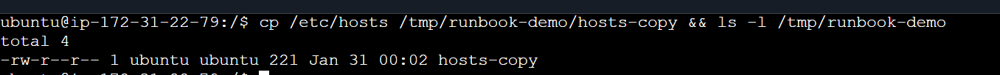
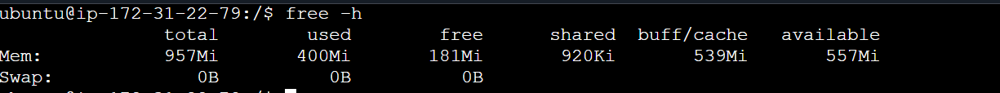
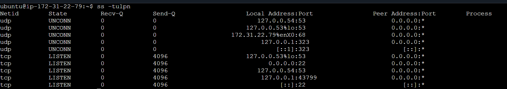
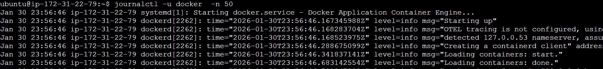

># ENVIRONMENT BASICS:
- #### `uname -a:` Displays detailed system information about your Linux machine in one line.

- #### `lsb_release -a:`Displays detailed information about the Linux distribution installed on your system.

># FILESYSTEM SANITY:
- #### `mkdir /tmp/runbook-demo:` Creates a file runbook-demo in /tmp directory and can be viewed by ls.

- #### `cp /etc/hosts /tmp/runbook-demo/hosts-copy && ls -l /tmp/runbook-demo:` Copies the contents of hosts (which is in /etc) to hosts-copy which is in runbook-demo inside /tmp.

- #### `ls -l:`shows the permissions of runbook-demo.

># CPU/MEMORY:

- #### ` top:` Displays real-time system information including CPU, memory, and running processes.

- #### `free -h:` Shows system memory usage in a human-readable format (RAM and swap).

># DISK/IO:

- #### `df -h:` Shows disk space usage for all mounted filesystems in a human-readable format (GB, MB).

- #### `du -sh /var/log:` Shows the total disk space used by the /var/log directory in a human-readable format.

># NETWORK:
- #### ` ss -tulpn:`Shows all listening sockets (TCP/UDP) on your Linux system with process info and ports.Useful for troubleshooting.

- #### ` curl -I :` http://localhost:5000/ping: {ERROR}

> # LOGS:
- #### ` journalctl -u <service> -n 50:` In performed the tasks on docker.Shows the last 50 log entries for the Docker service from the system journal. Useful for quickly checking recent Docker activity or errors.

- #### `tail -n 50 /var/log/kern.log:` Shows the last 50 lines of the kernel log file (kern.log).Contains messages from the Linux kernel, including hardware events, driver messages, and system errors.

># IF IT WORSENS:
- #### `Restart Policy:`Planning how to safely restart a service or process when it misbehaves, (sudo systemctl restart docker)  

- #### `Increase Log Verbosity:`Make the service write more detailed logs for troubleshooting, (sudo dockerd --log-level debug)

- #### `Collect strace:` strace is a tool to trace system calls a process makes,(sudo strace -p <docker-pid>)
