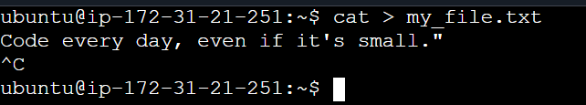
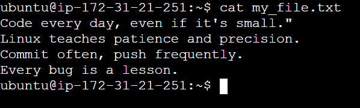
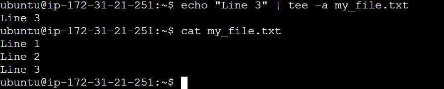
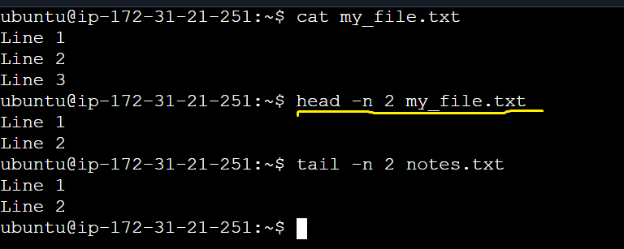
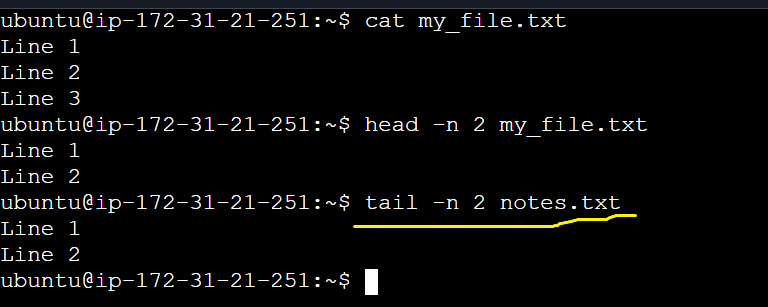

># `Linux Fundamentals: Read and Write Text Files`

- >### `File Creation:` I created a file with touch command, touch my_file.txt

- >### `Writing text to the file:` Added the contents with cat > my_file.txt command.

- >### `Appending the file:` Appended the file with cat >> my_file.txt command.

- >### `File Reading:` Read the file, it will display the whole content with cat my_file.txt command.
> #### `Following two screenshots are about file reading before and after appending more content.`

- > ### `echo "Line 1" > my_file.txt:` Writes the text Line 1 into a file named my_file.txt, creating it if it doesn’t exist or overwrites the existing file content.

- >### `echo "Line 2" >> my_file.txt:`Appends the text Line 2 to the end of my_file.txt without overwriting existing content.

- > ### `echo "Line 3" | tee -a my_file.txt:` Adds Line 3 to the end of my_file.txt and also displays it on the terminal at the same time.

- > ### `head -n 2 my_file.txt:` Displays the first 2 lines of the file content.

- > ### `tail -n 2 my_file.txt:` Displays the last 2 lines of the file content.

