- > ## `Part 1:Linux File System Hierarchy`
- [x] `/` : Root of the linux tree or system,conatins all the directories of the Linux system.Its a top level directory.
 
   `ls -l /:`Contains bin etc home usr var and others.

-  I would use it when: I need to navigate the overall filesystem structure.
 - [x] `home` : Home directories of regular users are in this directory since each user has their own folder
 
   `ls -l /:`Contains users like ubuntu or any other that I created.
  
 - I would use it when:I need to perform user specific tasks.

 - [x] `root` : Home directory of the root   user (superuser).
 
   `ls -l /:`.bashrc .profile
  
 - I would use it when:Storing root user’s configuration files or admin scripts.

 - [x] `etc` : For storing system and application configuration files.
 
   `ls -l /:` passwd,groups,ssh
  
 - I would use it when: Working with conf. file of nginx,ssh etc.

 - [x] `/var/log:` Log files for system and  services.
 
    `ls -l /:` syslog auth.log
  
 - I would use it when:Dealing with troubleshooting and monitoring tasks.

  - [x] `/tmp:` Temporary files created by applications or the system.
 
    `ls -l /:` tmp1234 nano.tmp
  
 - I would use it when:Storing temporary files for scripts or processes.

- [x] `/bin:` Most commonly used binaries needed for all users.
 
    `ls -l /:` ls, cat, cp
  
 - I would use it when: I need to manage the system.
 - [x] `/usr/bin:`Binaries for standard user
   programs.
 
    `ls -l /:` python3, git, curl
  
 - I would use it when:Running user-level programs.
 - [x] `/opt:`Optional or third-party  software packages.
 
    `ls -l /:` google vscode
  
 - I would use it when:Installing software that doesn’t come with the default OS.

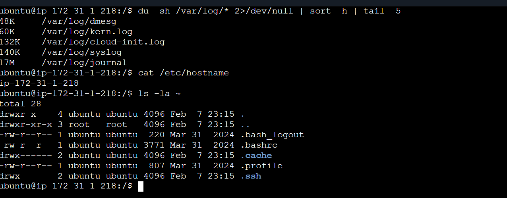

- > ## `Part 2: Scenario-Based Practice `
----------------------------------------
#### I installed two service nginx and docker to perfome the following monitoring tasks.
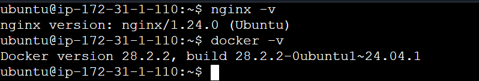

- > ### `Scenario1: `
----------------------------------------
- [x] `Is the service running or failed?`
> `systemctl status nginx`

> `systemctl status docker`

    These two commands will give the current status of the services on the Linux system that whether active or in active,running or stopped.
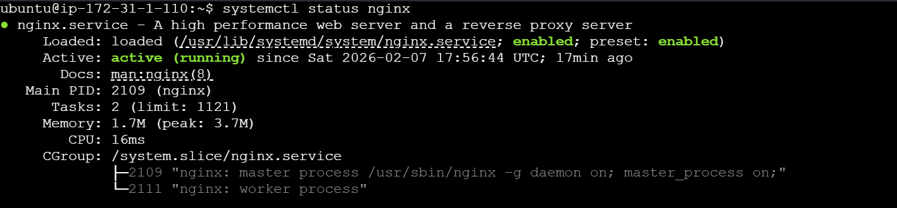

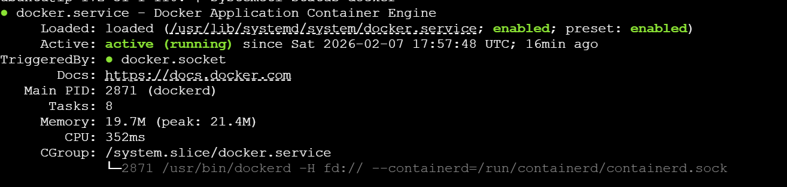

   

- [x] ` What do the logs say?`
- `journalctl logs -u docker -n 50 `
- `journalctl log -u nginx -n 50`

   Used to view and manage logs that are collected by the systemd journal and -n 50 flag provides the last 50 logs.

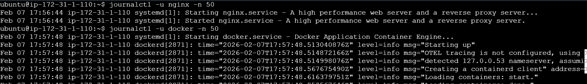

- [x] ` Is it enabled to start on boot?`

- `systemctl is-enabled nginx`
- `systemctl is-enabled docker`
 
 Checks whether the nginx service is configured to start automatically at boot.
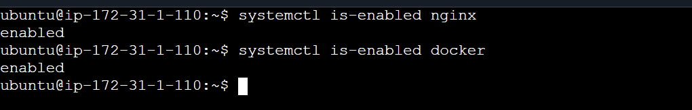

- `sudo dmesg | tail -n 50`
This command shows the last 50 kernel log messages from your system.(Good to practice.)

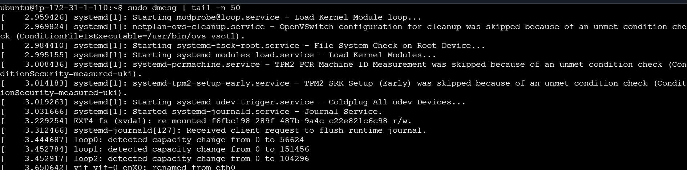

- > ### `Scenario2: `
----------------------------------------
- [x] `Look for processes sorted by   CPU    percentage `
> `htop`
htop is an interactive, real-time process viewer for Linux.It shows running processes with live CPU, memory, and load usage in a colorful, easy-to-navigate interface, and lets you scroll, search, and manage processes (kill, renice, etc.) using the keyboard.

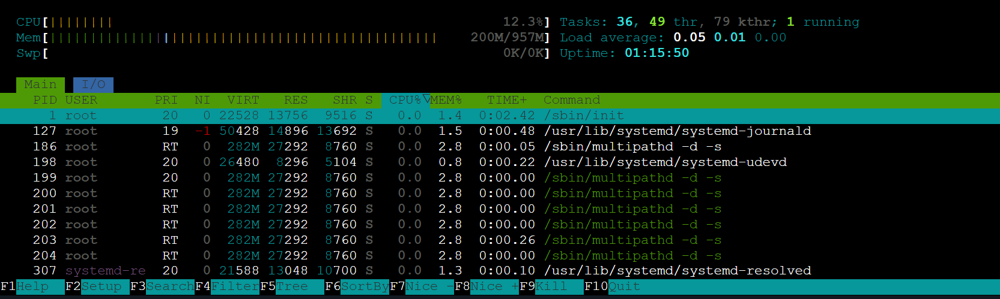

- [x] ` Use a command that shows live CPU      usage`
- `ps aux --sort=-%cpu | head -10`
It displays the top 10 processes using the most CPU right now.Likewise we can also check memory.
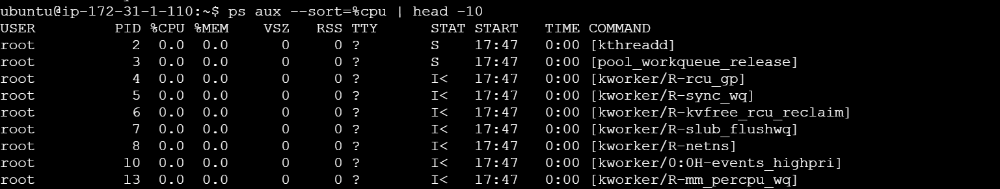

- `uptime` It is a command that shows how long the system has been running since the last reboot, along with the current time, number of users logged in, and system load averages

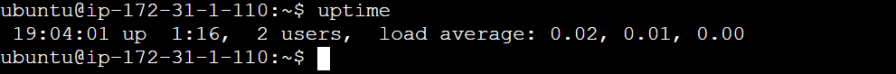

- [x] `Note the PID (Process ID) of the top process` 
- Once we get the PID through ps command, we can do `kill -9 <PID>` (optional) to get rid of unwanted processes.

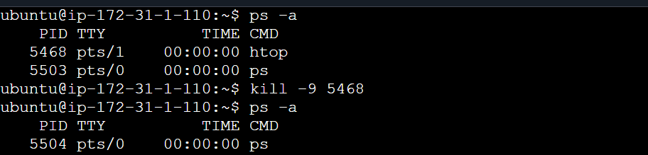

- > ### `Scenario3: `
----------------------------------------
- [x] `Check the status of the service `
> `systemctl service nginx:`First step would be to check the status of the service.
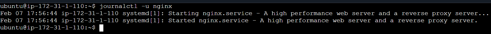

- [x] `Collect the logs of the service `
- `journalctl -u nginx:` It shows the logs for the nginx service from the systemd journal.
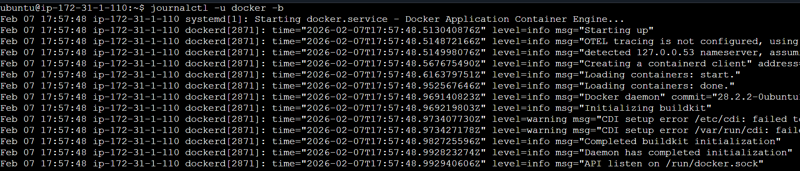

- [x] `Collect the logs at boot time (optional)`
Following are the commands to collect logs of the services as per requirement.
- `journalctl -u nginx`: Collects the logs of the service.

- `journalctl -u nginx -b`: Collects the logs at the boot time.

- `journal -u nginx -f:`This command shows live SSH service logs as they happen.
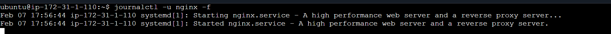

- > ### `Scenario 4: `
----------------------------------------
- [x] Following screenshot shows the flow of alloting +x permissions thorugh chmod.
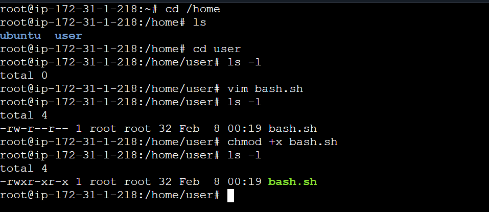

