># `Day-09-Linux User & Group Managaemnt Challenge`

>## Description:
This task is about the user and group creation,their verification in there respective directories (of Linux System).Assignment of users to groups,switching users and then checking permissions of the directories according to each user.

># `Task:1:`
Create three users with home directories and passwords:

tokyo
berlin
professor
Verify: Check /etc/passwd and /home/ directory
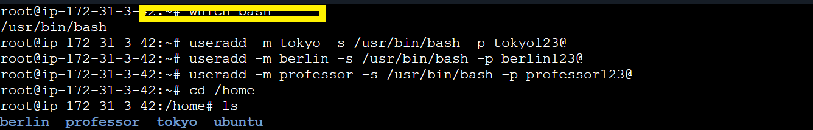

- `which bash:` Check the current shell.
- `useradd -m -s usr/bin/bash -p <shell>:`Adds a new user with same shell as user's login shell Bash and <passowrd> in the home directory.

-  ` -m :`flag helps to add the users in home directory.
- `/etc/passwd:` A system file that stores information about all user accounts on a Linux/Unix system.

># `Task:2:`
Create two groups:

developers
admins
Verify: Check /etc/group

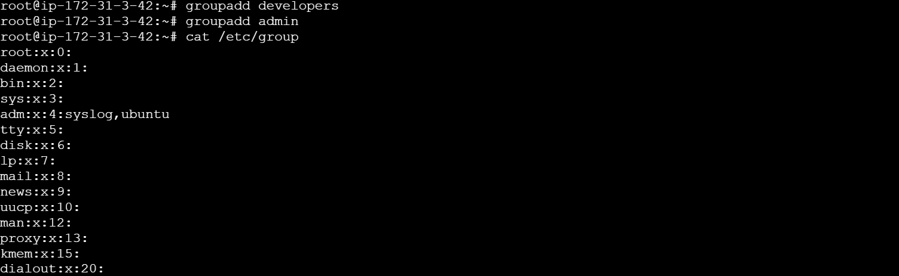

- `groupadd <group_name>:` Adds a new group in the system.
- `/etc/group:` Is a Linux system file that lists all groups on the system and their members

># `Task:3:`
Assign users:

tokyo → developers
berlin → developers + admins (both groups)
professor → admins
Verify: Use appropriate command to check group membership
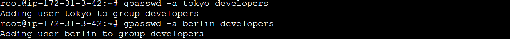
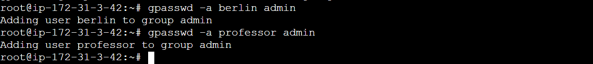

- `gpasswd -a <user> <group>:` Adds the user to group.
- `cat /etc/group:` Displays the complete info of users and their related groups.

># `Task:4:`
Create directory: /opt/dev-project
Set group owner to developers
Set permissions to 775 (rwxrwxr-x)
Test by creating files as tokyo and berlin
Verify: Check permissions and test file creation.

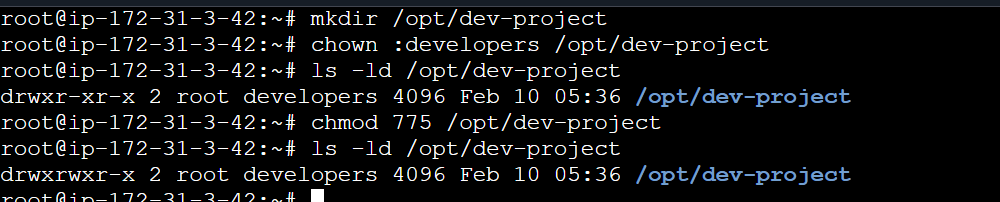
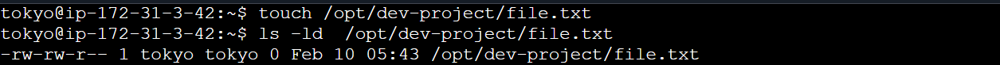
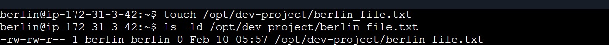

- `chown user:group /path/to/file`:Change owner and/or group of a file or directory

- `ls -ld /path/t/file:`List details of a directory itself (not its contents). 

- `chmod <permissions> path/to/file:`Change file or directory permissions (read, write, execute). 

># `Task:5:`
Create user nairobi with home directory
Create group project-team
Add nairobi and tokyo to project-team
Create /opt/team-workspace directory
Set group to project-team, permissions to 775
Test by creating file as nairobi

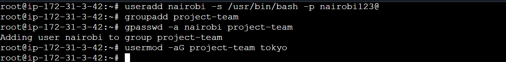

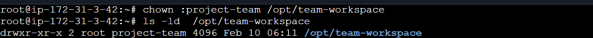
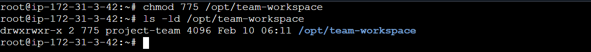
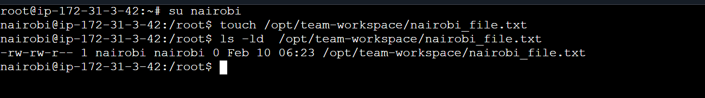

- `usermod -aG <group_name> <user>:` Appends the group of the user,maintaining the previous group if any.

> ## Key Points:
- Difference between ls -la and ls -ld.
- When a user is being switched, what chages happen in groups and permissions.
- Difference between `usermod -a`<user> <group> nad usermod -aG <group> <user>.

