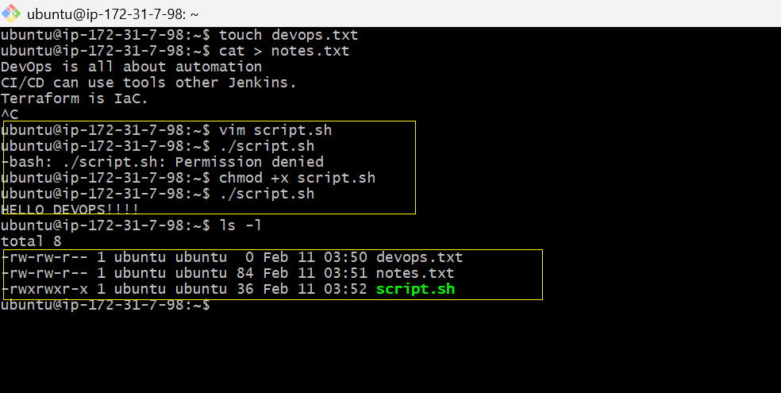
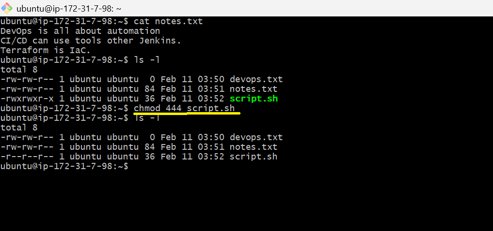
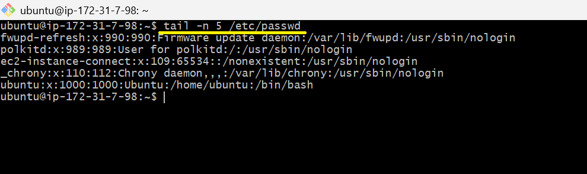
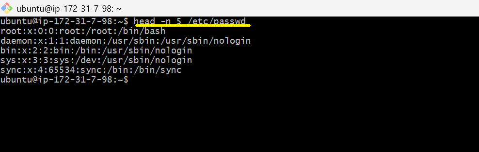
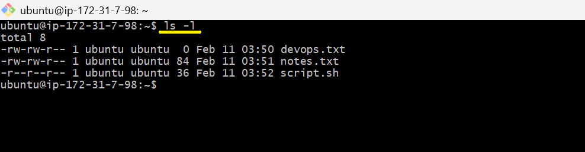
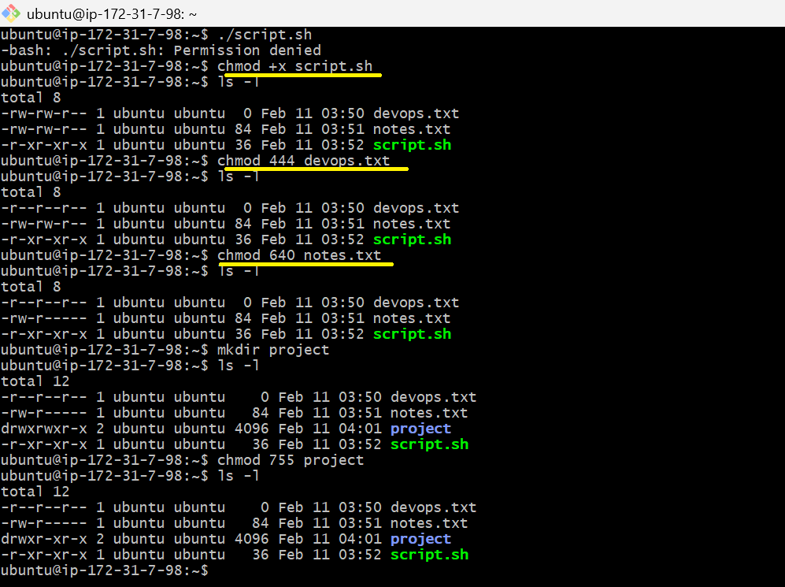
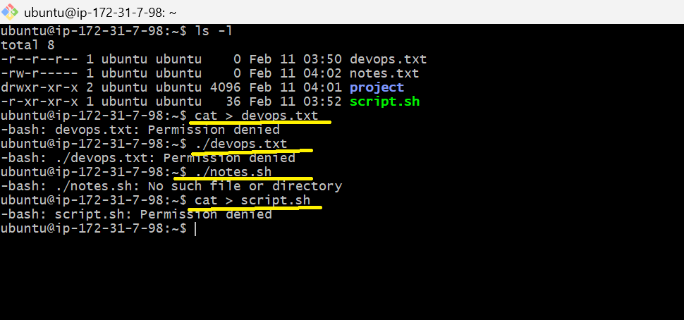

># `Day 10 – File Permissions & File Operations Challenge`

> # `Description:`
- Creating files using cat,vim andtouch commands.
- Reading files  using cat,head and tail commands.
- File permissions and modification using chmod command.
- Analysis through read,write and execute operations on fils.

># `Task_1:`
- Create empty file devops.txt using touch.
- Create notes.txt with some content using cat or echo.
- Create script.sh using vim with content: echo "Hello DevOps".

>## `Comments:` 
- +x permission must be given for bash script to make it executable. 

># `Task_2:`
- Read notes.txt using cat.
- View script.sh in vim read-only mode.
- Display first 5 lines of /etc/passwd using head.
- Display last 5 lines of /etc/passwd using tail.

>## `Comments:`
- Understood the use of tail and head commands.
- Also how permissions are modified as per requirement.

># `Task3:`

r = read (4), w = write (2), x = execute (1)
Check your files: ls -l devops.txt notes.txt script.sh

>## `Comments:`
- Deep understanding about the permisssions,how calculation is done for each.

># `Task_4:`
- Make script.sh executable → run it with ./script.sh.
- Set devops.txt to read-only (remove write for all).
- Set notes.txt to 640 (owner: rw, group: r, others: none).
- Create directory project/ with permissions 755.

>## `Comments:`
- When a directory is created, which permissions do it contain.
- Futher how can permissions be modified.

># `Task_5:`
Try writing to a read-only file - what happens?
Try executing a file without execute permission.
Document the error messages.

>## `Comments:`
- When permissions are restricted, not every operation is performed on the files.This feature is very important to maintain the security of the Linux file system.

