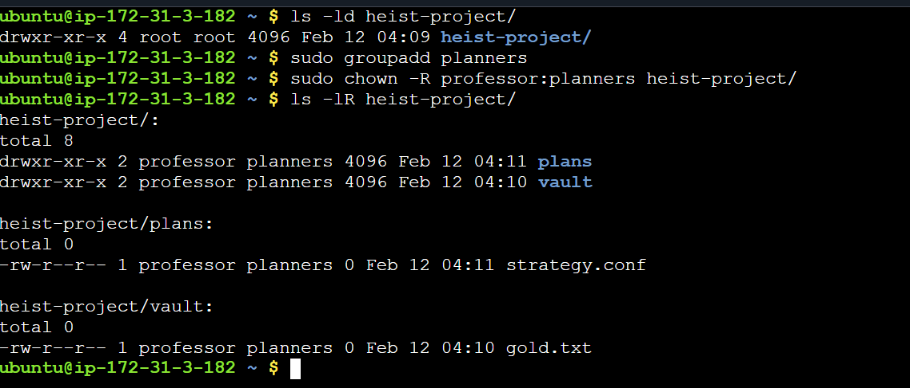
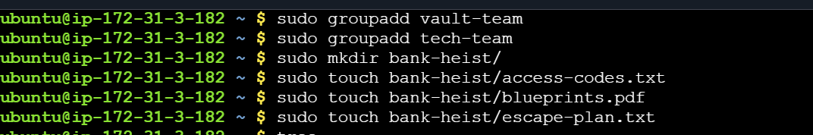
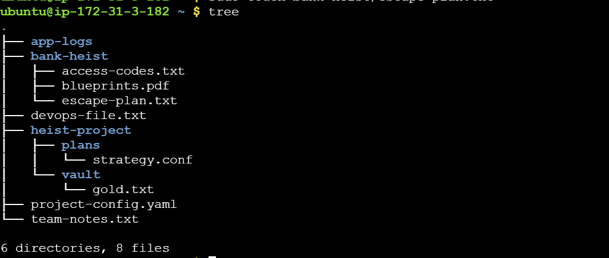

* #  Day 11 – File Ownership Challenge (chown & chgrp)
> ## `USERS:`
-  tokyo
-  berlin
-  nairobi
- professor

>## `GROUPS:`
-
-
-
-
>## `FILES:`
-
-
-
-
>## `DIRECTORIES:`
-
-
-
-

> ## `Task 1: Understanding Ownership` 
- [x] Run ls -l in your home directory.
- [x] Identify the owner and group columns.
- [x] Check who owns your files.

> ## `Comments:` 
>The file owner is the user who controls a file’s primary permissions, while the file group is a collection of users who share a secondary set of permissions on that file.

> ## `Task 2: Basic chown Operations` 
- [x] Create file devops-file.txt.
- [x] Check current owner: ls -l devops-file.txt.
- [x] Change owner to tokyo (create user if needed).
- [x] Change owner to berlin.
- [x] Verify the changes.

> ## `Task 3: Basic chgrp Operations` 
- [x] Create file team-notes.txt.
- [x] Check current group: ls -l team-notes.txt.
- [x] Create group: sudo groupadd heist-team.
- [x] Change file group to heist-team.
- [x] Verify the change.

> ## `Task 4: Combined Owner & Group Change` 
- [x] Using chown you can change both owner and group together.
- [x] Create file project-config.yaml.
- [x] Change owner to professor AND group to heist-team (one command).
- [x] Create directory app-logs/.
- [x] Change its owner to berlin and group to heist-team.

> ## `Task 5: Recursive Ownership` 
- [x] Create directory structure.
- [x] Create group planners.

- [x] Change ownership of entire heist-project/ directory.     
- [x] Use recursive flag (-R).
- [x] Verify all files and subdirectories changed: ls -lR heist-project/.

> ## `Task 6: Practice Challenge` 
- [x] Create users: tokyo, berlin, nairobi (if not already created).

- [x] Create groups: vault-team, tech-team.

- [x] Create directory: bank-heist/.

- [x] Create 3 files inside:
   - [ ] access-codes.txt
   - [ ] blueprints.pdf
   - [ ] escape-plan.txt
- [x] Set different ownership:

    - [ ] access-codes.txt → owner: tokyo, group: vault-team
    - [ ] blueprints.pdf → owner: berlin, group: tech-team
    - [ ] escape-plan.txt → owner: nairobi, group: vault-team
    
    
    