>## **Day 13 – Linux Volume Management (LVM)**
-------

##**STEP1:** 
- EC2-In stance creation.
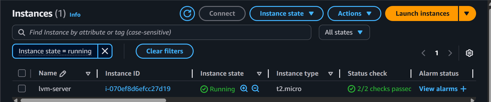

##**STEP2:**
- `lsblk` lists up all the root voulmes.
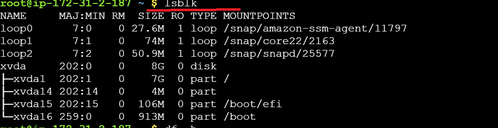

##**STEP3:**
- `df -h`Shows disk space usage of all mounted file systems at root level in a human-readable format.
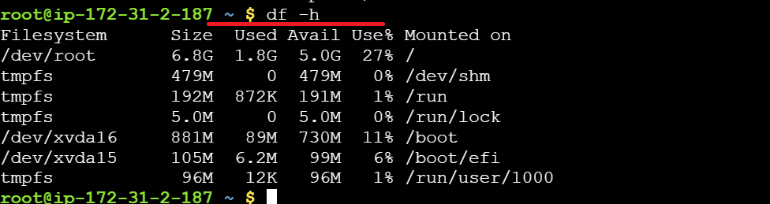

##**STEP4:**
- Using `EBS` three storage blocks have been created `/dev/xvdf` , `/dev/xvdg` , `/dev/xvdg` of 10G,12G and 5G respectiely.
- These storage blocks are then attached to the instance.

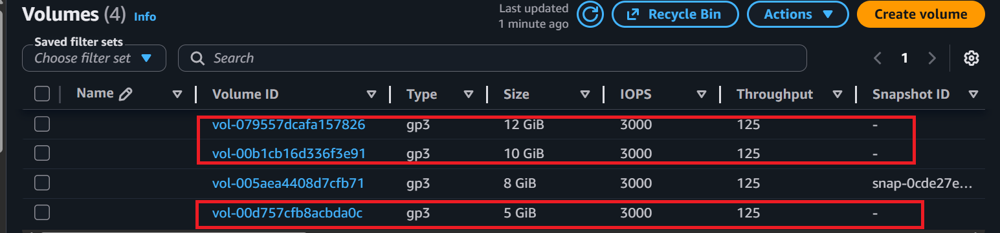

##**STEP5:**
- `lsblk ` lists up the newly created blocks ,showing that the blocks have been attached to the instance.

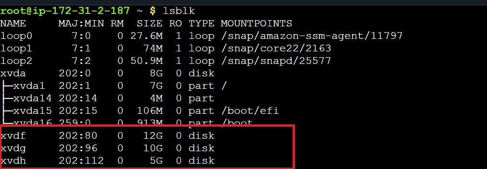

##**STEP6:**
- Now physical Volumes (PV) would be created, `pvs` shows there are no physical volumes already created.
- Therefore `pvcreate` helps to create PVs of these storage blocks.

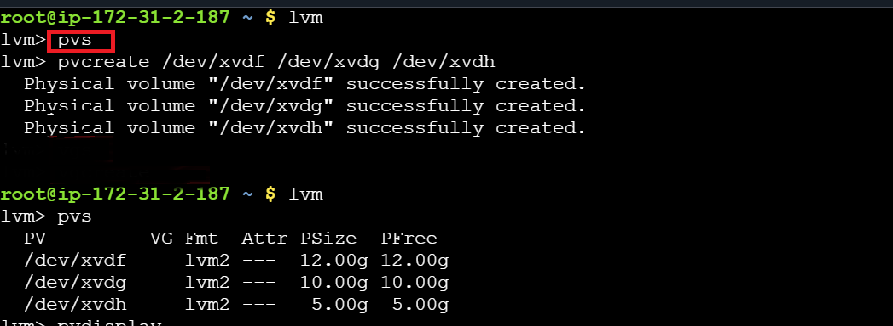

##**STEP7:**
- `pvdisplay` displays all te details of each PV created.
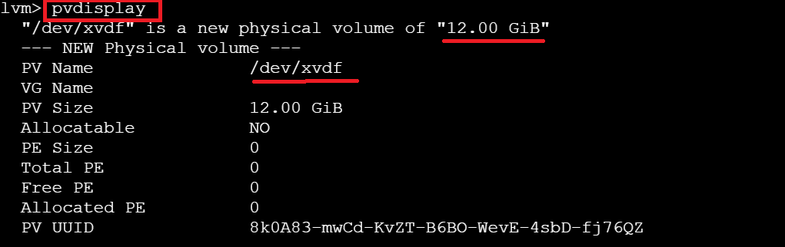

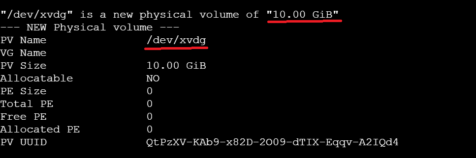

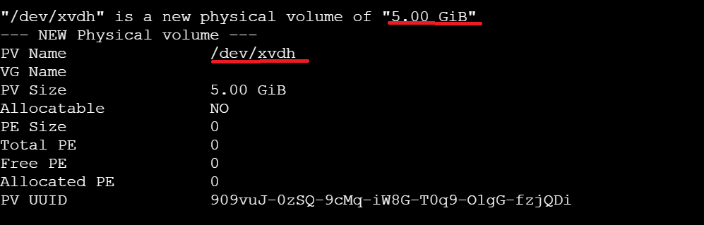

##**STEP8:**
- A Volume Group would be now created using any of these PVs (as per requirement).
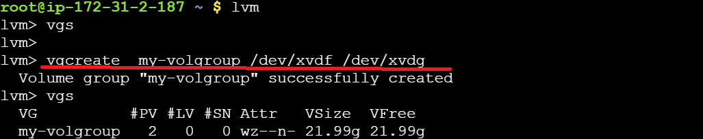

- `vgdisplay` ellaborates the details of the Vol Group created.

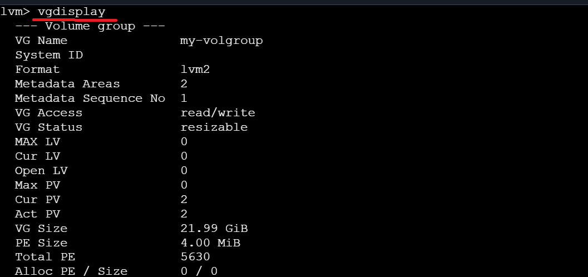

##**STEP9**
- From Vol. Group, Logical Volumes are created of required sizes.

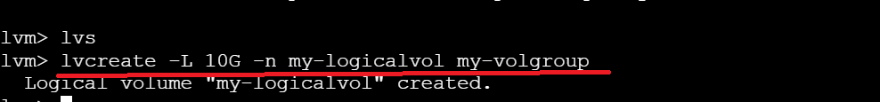

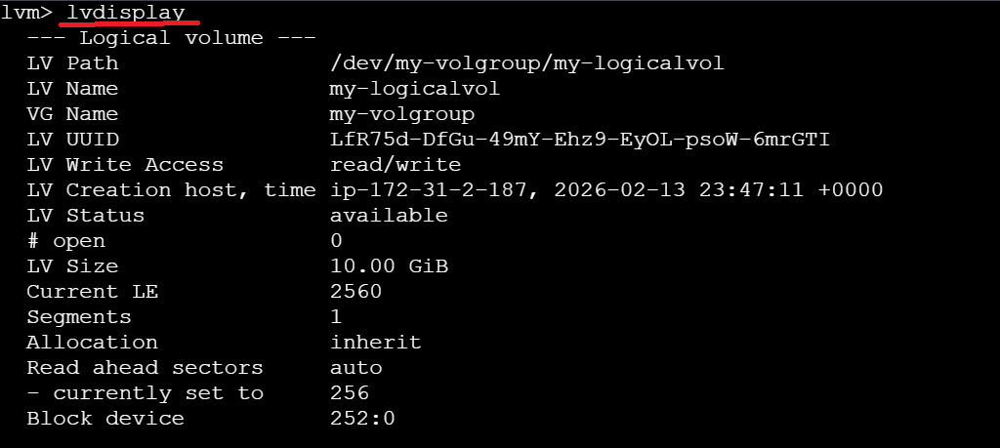

##**STEP10:**
- `lsblk` shows the slicing up of 10G from the Volume Group.

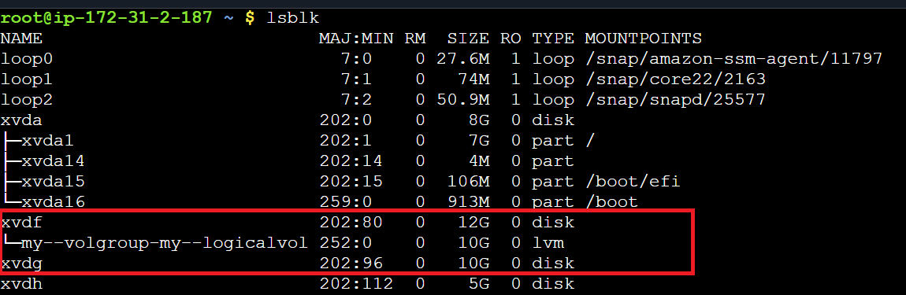

##**STEP11:**
- `lvs` is showing up the Logical Vol. cretaed from the Vol. Group of 10 G.
 
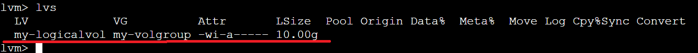

##**STEP12:**
- The most imp step is to mount up the Logical Vol. to the instance.That includes  
- [ ] Creation of mount folder 
- [ ] Formatting of the whole path.

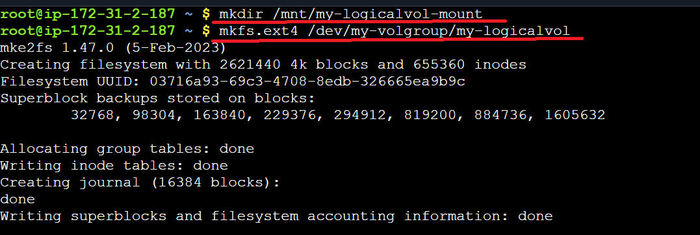

##**STEP13:**
- After the completion of the above steps, using `mount` command, the source would be mounted up to the destination.
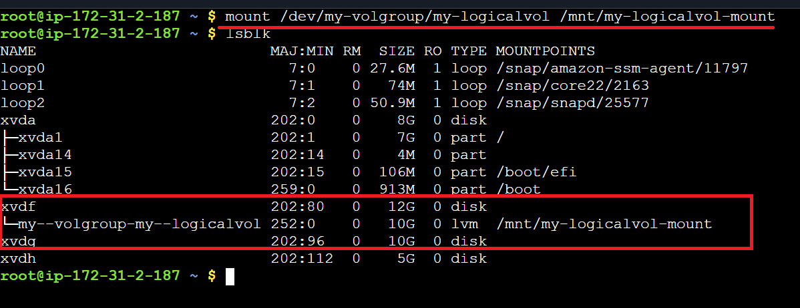

##**STEP14:**
- `df -h` shows out Logical Vol. has been mounted up succssfully.
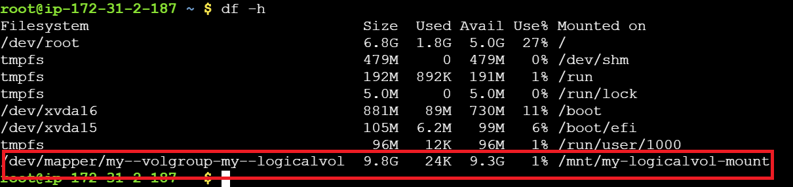

##**STEP13:**
- The screenshot ellaborates that once the mounting part is done , directories and files can be created inside that volume according to the requirement.
- These files/directories can be accessed from the root as well.
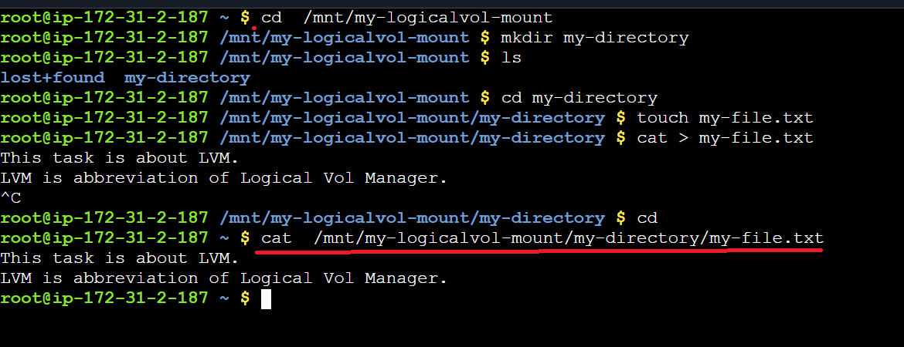

>## **How To Extend the Volume**
## **Step1:**

- `lvextend` command helps to extend the current Logical Volume.
- Here the volume has been extended upto 3G two times so total increment would be 6G.

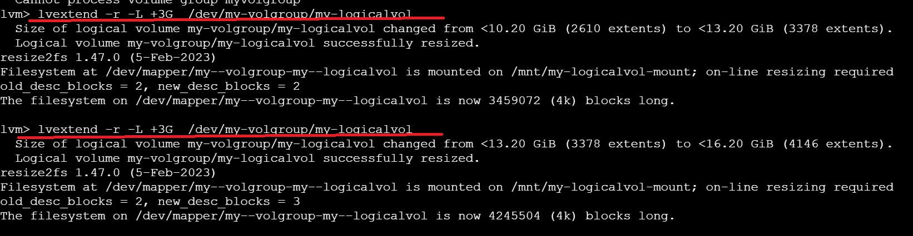

## **Step2:**

-`resize2fs` It is typically used after extending or reducing an LVM logical volume to make the filesystem use the updated space.

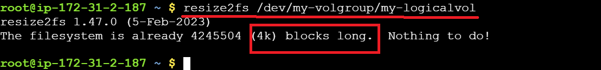

## **Step3:**

- `df-h ` is showing the total size of 16G.

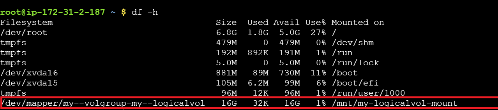

## **Step4:**

- Since we created the Volume Group of 10G+12G= 22G total,after extending the volume, the Logical Volume is taking up more from the other PV, which is also the part of Volume Group.  
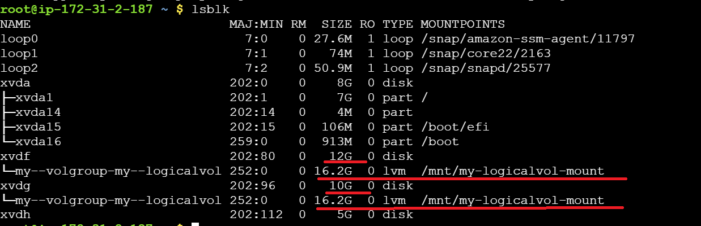
