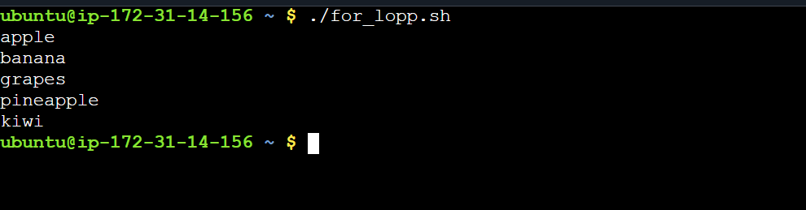
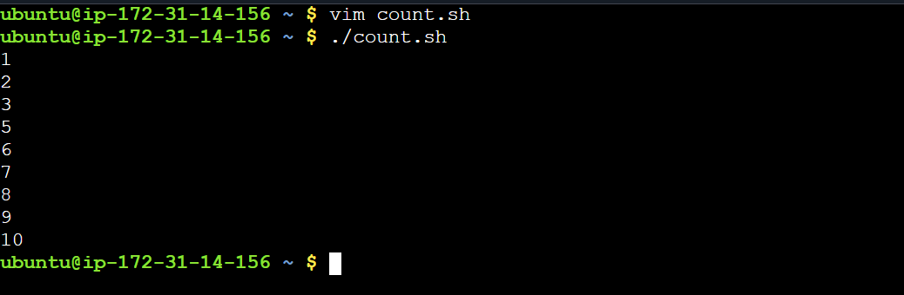
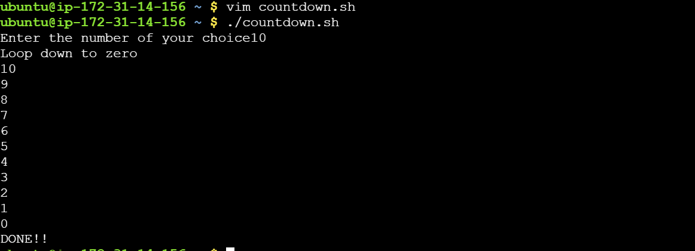
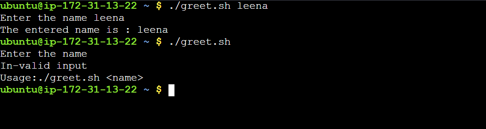
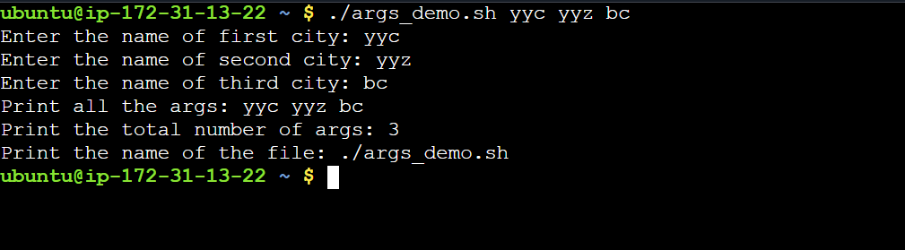
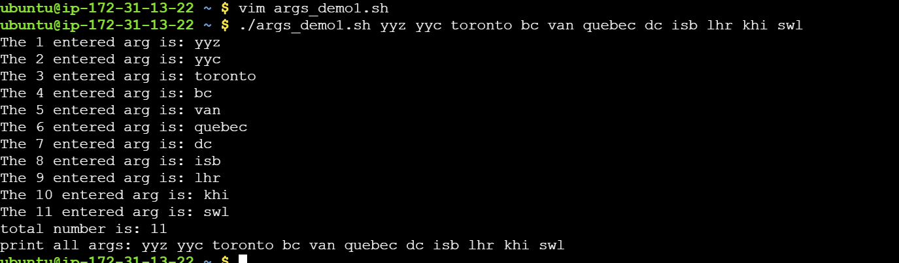
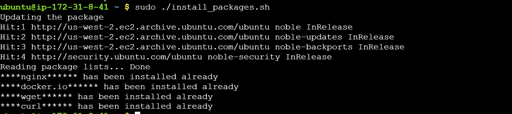
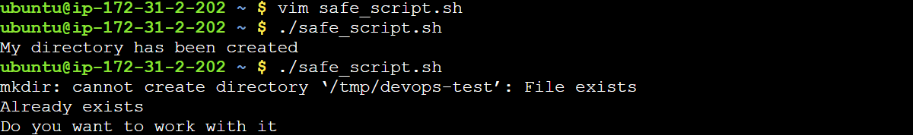

> ### Day 17 – Shell Scripting: Loops, Arguments & Error Handling
----
>#### Task 1: For Loop
---
- [x] Create for_loop.sh that:
- [x] Loops through a list of 5 fruits and prints each one
- [x] Create count.sh that:
- [x] Prints numbers 1 to 10 using a for loop

>> **[ Script](scripts/for_loop.sh)**

>> **[ Script](scripts/count.sh)**

>#### Task 2:  While Loop
----

- [x] Create countdown.sh that:

  - [ ] Takes a number from the user
  - [ ] Counts down to 0 using a while loop
  - [ ] Prints "Done!" at the end

>> **[ Script](scripts/countdown.sh)**

>#### Task 3: Command-Line Arguments
----

- [x] Create greet.sh that:

  - [ ] Accepts a name as $1
  - [ ] Prints Hello, <name>!
  - [ ] If no argument is passed, prints "Usage: ./greet.sh "

>> **[ Script](scripts/greet.sh)**

- [x] Create args_demo.sh that:

   - [ ] Prints total number of arguments ($#)
   - [ ] Prints all arguments ($@)
   - [ ] Prints the script name ($0)

>> **[ Script](scripts/arg_demo1.sh)**
>>> **[ Script](scripts/arg_demo.sh)**

>#### Task 4: Install Packages via Script
----
- [x] Create install_packages.sh that:
    - [ ] Defines a list of packages: nginx, curl, wget
    - [ ] Loops through the list
    - [ ] Checks if each package is installed (use dpkg -s or rpm -q)
    - [ ] Installs it if missing, skips if already present
    - [ ] Prints status for each package
- Run as root: sudo -i or sudo su

>>  **[ Script](scripts/install_packages.sh)**

>#### Task 5: 

- [x] Create safe_script.sh that:
   - [ ] Uses set -e at the top (exit on error)
   - [ ] Tries to create a directory /tmp/devops-test
   - [ ] Tries to navigate into it
   - [ ] Creates a file inside
   - [ ] Uses || operator to print an error if any step fails
>Example:
>mkdir /tmp/devops-test || echo "Directory already exists"
- [x] Modify your install_packages.sh to check if the script is being run as root — exit with a message if not.

> **[ Script](scripts/safe_script.sh)**

