##Day 18 – Shell Scripting: Functions & intermediate Concepts
----
### Task:1 Basic Functions
- Create functions.sh with:
   - [ ]  A function greet that takes a name as argument and prints Hello, <name>!
   - [ ] A function add that takes two numbers and prints their sum
   - [ ] Call both functions from the script

>>**[ Script](Scripts/function.sh)**

>>**[ Script](Scripts/function_call.sh)**

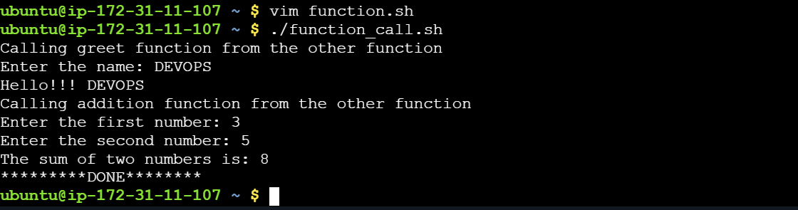

### Task:2 Functions with Return Values
- Create disk_check.sh with:
   - [ ] A function check_disk that checks disk usage of / using df -h
   - [ ] A function check_memory that checks free memory using free -h
   - [ ] A main section that calls both and prints the results

>>**[ Script](Scripts/disk_check.sh)**

>>**[ Script](Scripts/system_check.sh)**

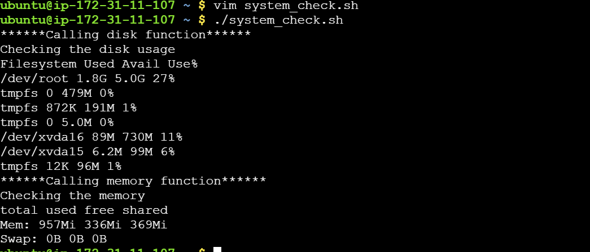

### Task 3: Strict Mode — set -euo pipefail
- Create strict_demo.sh with set -euo pipefail at the top
- Try using an undefined variable — what happens with set -u?
- Try a command that fails — what happens with set -e?
- Try a piped command where one part fails — what happens with set -o pipefail?

>>**[ Script](Scripts/set_e.sh)**

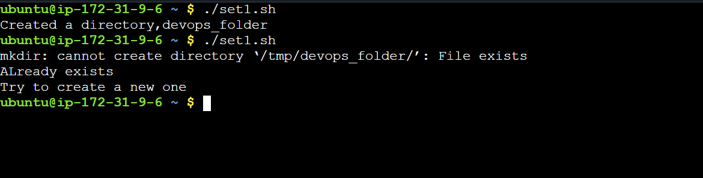

>>**[ Script](Scripts/set_o.sh)**

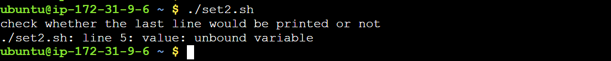

>>**[ Script](Scripts/set_u.sh)**

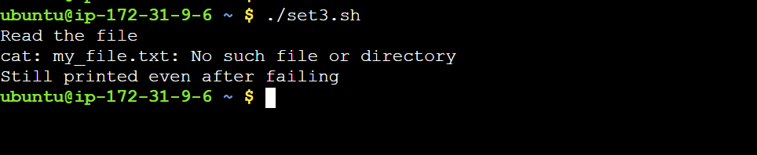

>>**[ Script](Scripts/set_e+o.sh)**

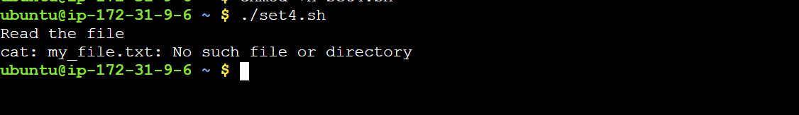

>>**[ Script](Scripts/pipefail.sh)**

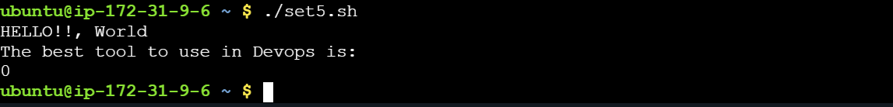

>>**[ Script](Scripts/pipefail2.sh)**

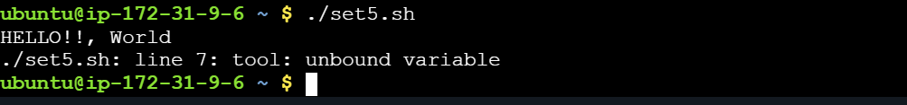

### Task 4: Local Variables
- Create local_demo.sh with:
  - [ ] A function that uses local keyword for variables
  - [ ] Show that local variables don't leak outside the function
  - [ ] Compare with a function that uses regular variables

>>**[ Script](Scripts/local_demo.sh)**

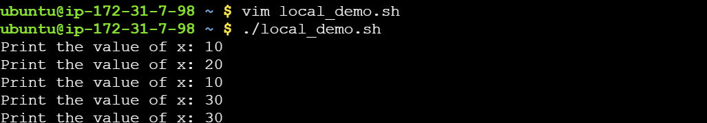

### Task 5: Build a Script — System Info Reporter
- Create system_info.sh that uses functions for everything:

- A function to print hostname and OS info
- A function to print uptime
- A function to print disk usage (top 5 by size)
- A function to print memory usage
- A function to print top 5 CPU-consuming processes
- A main function that calls all of the above with section headers
- Use set -euo pipefail at the top

>>**[ Script](Scripts/system_info.sh)**

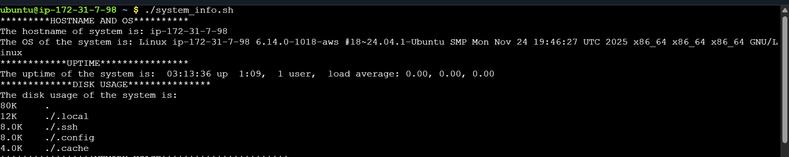

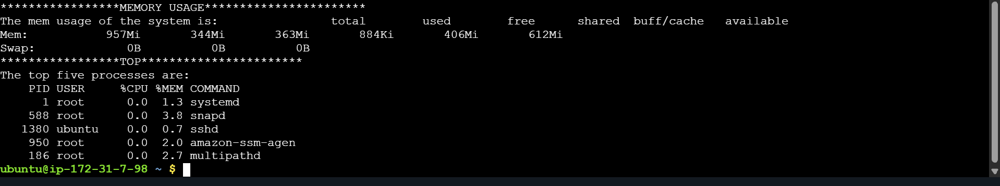

#### NOTES:
- `set -e` stops the scirpt write away when it find invalid action.For example a directory once created, will not be created again.An error will be displayed and any code line after that will not work.
Stops immediately as soon as any error is found.
- `set -o` stops the code if undefined variable is found.
- `set -o pipefail`: In case we have false | true ,in case error is detected, the code below it will continue to work and return with status 0.Until or unless we accompany this command with `set -e`.

- ` set -euo pipefail`: This command will work for all the above cases that includes stopping of the code lines once errors are detected.
Exits on error.Exits on undefined variable.Detect failures inside pipelines.
