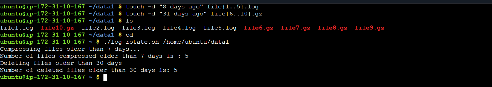
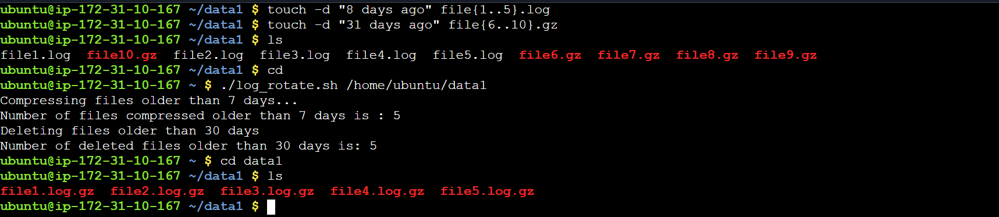
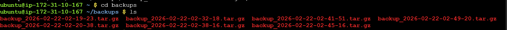
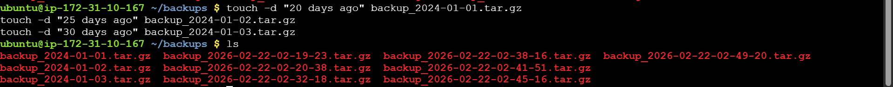
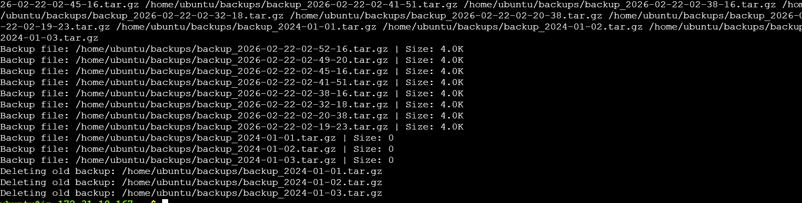
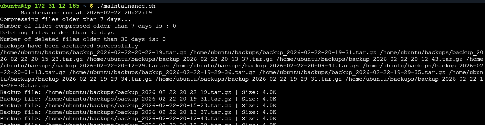

### Day 19 – Shell Scripting Project: Log Rotation, Backup & Crontab

#### Task 1: Log Rotation Script
- Create log_rotate.sh that:

- Takes a log directory as an argument (e.g., /var/log/myapp)
- Compresses .log files older than 7 days using gzip
- Deletes .gz files older than 30 days
- Prints how many files were compressed and deleted
- Exits with an error if the directory doesn't exist

>>**[ Script](scripts/log_rotate.sh)**

#### Task 2: Server Backup Script
- Create backup.sh that:

- Takes a source directory and backup destination as arguments
- Creates a timestamped .tar.gz archive (e.g., backup-2026-02-08.tar.gz)
- Verifies the archive was created successfully
- Prints archive name and size
- Deletes backups older than 14 days from the destination
- Handles errors — exit if source doesn't exist

>>**[ Script](scripts/backup.sh)**

#### Task 3: Crontab
Read: crontab -l — what's currently scheduled?
Understand cron syntax:
* * * * *  command
│ │ │ │ │
│ │ │ │ └── Day of week (0-7)
│ │ │ └──── Month (1-12)
│ │ └────── Day of month (1-31)
│ └──────── Hour (0-23)
└────────── Minute (0-59)
Write cron entries (in your markdown, don't apply if unsure) for:
Run log_rotate.sh every day at 2 AM

- #### 0 2 * * * 
Run backup.sh every Sunday at 3 AM 
-  #### 0 3 * * 0
Run a health check script every 5 minutes
- #### */5 * * * *

#### Task 4: Combine — Scheduled Maintenance Script
- Create maintenance.sh that:

- Calls your log rotation function
- Calls your backup function
- Logs all output to /var/log/maintenance.log with timestamps
- Write the cron entry to run it daily at 1 AM

>>**[ Script](scripts/maintainance.sh)**

### Notes:
#### Following are a few things that helped me completing the above tasks

- From `task1` searching the files w.r.t to a certain time period.
- From `task2` how to archive the files
- From `task1` and `task2` how to fake the files using `touch -d "...days ago"` command to make scripts work properly.
- From `task3` how to do schedule, using crontab -e.
- From `task4` the use of `tee -a <Filename>` to append the content.
- Most importantly how to use syntax for current date by using `+%Y-%m-%d-%H-%M-%S`.
