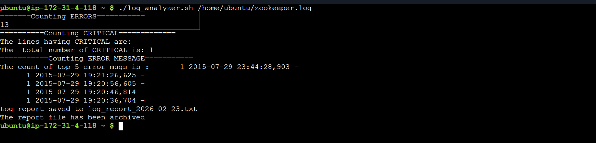
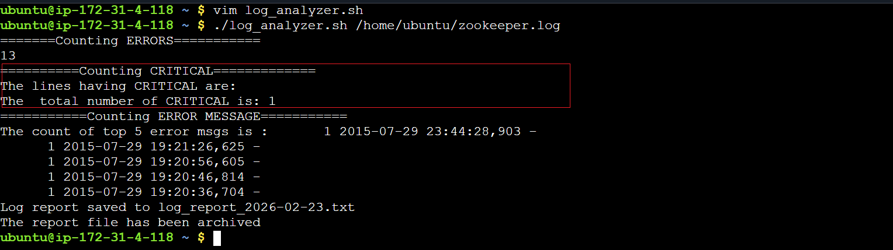
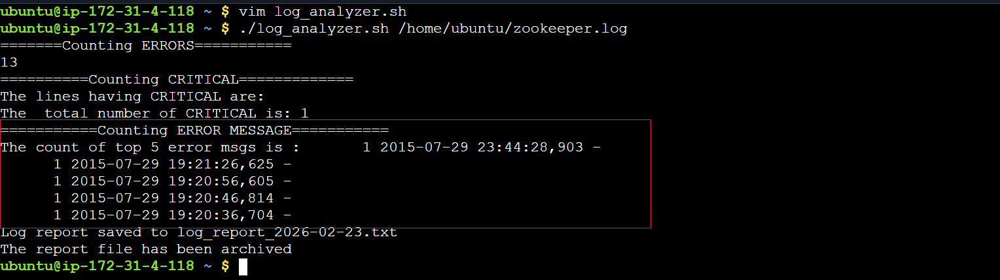
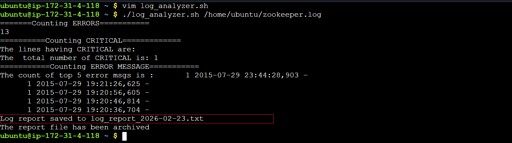
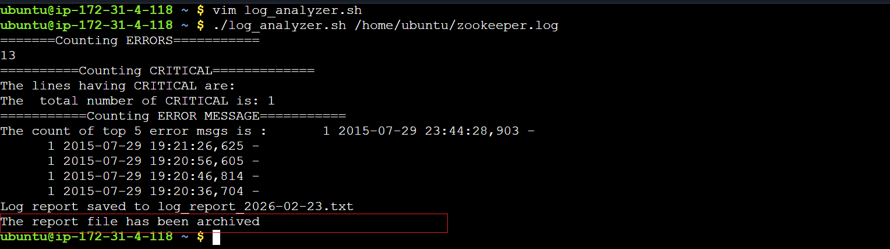
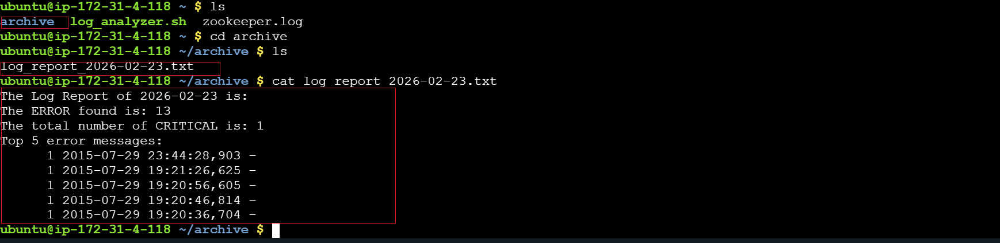

>>**[ Script](log_analyzer.sh)**

#### Task 1: Input and Validation
Your script should:

- Accept the path to a log file as a command-line argument
- Exit with a clear error message if no argument is provided
- Exit with a clear error message if the file doesn't exist

#### Task 2: Error Count
- Count the total number of lines containing the keyword ERROR or Failed
- Print the total error count to the console

#### Task3: Critical Events
- Search for lines containing the keyword CRITICAL
- Print those lines along with their line number

#### Task 4: Top Error Messages
- Extract all lines containing ERROR
- Identify the top 5 most common error messages
- Display them with their occurrence count, sorted in descending order

#### Task 5:Summary Report
Generate a summary report to a text file named log_report_<date>.txt (e.g., log_report_2026-02-11.txt). The report should include:

- Date of analysis
- Log file name
- Total lines processed
- Total error count
- Top 5 error messages with their occurrence count
- List of critical events with line numbers

#### Task 6 (Optional): Archive Processed Logs
- Add a feature to:

- Create an archive/ directory if it doesn't exist
- Move the processed log file into archive/ after analysis
- Print a confirmation message

#### Notes:
- This task helps me understand how to process log files
- How to search, extract ,organize and arrange the information by using `grep` ,`awk` ,`sort` , `sort`,` uniq -c` keywords.
- How to put the information in a separate file, according to a specific date.
