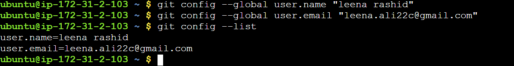
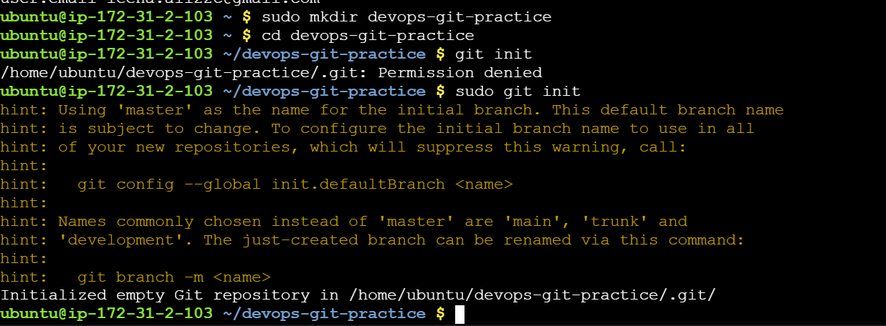
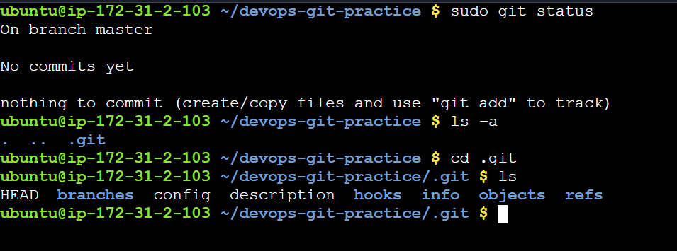
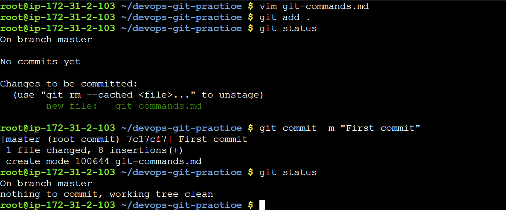
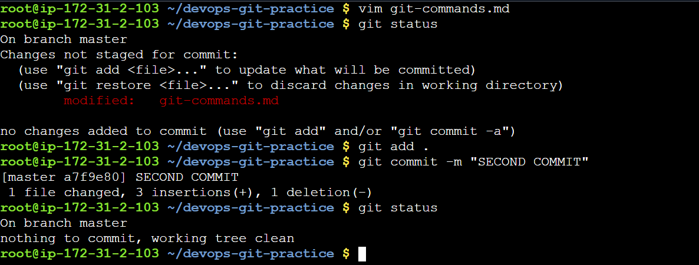
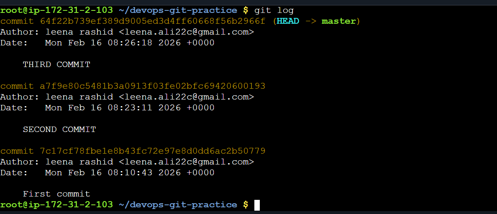

### Day 22 – Introduction to Git: Your First Repository
---
#### Task 1: Install and Configure Git

- Verify Git is installed on your machine
- Set up your Git identity — name and email
- Verify your configuration

---

#### Task2:Create Your Git Project
- Create a new folder called devops-git-practice
- Initialize it as a Git repository
- Check the status — read and understand what Git is telling you
- Explore the hidden .git/ directory — look 
at what's inside

----

#### Task 3: Create Your Git Commands Reference
Create a file called git-commands.md inside the repo
Add the Git commands you've used so far, organized by category:
Setup & Config
Basic Workflow
Viewing Changes
For each command, write:
What it does (1 line)
An example of how to use it

>>[View Git Commands](Images/git_commands.md)
----
#### Task 4: Stage and Commit
- Stage your file
- Check what's staged
- Commit with a meaningful message
- View your commit history

-----

#### Task 5: Make More Changes and Build History
- Edit git-commands.md — add more commands as you discover them
- Check what changed since your last commit
- Stage and commit again with a different, descriptive message
- Repeat this process at least 3 times so you have multiple commits in your history
- View the full history in a compact format

-----
#### Task 6: Understand the Git Workflow
Answer these questions in your own words (add them to a day-22-notes.md file):

- What is the difference between git add and git commit?

**Answer**:`git add` : Adds changes from the working directory to the staging area.

  `git add file.txt`
  `git add .`

  - `git commit`: Saves staged changes to the repository with a message.

  `git commit -m "A meaningful message to describe the push action precisely.`

- What does the staging area do? Why doesn't Git just commit directly?

**Answer**:The staging area is a middle step between the working directory and the final commit.

It allows you to:

✅ Select exactly which changes you want to include in the next commit
✅ Prepare changes before permanently saving them for organized practices.

Otherwise with Git directly, it will very confusing situation that what goes into a commit.

- What information does git log show you?
It ellaborates the commits includung the commit ids,commit meaasges and the changes happened to the files.The author's information and the dates are also included.
        

- What is the .git/ folder and what happens if you delete it?

It stores:

✅ All commit history

✅ Branch information

✅ Tags

✅ Remote repository info

✅ The staging area (index)

✅ Configuration settings

✅ Object database (all file snapshots)

If it gets deleted all project files will still exist — but it will no longer be a Git repository.

- What is the difference between a working directory, staging area, and repository?

The working directory is where you modify files, the staging area is where you prepare selected changes using git add, and the repository is where those changes are permanently saved using git commit.

------
