### Day 26 – GitHub CLI: Manage GitHub from Your Terminal
---
#### Task 1: Install and Authenticate
- Install the GitHub CLI on your machine

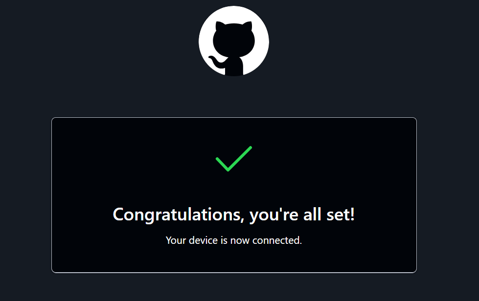

- Authenticate with your GitHub account

- Verify you're logged in and check which account is active

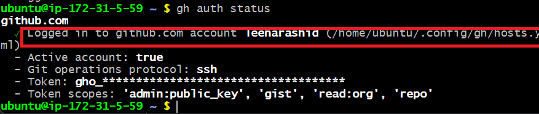

-  What authentication methods does gh support?
**Answer**
- OAuth Web Flow – Default, opens browser for login.

- Personal Access Token (PAT) – For scripts, CI/CD, or manual token login.

- SSH – For Git operations (clone, push, pull).

- Git Credential Helper – Uses credentials already stored by Git.

- GitHub App / Enterprise Token – For GitHub Enterprise automation.

-------

#### Task 2: Working with Repositories
- Create a new GitHub repo directly from the terminal — make it public with a README

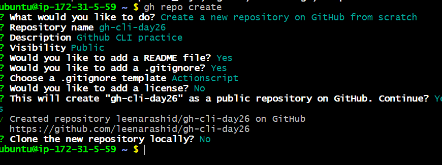

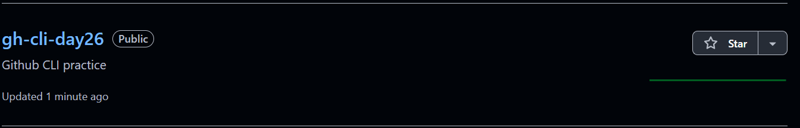

- Clone a repo using gh instead of git clone

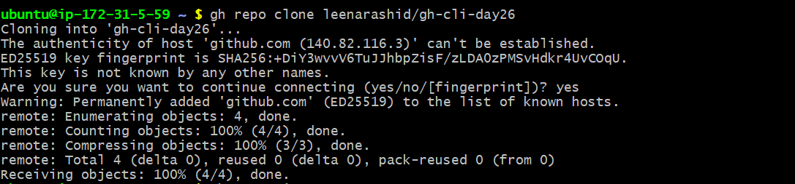
- View details of one of your repos from the terminal

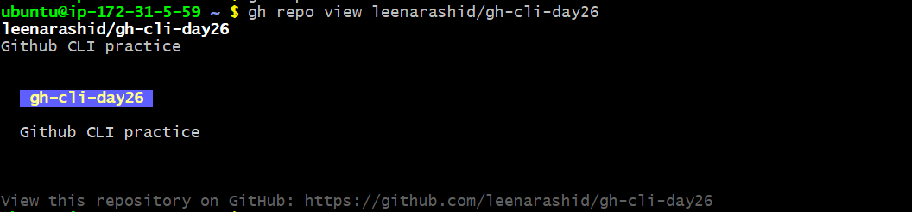

- List all your repositories

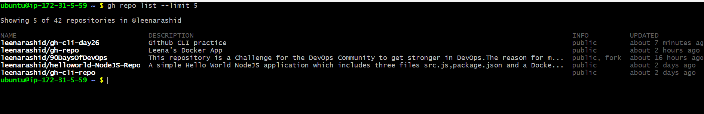

- Open a repo in your browser directly from the terminal
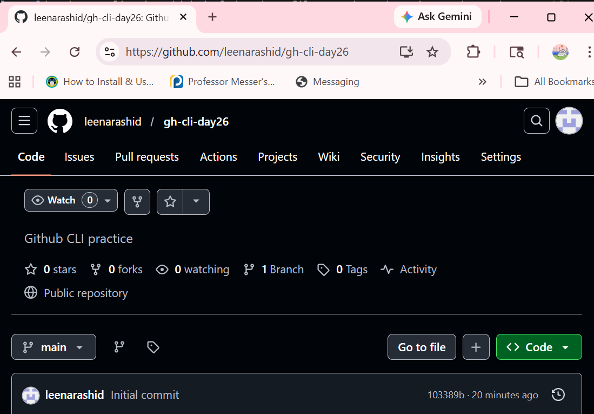

- Delete the test repo you created (be careful!)

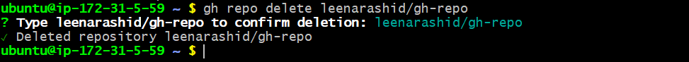

-----

#### Task 3: Issues
- Create an issue on one of your repos from the terminal — give it a title, body, and a label

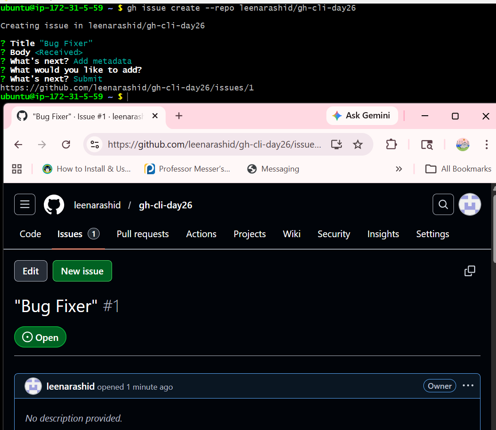

- List all open issues on that repo

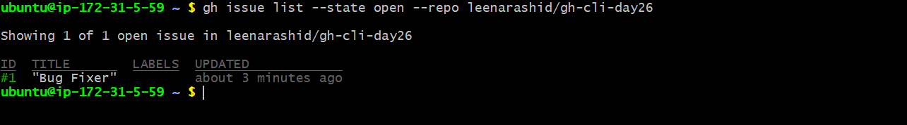

- View a specific issue by its number

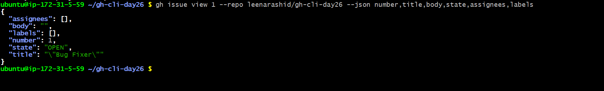
- Close an issue from the terminal

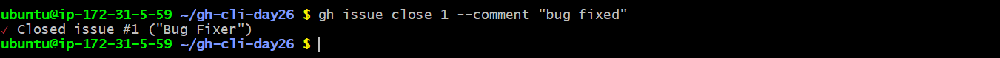

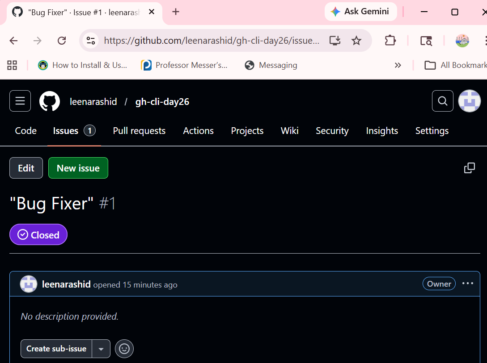

- How could you use gh issue in a script or automation?

**Answer**
1) Create an issue
2) List/view the issue
3) Update the issue
3) Close the issue

-----
#### Task 4: Pull Requests
- Create a branch, make a change, push it, and create a pull request entirely from the terminal

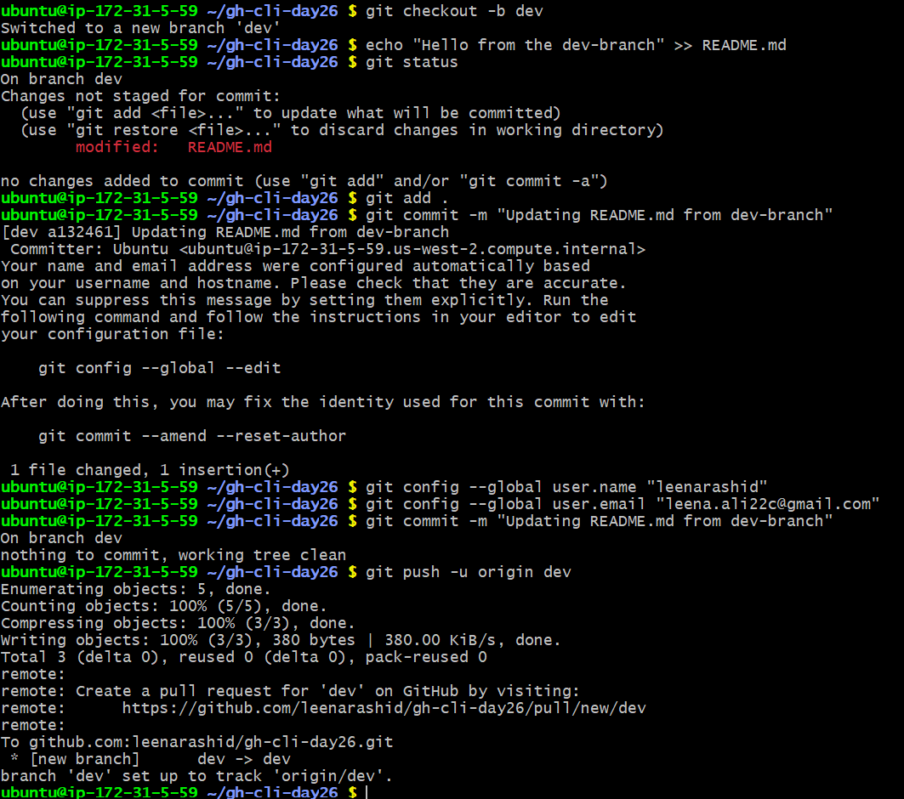

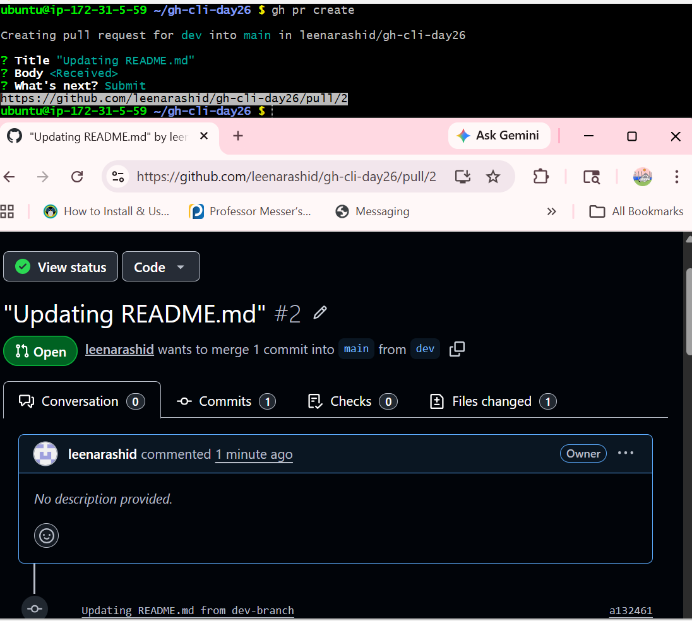

- List all open PRs on a repo

- View the details of your PR — check its status, reviewers, and checks

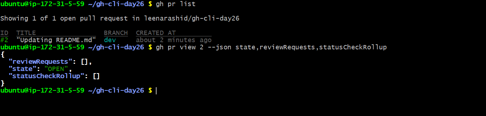

- Merge your PR from the terminal

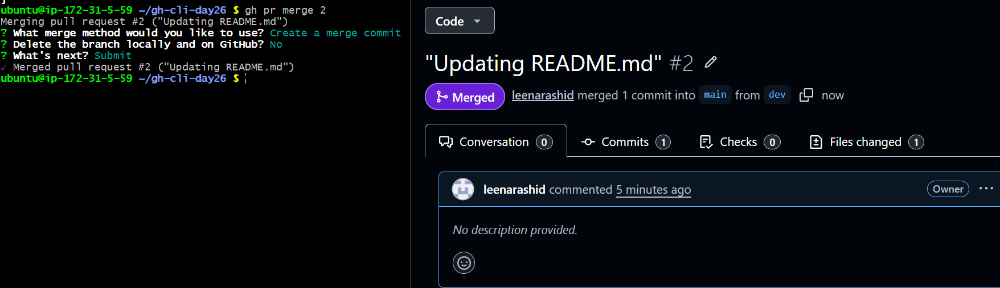

- What merge methods does gh pr merge support?
**Answer**
gh pr merge supports these merge methods:

1) Merge commit (--merge) – Creates a merge commit, keeps all commits from the branch.

2) Squash (--squash) – Combines all commits into a single commit on the base branch.

3) Rebase (--rebase) – Reapplies commits from the branch onto the base branch

- How would you review someone else's PR using gh?

**Answer**

- `gh pr review <PR-number>`
-----
#### Task 5: GitHub Actions & Workflows (Preview)
- List the workflow runs on any public repo that uses GitHub Actions
- View the status of a specific workflow run

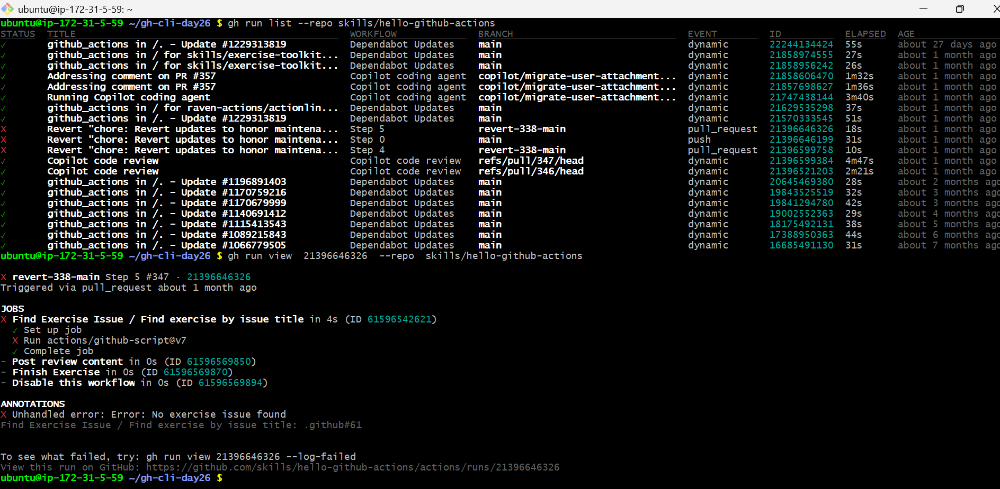

- How could gh run and gh workflow be useful in a CI/CD pipeline?
**Answer**
`gh run` and `gh workflow` can be used in CI/CD pipelines to monitor, trigger, and manage GitHub Actions programmatically, no need to hadle the tasks manually.