### Day 29 – Introduction to Docker
----
#### Task 1: What is Docker?
Research and write short notes on:

#### What is a container and why do we need them?
**Answer**:
A conatiner is a packed object that conatins all the dependencies for an appliaction to run regardless of the platform available. It contains all the configuration files and required libraries.Generally to avoid environment conflicts, containers are used.

#### Containers vs Virtual Machines — what's the real difference?

**Answer**: 
**1**.VMs virtualize hardware
Containers virtualize the operating system.
**2**. VMs run on Hypervisor while conatiners run on Docker engine.**3**.VMs are resource hungry while conatiners sice running on light weight environment platforms and share the resources or share the host OS kernel.

#### What is the Docker architecture? (daemon, client, images, containers, registry) Draw or describe the Docker architecture in your own words.

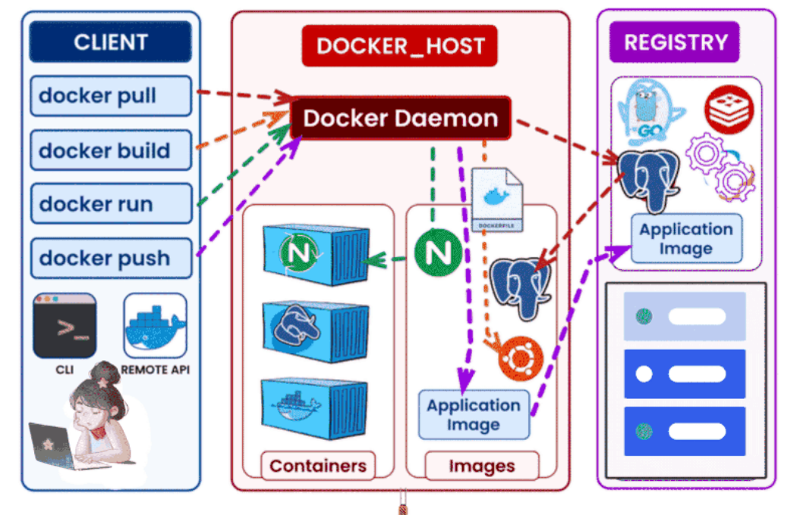

**Explanition:**

- You run a command on **Docker Client** (docker run python:3.13)

- Client talks to **Docker Daemon**

- Daemon checks if the **image** exists locally

- If not → pulls from **Docker Hub**

- Daemon creates a **container** from the image

- Container runs your command or application

- Output is sent back to the client/terminal

- **Docker Compose** → defines multi-container applications in YAML.

- **Docker Swarm** / Kubernetes → orchestrates containers across multiple hosts.

- **Volumes** → persistent storage for containers.

------
#### Task 2: Install Docker
- Install Docker on your machine (or use a cloud instance)
- Verify the installation
- Run the hello-world container
- Read the output carefully — it explains what just happened

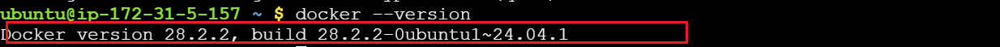
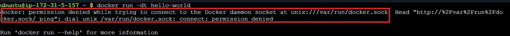
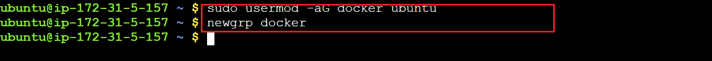
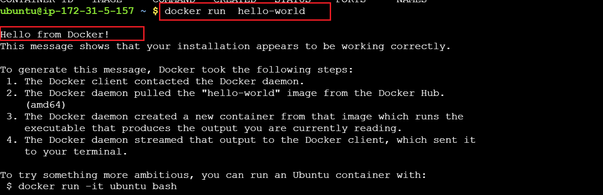
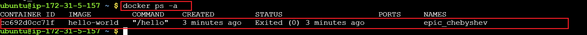

**Explanition:**

The hello-world image is pulled from Docker Hub.

When you run it, Docker creates a container from this image.

The container prints the Hello message and exits immediately.

The main workflow:

**Docker Client** → sends a request to run the container.

**Docker Daemon**→

pulls the image from Docker Hub (if not already available locally),

creates the container,

runs it,

sends the output back to the terminal.

**Key point:** The container runs, does its task (printing), and stops. Docker Daemon manages all of this behind the scenes.

**Notes:**

To access docker conatiners, the ubuntu user should be added to the docker group.
- sudo usermod -aG docker ubuntu
- newgrp docker

------
#### Task 3: Run Real Containers
- Run an Nginx container and access it in your browser

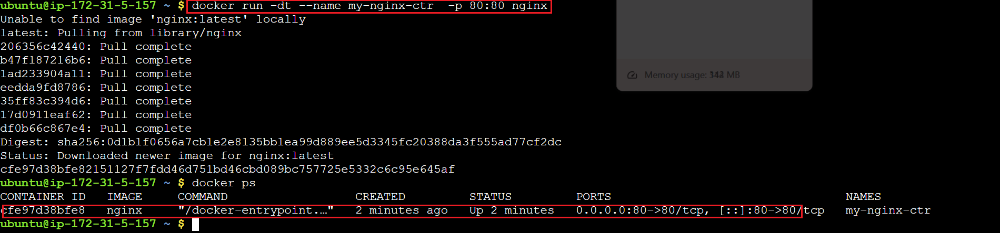
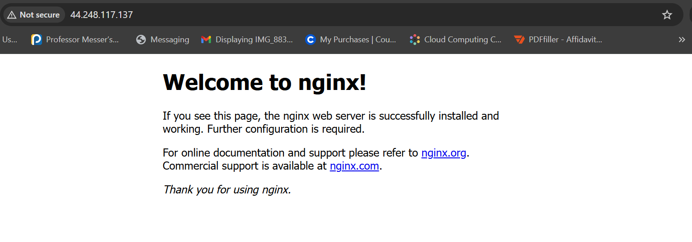

- Run an Ubuntu container in interactive mode — explore it like a mini Linux machine
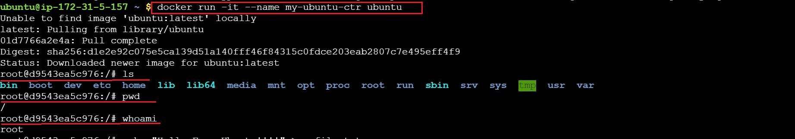

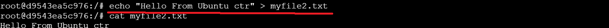

- List all running containers
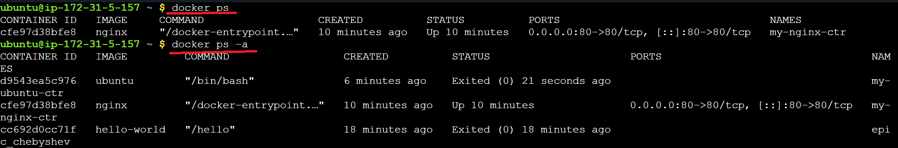

- List all containers (including stopped ones)

- Stop and remove a container
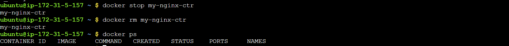

------

#### Task 4: Explore
- Run a container in detached mode — what's different?
- Give a container a custom name
- Map a port from the container to your host
- Check logs of a running container

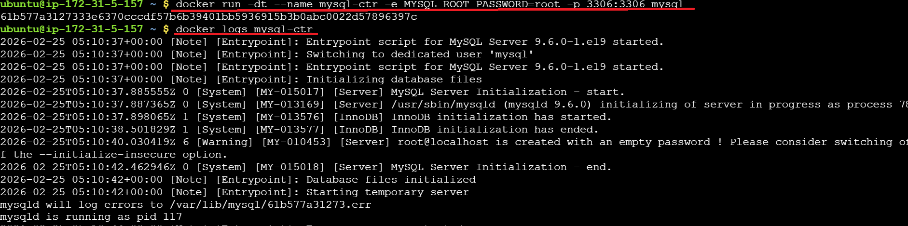

- Run a command inside a running container

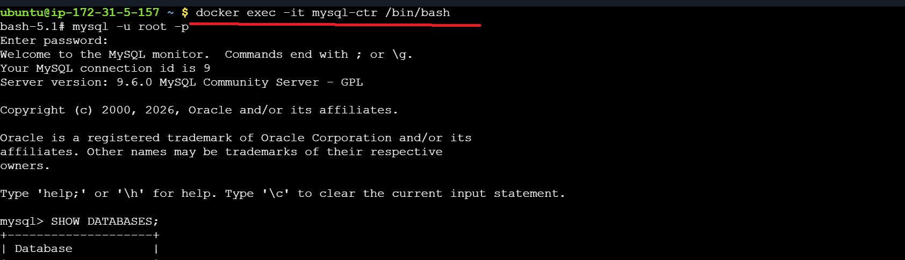

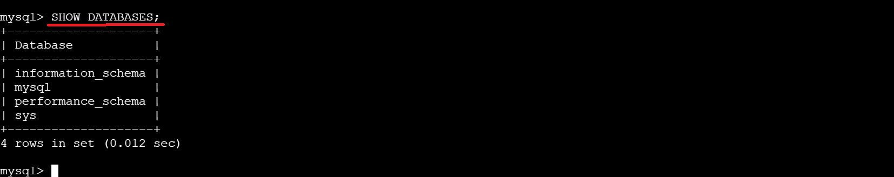
-----
