### Day 30 – Docker Images & Container Lifecycle

#### Task 1: Docker Images
- Pull the nginx, ubuntu, and alpine images from Docker Hub

- List all images on your machine — note the sizes
- Compare ubuntu vs alpine — why is one much smaller?
- Inspect an image — what information can you see?
- Remove an image you no longer need

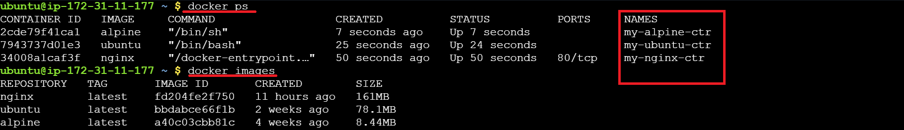

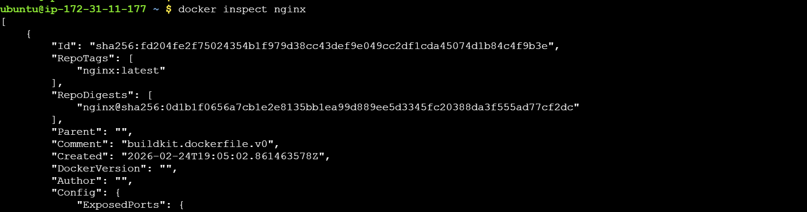
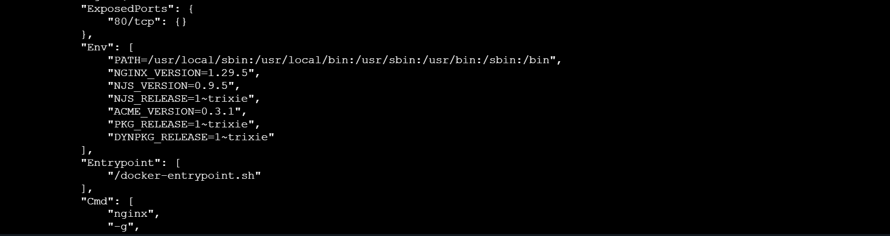
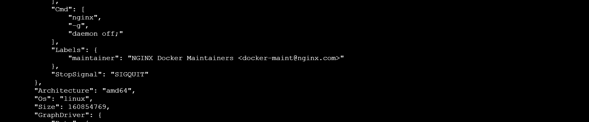
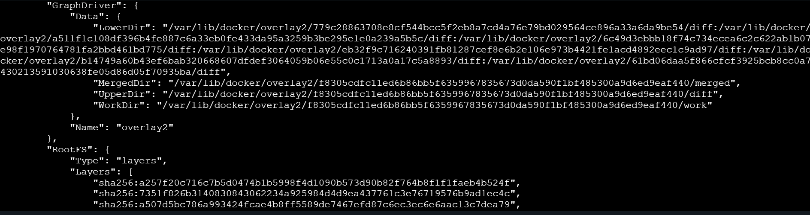
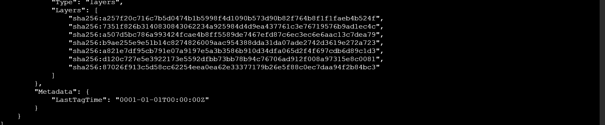
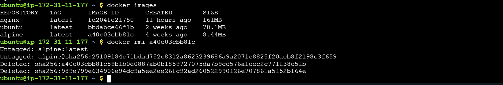

#### Task 2: Image Layers
- Run docker image history nginx — what do you see?
- Each line is a layer. Note how some layers show sizes and some show 0B
- Write in your notes: What are layers and why does Docker use them?

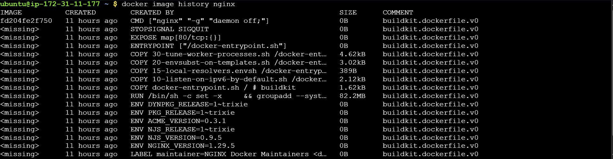

**Explanition**
Layers are like building blocks of an image.

- Each layer represents a set of filesystem changes (adding files, installing packages, or setting metadata).

- Layers are stacked on top of each other to form the final Docker image.

- Docker reuses layers between images if they’re identical — this saves space and speeds up building and downloading.

**0B**
**Explanition:**
- Layers with size 0B are metadata-only changes, such as:

- CMD → default command for the container

- EXPOSE → ports the container listens on

- LABEL → metadata information

- ENV → environment variables

#### Task 3: Container Lifecycle
Practice the full lifecycle on one container:

- Create a container (without starting it)
- Start the container
- Pause it and check status
- Unpause it
- Stop it
- Restart it
- Kill it
- Remove it
- Check docker ps -a after each step — observe the state changes.

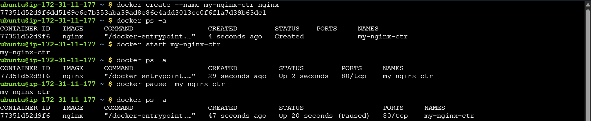

#### Task 4: Working with Running Containers
- Run an Nginx container in detached mode
- View its logs
- View real-time logs (follow mode)
- Exec into the container and look around the filesystem
- Run a single command inside the container without entering it
- Inspect the container — find its IP address, port mappings, and mounts

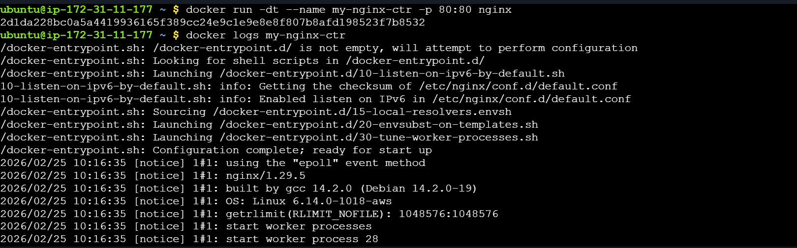
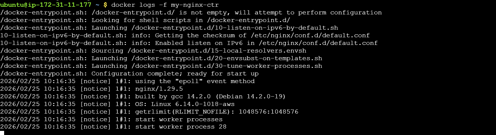

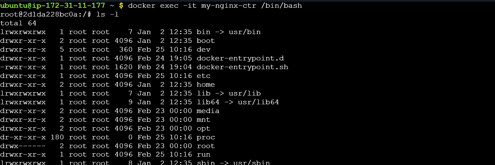
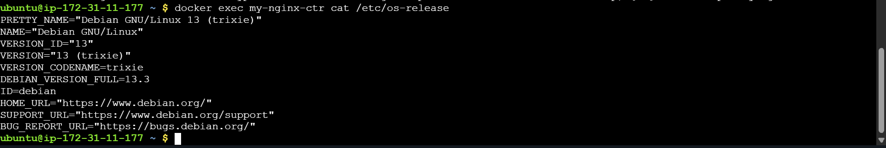
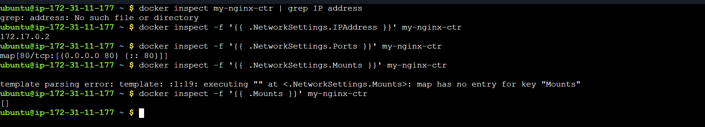

#### Task 5: Cleanup
- Stop all running containers in one command
- Remove all stopped containers in one command
- Remove unused images
- Check how much disk space Docker is using

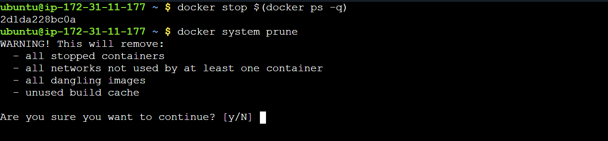
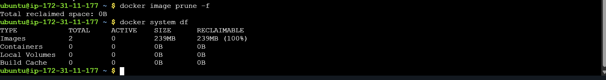