### Day 31 – Dockerfile: Build Your Own Images
-----
#### Task 1: Your First Dockerfile
- Create a folder called my-first-image
- Inside it, create a Dockerfile that:
- Uses ubuntu as the base image
- Installs curl
- Sets a default command to print "Hello from my custom image!"
- Build the image and tag it my-ubuntu:v1
- Run a container from your image
- Verify: The message prints on docker run

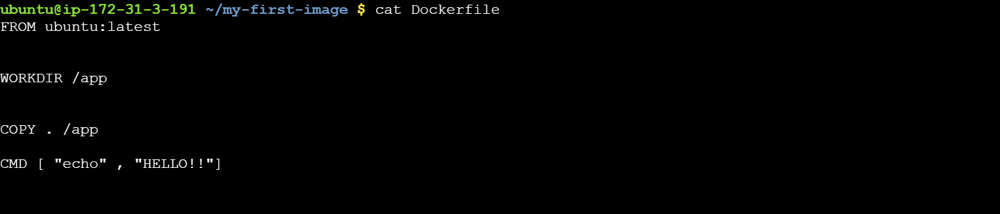

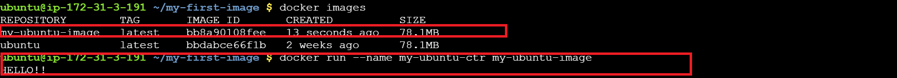

------

#### Task 2: Dockerfile Instructions
- Create a new Dockerfile that uses all of these instructions:

**FROM** — base image
**RUN** — execute commands during build
**COPY** — copy files from host to image
**WORKDIR** — set working directory
**EXPOSE** — document the port
**CMD** — default command
- Build and run it. Understand what each line does

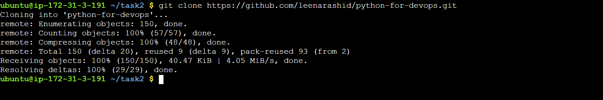

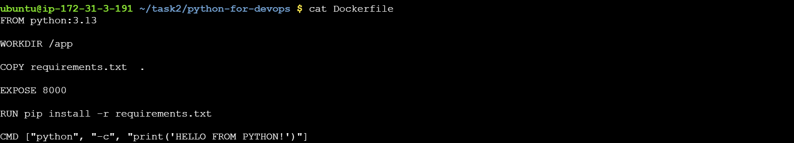
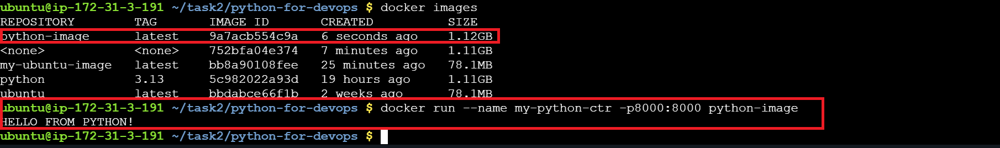
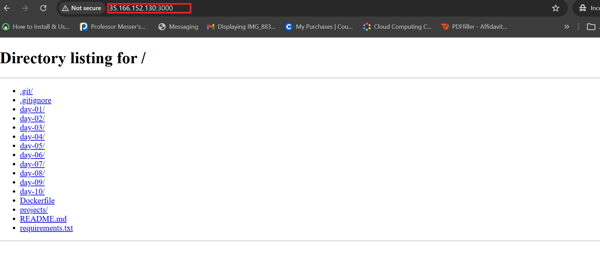
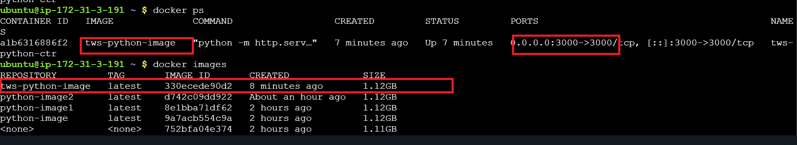

------

#### Task 3: CMD vs ENTRYPOINT
- Create an image with CMD ["echo", "hello"] — run it, then run it with a custom command. What happens?
- Create an image with ENTRYPOINT ["echo"] — run it, then run it with additional arguments. What happens?
- Write in your notes: When would you use CMD vs ENTRYPOINT?

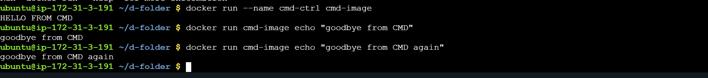

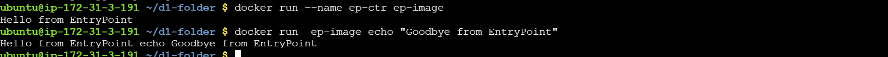

-----

#### Task 4: Build a Simple Web App Image
- Create a small static HTML file (index.html) with any content
- Write a Dockerfile that:
- Uses nginx:alpine as base
- Copies your index.html to the Nginx web directory
- Build and tag it my-website:v1
- Run it with port mapping and access it in your browser
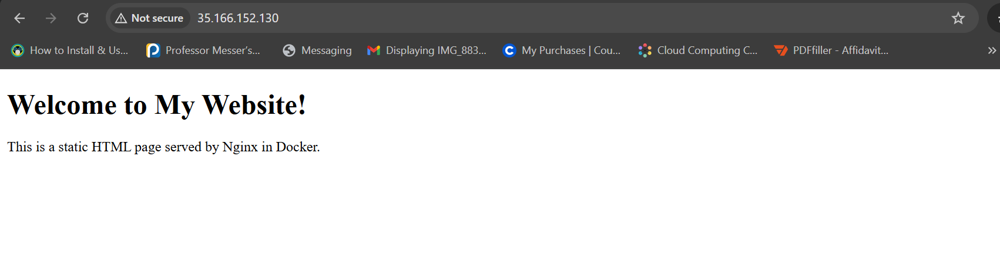
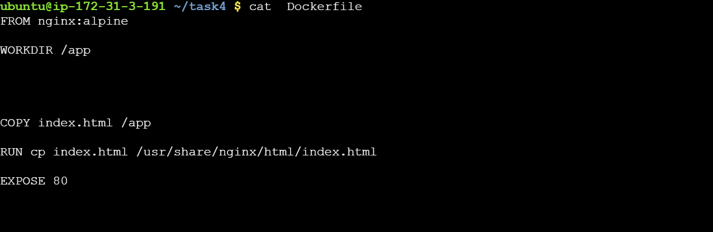

----
#### Task 5: .dockerignore
- Create a .dockerignore file in one of your project folders
- Add entries for: node_modules, .git, *.md, .env
- Build the image — verify that ignored files are not included

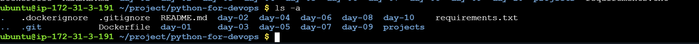
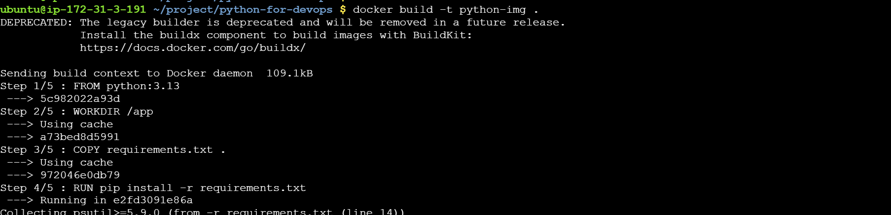
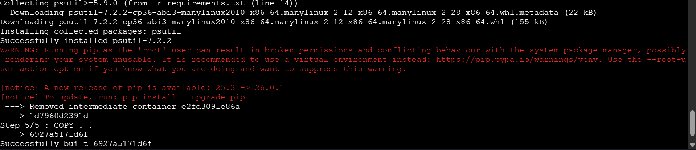
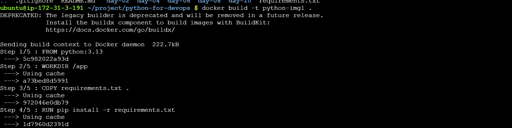

---------

#### Task 6: Build Optimization
- Build an image, then change one line and rebuild — notice how Docker uses cache
- Reorder your Dockerfile so that frequently changing lines come last

- Write in your notes: Why does layer order matter for build speed?

**Answer:**

Layer order affects build speed because Docker reuses cached layers from previous builds. Stable layers should come first, frequently changing layers last, so only the minimal part of the image is rebuilt.