### Day 32 – Docker Volumes & Networking
----
#### Task 1: The Problem
- Run a Postgres or MySQL container

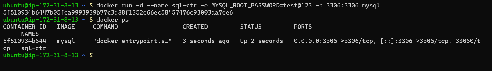

- Create some data inside it (a table, a few rows — anything)

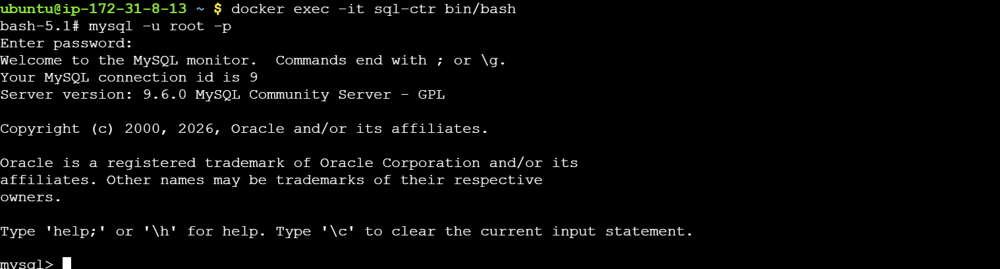
- Stop and remove the container

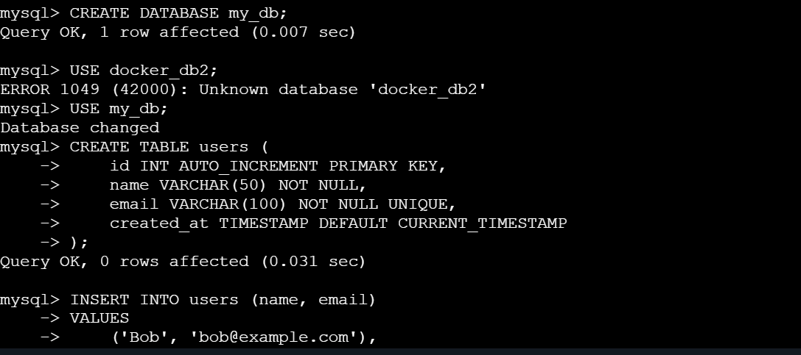

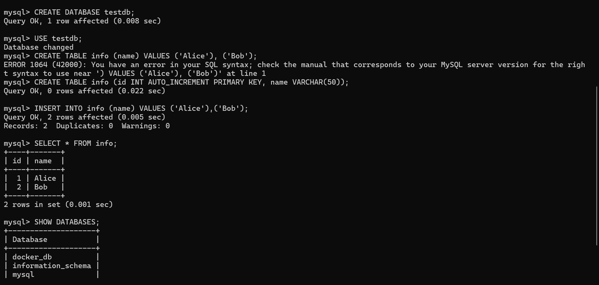

- Run a new one — is your data still there?

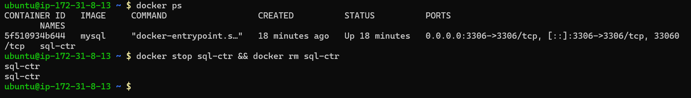

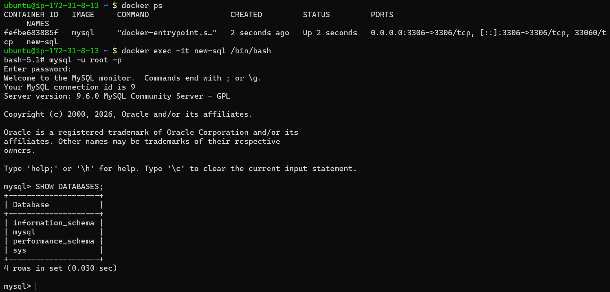

- Write what happened and why.
**Answer:**
Data will be lost when the container is removes as conatiners are ephimeral (cant persist data).

-------

#### Task 2: Named Volumes
- Create a named volume
- Run the same database container, but this time attach the volume to it
- Add some data, stop and remove the container
- Run a brand new container with the same volume

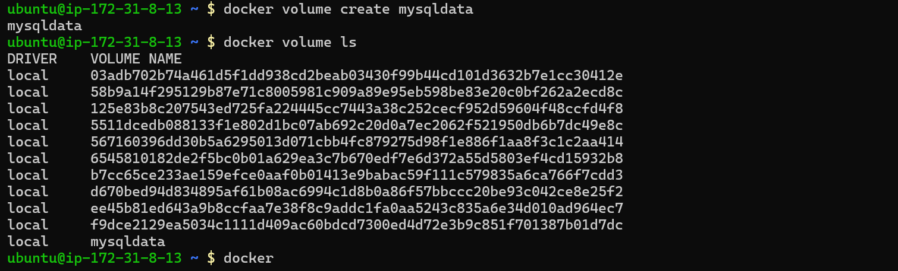

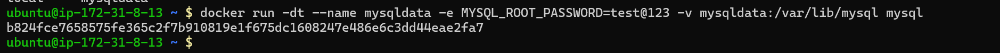

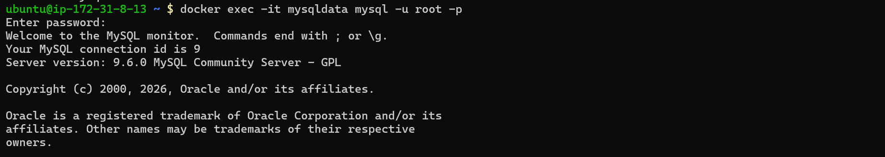

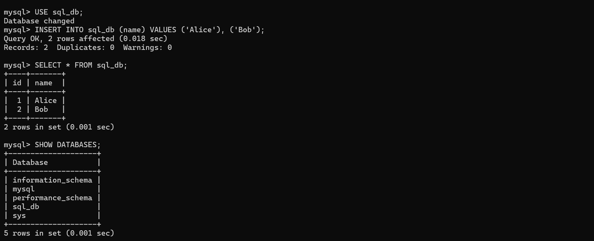

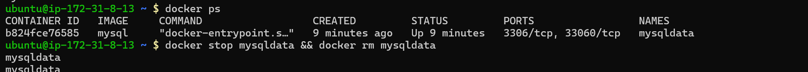

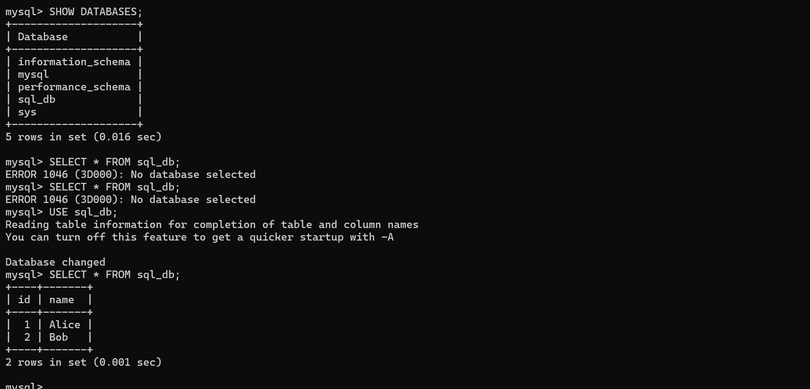

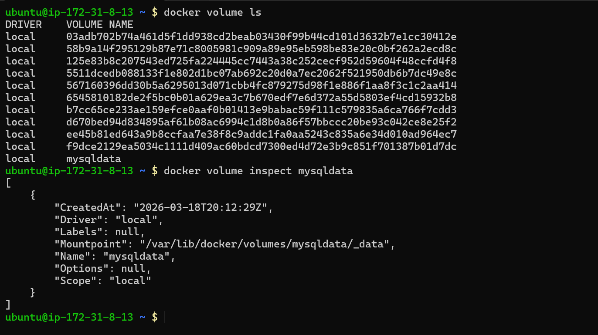

- Is the data still there?
**Answer:**

Yes the data is still there as an outer volume is attached that can be shared across containers.

-----

#### Task 3: Bind Mounts
- Create a folder on your host machine with an index.html file
- Run an Nginx container and bind mount your folder to the Nginx web directory
- Access the page in your browser
- Edit the index.html on your host — refresh the browser

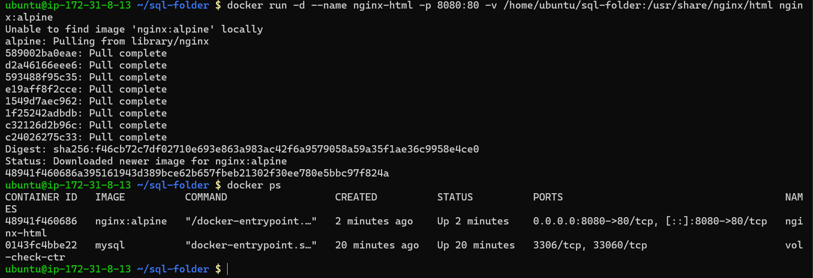

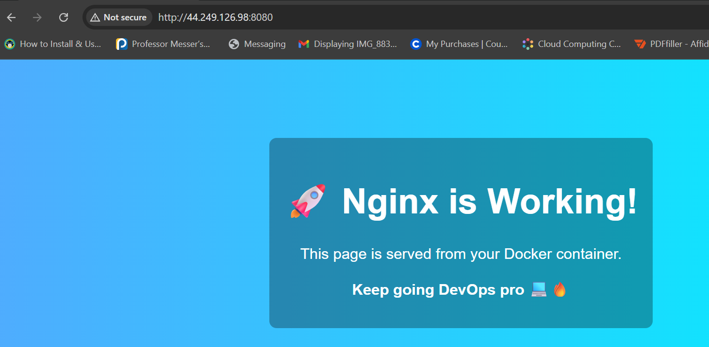

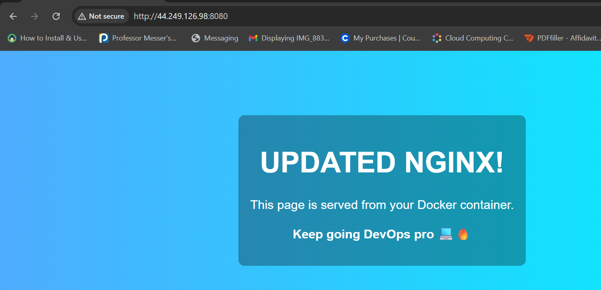

- Write in your notes: What is the difference between a named volume and a bind mount?
**Answer:**

- A named volume is managed by Docker itself.
- A bind mount connects a folder from your local system to the container.

-----

#### Task 4: Docker Networking Basics
- List all Docker networks on your machine
- Inspect the default bridge network
- Run two containers on the default bridge — can they ping each other by name?
- Run two containers on the default bridge — can they ping each other by IP?

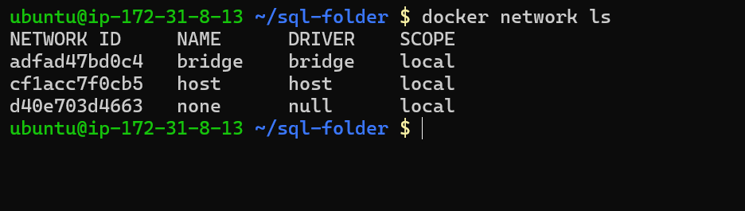

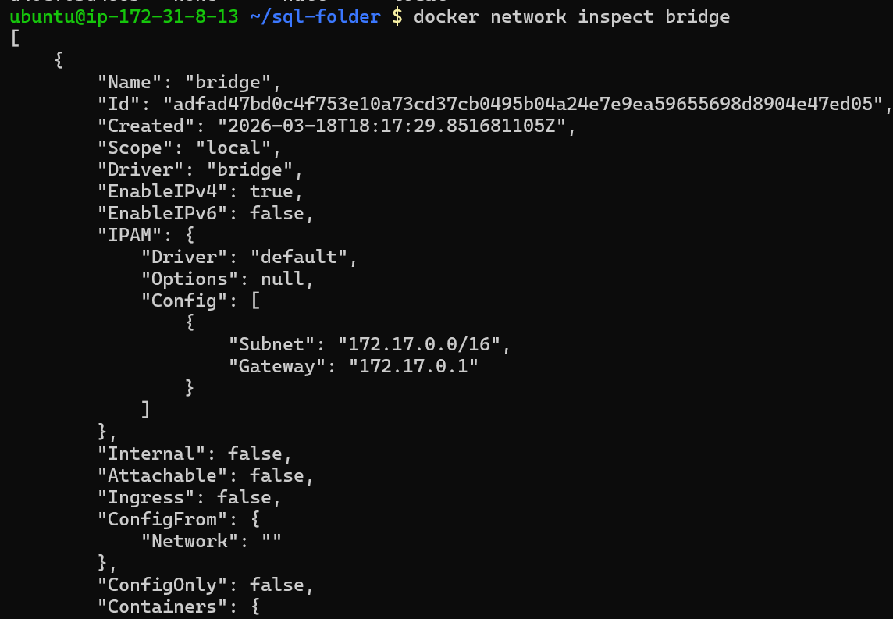

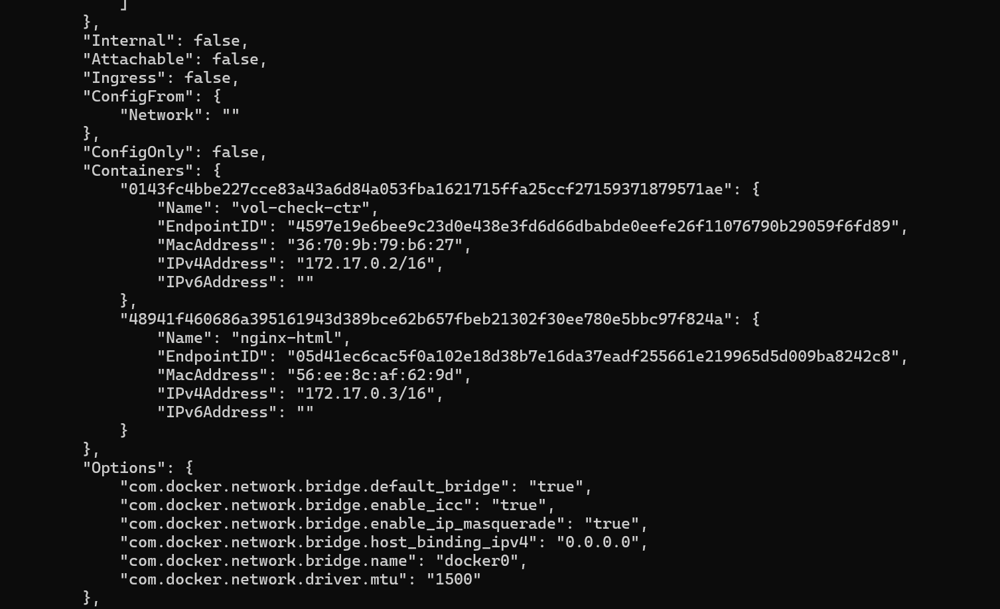

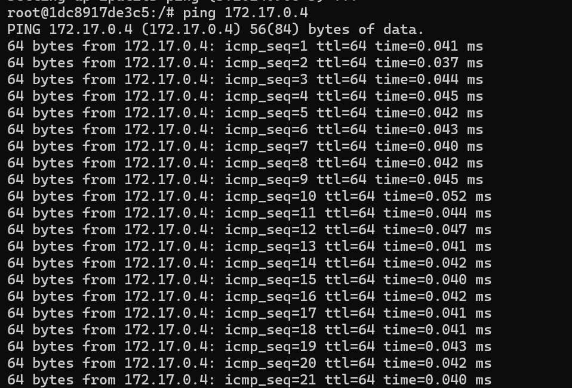

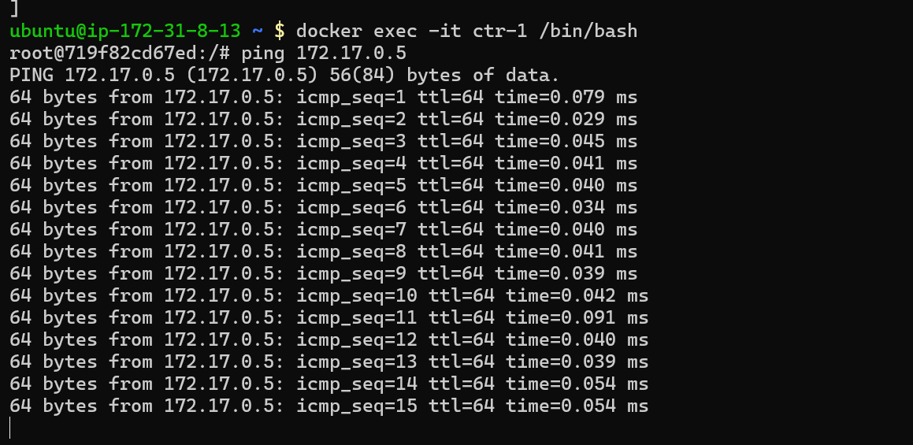

**Note:**
Yes they can ping each other by IP but not by name.

-----
#### Task 5: Custom Networks
- Create a custom bridge network called my-app-net
- Run two containers on my-app-net
- Can they ping each other by name now?

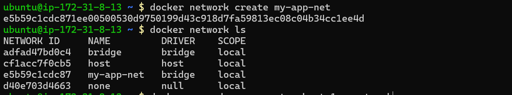

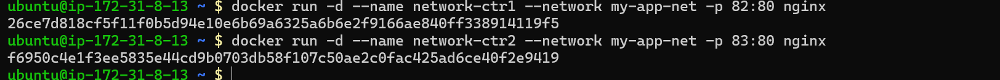

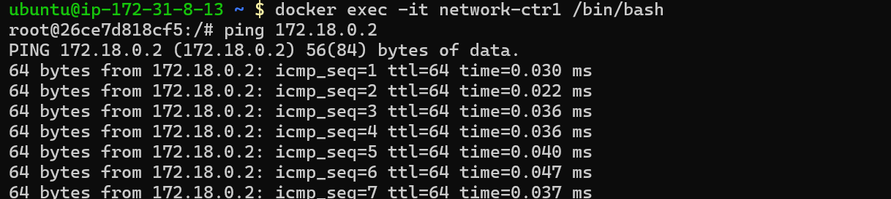

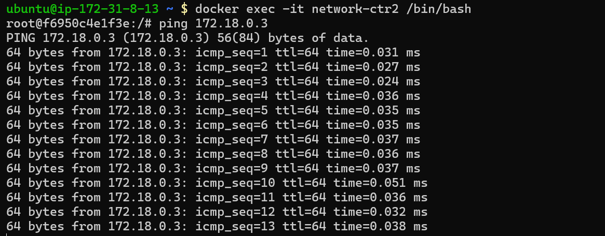

- Write in your notes: Why does custom networking allow name-based communication but the default bridge doesn't?

**Answer**
- Custom networks have built-in DNS, so containers can talk using service/container names.
-  The default bridge network does not provide automatic DNS resolution, so you must use IP addresses (or manual linking).

-----
#### Task 6: Put It Together
- Create a custom network
- Run a database container (MySQL/Postgres) on that network with a volume for data
- Run an app container (use any image) on the same network

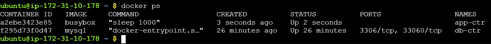

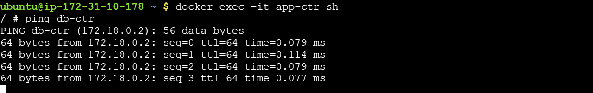

- Verify the app container can reach the database by container name

**Answer:**
Yes being on the same network they can ping each other by name.