### Day 33 – Docker Compose: Multi-Container Basics

----

#### Task 1: Install & Verify
- Check if Docker Compose is available on your machine
- Verify the version

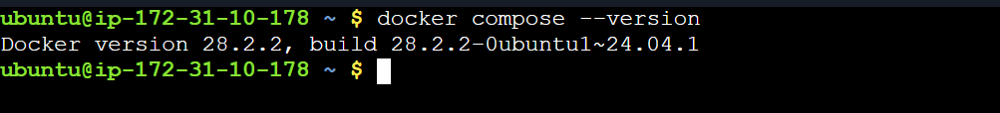

-----

#### Task 2: Your First Compose File
- Create a folder compose-basics
- Write a docker-compose.yml that runs a single Nginx container with port mapping
- Start it with docker compose up
- Access it in your browser
- Stop it with docker compose down

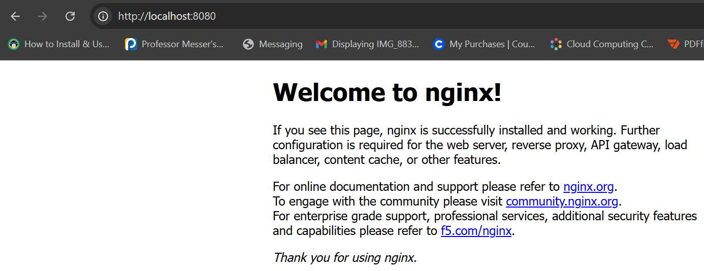

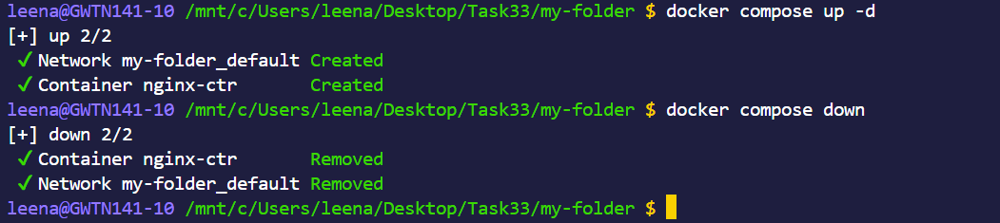

[Dockerfile](app/Dockerfile)

------
#### Task 3: Two-Container Setup
- Write a docker-compose.yml that runs:

A WordPress container
A MySQL container
They should:

- Be on the same network (Compose does this automatically)
- MySQL should have a named volume for data persistence
- WordPress should connect to MySQL using the service name
- Start it, access WordPress in your browser, and set it up.

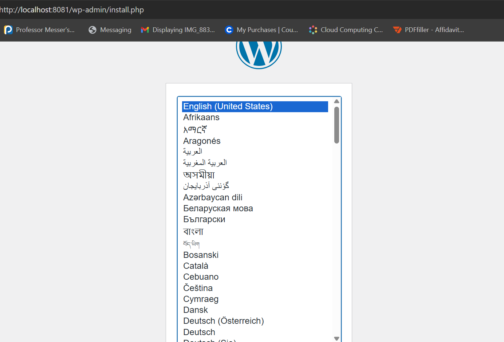

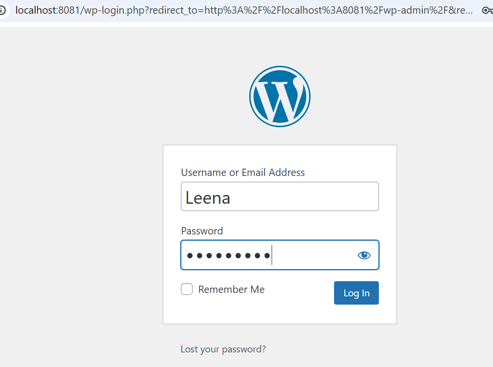

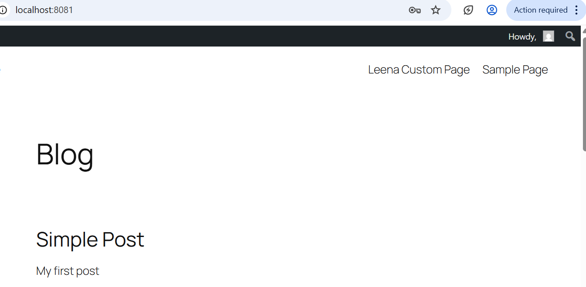

[Docker-Compose](assets/docker-compose1.yml)

- Verify: Stop and restart with docker compose down and docker compose up — is your WordPress data still there?

-----
#### Task 4: Compose Commands
- Practice and document these:

- Start services in detached mode

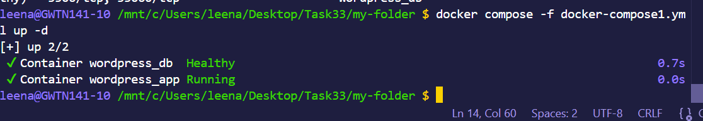
- View running services
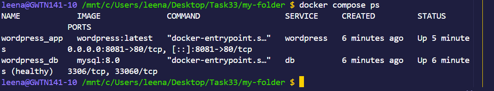

- View logs of all services
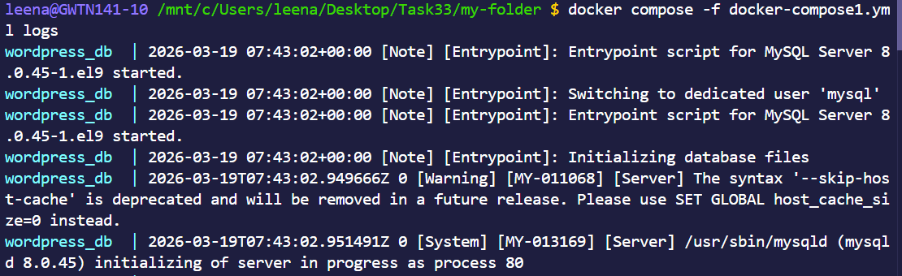

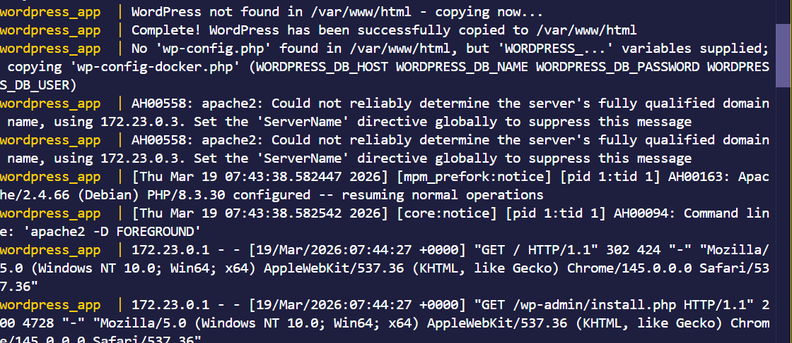

- View logs of a specific service
- Stop services without removing
- Remove everything (containers, networks)

- Rebuild images if you make a change

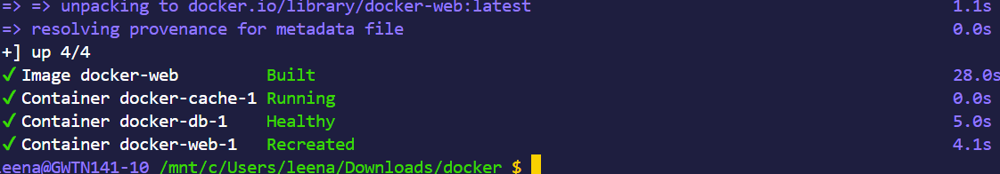

----
#### Task 5: Environment Variables
- Add environment variables directly in your docker-compose.yml
- Create a .env file and reference variables from it in your compose file
- Verify the variables are being picked up

[Docker-compose](assets/docker-compose2.yml)