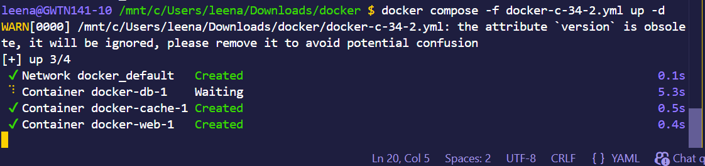
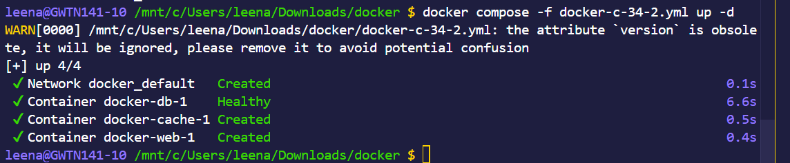
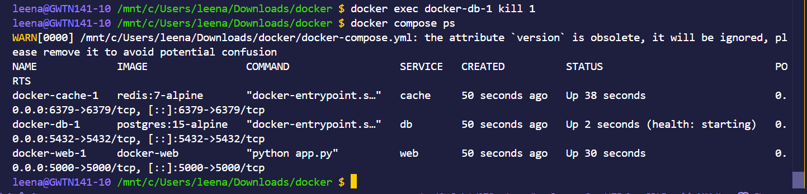
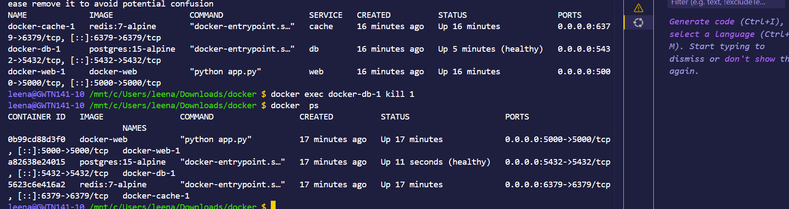
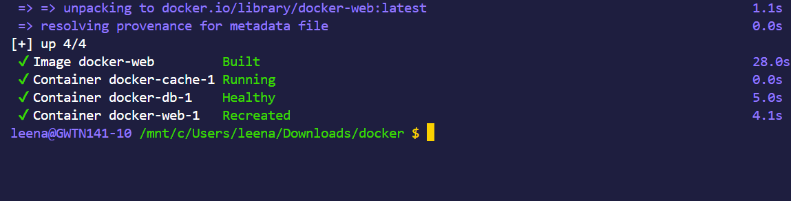
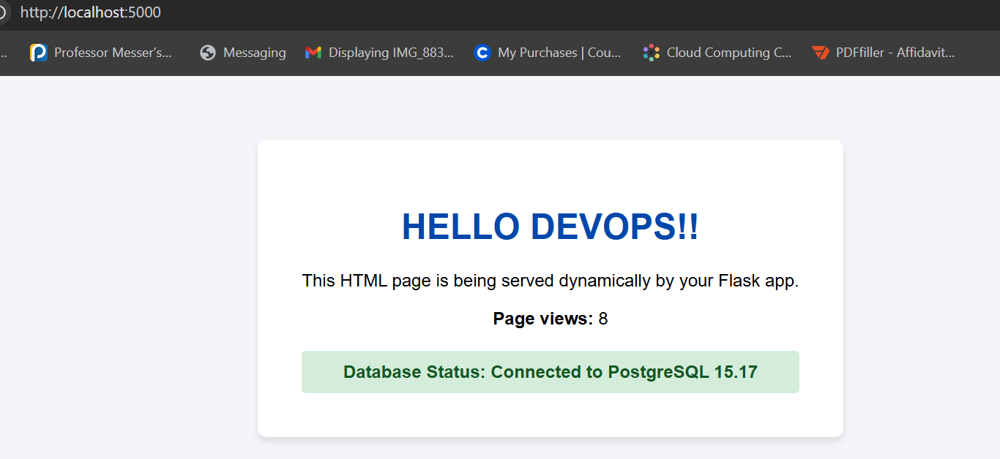
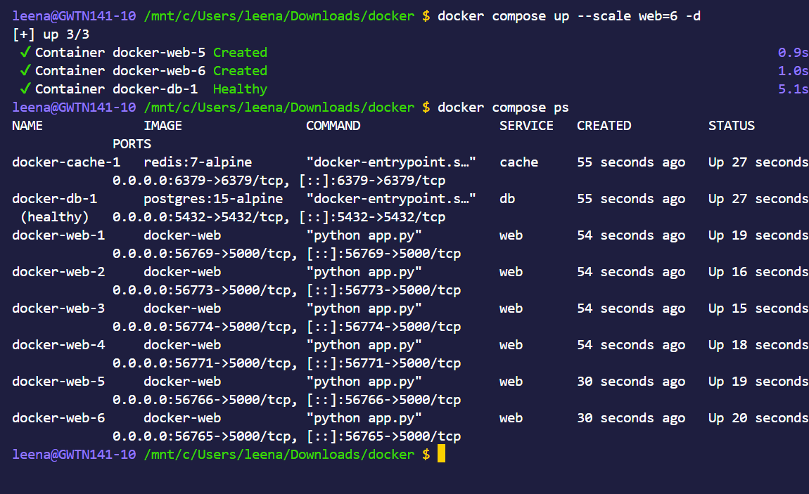

### Day 34 – Docker Compose: Real-World Multi-Container Apps
-----

#### Task 1: Build Your Own App Stack
- Create a docker-compose.yml for a 3-service stack:

- A web app (use Python Flask, Node.js, or any language you know)
- A database (Postgres or MySQL)
- A cache (Redis)
- Write a simple Dockerfile for the web app. The app doesn't need to be complex — even a "Hello World" that connects to the database is enough.

[Dockerfile](assets/Dockerfile)

------
#### Task 2: depends_on & Healthchecks
- Add depends_on to your compose file so the app starts after the database
- Add a healthcheck on the database service
- Use depends_on with condition: service_healthy so the app waits for the database to be truly ready, not just started
- Test: Bring everything down and up — does the app wait for the DB?

[Docker Compose File](assets/docker-compose(2+3).yml)

------
#### Task 3: Restart Policies

- Add restart: always to your database service
- Manually kill the database container — does it come back?
- Try restart: on-failure — how is it different?

- Write in your notes: When would you use each restart policy?

`restart: always`:
Is preferable when:
- Critical production services

- Apps that must always stay running

- Web servers, APIs

`restart: on-failure:`
Is preferable when:

- Apps that should restart only if they crash

- Background jobs / workers

- Error-prone processes

-----

#### Task 4: Custom Dockerfiles in Compose
- Instead of using a pre-built image for your app, use build: in your compose file to build from a Dockerfile
- Make a code change in your app
- Rebuild and restart with one command

[Docker Compose File](assets/docker-compose(2+3).yml)

------

#### Task 5: Named Networks & Volumes
- Define explicit networks in your compose file instead of relying on the default
- Define named volumes for database data
- Add labels to your services for better organization
[Docker Compose File](assets/docker-compose(2+3).yml)

----
#### Task 6: Scaling (Bonus)
- Try scaling your web app to 3 replicas using docker compose up --scale
- What happens? What breaks?
- Write in your notes: Why doesn't simple scaling work with port mapping?

[Docker Compose File](assets/docker-compose(2+3).yml)

**Notes:**

1)Multiple replicas of the web service are created

Containers run successfully if no port conflict

Each container gets a different dynamic port (if not fixed)

2)Fixed port mapping causes port conflicts

No built-in load balancing in Docker Compose

Hard to access multiple containers manually

3)Port mapping binds:

HOST_PORT → CONTAINER_PORT

Only one container can use a specific host port

Scaling creates multiple containers → all need same port → conflict