# Day 53 – Kubernetes Services


---

## Challenge Tasks

### Task 1: Deploy the Application
First, create a Deployment that you will expose with Services. Create `app-deployment.yaml`:

```yaml
apiVersion: apps/v1
kind: Deployment
metadata:
  name: web-app
  labels:
    app: web-app
spec:
  replicas: 3
  selector:
    matchLabels:
      app: web-app
  template:
    metadata:
      labels:
        app: web-app
    spec:
      containers:
      - name: nginx
        image: nginx:1.25
        ports:
        - containerPort: 80
```

```bash
kubectl apply -f app-deployment.yaml
kubectl get pods -o wide
```

Note the individual Pod IPs. These will change if pods restart — that is the problem Services fix.

**Verify:** Are all 3 pods running? Note down their IP addresses.

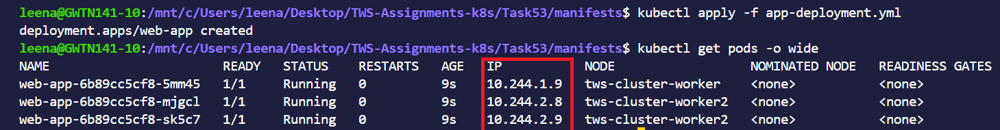


**Answer**
All the three pods are running and their IP addresses can be seen in IP column.

---

### Task 2: ClusterIP Service (Internal Access)
ClusterIP is the default Service type. It gives your Pods a stable internal IP that is only reachable from within the cluster.

Create `clusterip-service.yaml`:

```yaml
apiVersion: v1
kind: Service
metadata:
  name: web-app-clusterip
spec:
  type: ClusterIP
  selector:
    app: web-app
  ports:
  - port: 80
    targetPort: 80
```

Key fields:
- `selector.app: web-app` — this Service routes traffic to all Pods with the label `app: web-app`
- `port: 80` — the port the Service listens on
- `targetPort: 80` — the port on the Pod to forward traffic to

```bash
kubectl apply -f clusterip-service.yaml
kubectl get services
```

You should see `web-app-clusterip` with a CLUSTER-IP address. This IP is stable — it will not change even if Pods restart.

Now test it from inside the cluster:
```bash
# Run a temporary pod to test connectivity
kubectl run test-client --image=busybox:latest --rm -it --restart=Never -- sh

# Inside the test pod, run:
wget -qO- http://web-app-clusterip
exit
```

You should see the Nginx welcome page. The Service load-balanced your request to one of the 3 Pods.

**Verify:** Does the Service respond? Try running the wget command multiple times — the Service distributes traffic across all healthy Pods.


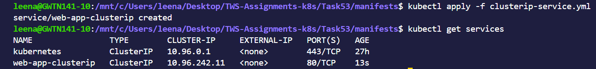

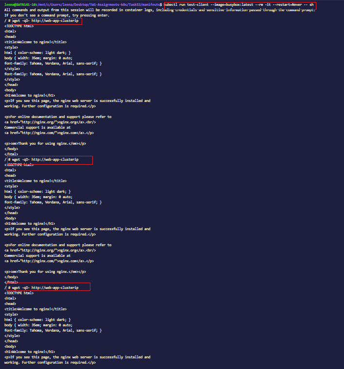


**Answer:**

Yes, the service distributed the traffic across the pods.

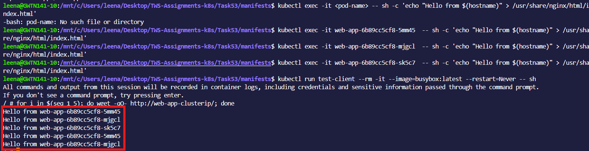


---

### Task 3: Discover Services with DNS
Kubernetes has a built-in DNS server. Every Service gets a DNS entry automatically:

```
<service-name>.<namespace>.svc.cluster.local
```

Test this:
```bash
kubectl run dns-test --image=busybox:latest --rm -it --restart=Never -- sh

# Inside the pod:
# Short name (works within the same namespace)
wget -qO- http://web-app-clusterip

# Full DNS name
wget -qO- http://web-app-clusterip.default.svc.cluster.local

# Look up the DNS entry
nslookup web-app-clusterip
exit
```

Both the short name and the full DNS name resolve to the same ClusterIP. In practice, you use the short name when communicating within the same namespace and the full name when reaching across namespaces.

**Verify:** What IP does `nslookup` return? Does it match the CLUSTER-IP from `kubectl get services`?


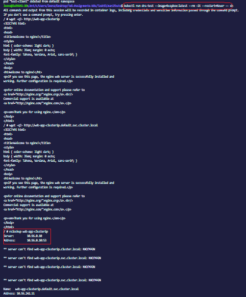 

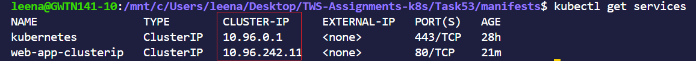 


---

### Task 4: NodePort Service (External Access via Node)
A NodePort Service exposes your application on a port on every node in the cluster. This lets you access the Service from outside the cluster.

Create `nodeport-service.yaml`:

```yaml
apiVersion: v1
kind: Service
metadata:
  name: web-app-nodeport
spec:
  type: NodePort
  selector:
    app: web-app
  ports:
  - port: 80
    targetPort: 80
    nodePort: 30080
```

- `nodePort: 30080` — the port opened on every node (must be in range 30000-32767)
- Traffic flow: `<NodeIP>:30080` -> Service -> Pod:80

```bash
kubectl apply -f nodeport-service.yaml
kubectl get services
```

Access the service:
```bash
# If using Minikube
minikube service web-app-nodeport --url

# If using Kind, get the node IP first
kubectl get nodes -o wide
# Then curl <node-internal-ip>:30080

# If using Docker Desktop
curl http://localhost:30080
```

**Verify:** Can you see the Nginx welcome page from your browser or terminal using the NodePort?

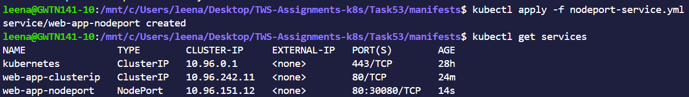 

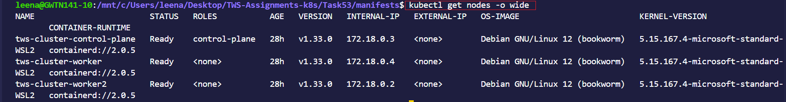 

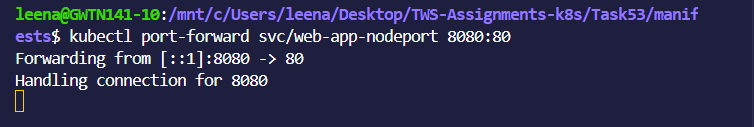 

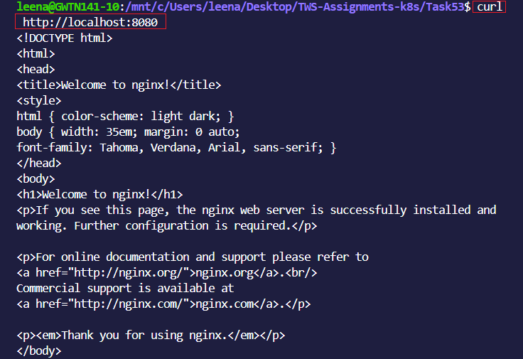 

**Answer**
The nginx page can be viewed from the terminal.
---

### Task 5: LoadBalancer Service (Cloud External Access)
In a cloud environment (AWS, GCP, Azure), a LoadBalancer Service provisions a real external load balancer that routes traffic to your nodes.

Create `loadbalancer-service.yaml`:

```yaml
apiVersion: v1
kind: Service
metadata:
  name: web-app-loadbalancer
spec:
  type: LoadBalancer
  selector:
    app: web-app
  ports:
  - port: 80
    targetPort: 80
```

```bash
kubectl apply -f loadbalancer-service.yaml
kubectl get services
```

On a local cluster (Minikube, Kind, Docker Desktop), the EXTERNAL-IP will show `<pending>` because there is no cloud provider to create a real load balancer. This is expected.

If you are using Minikube:
```bash
# Minikube can simulate a LoadBalancer
minikube tunnel
# In another terminal, check again:
kubectl get services
```

In a real cloud cluster, the EXTERNAL-IP would be a public IP address or hostname provisioned by the cloud provider.

**Verify:** What does the EXTERNAL-IP column show? Why is it `<pending>` on a local cluster?

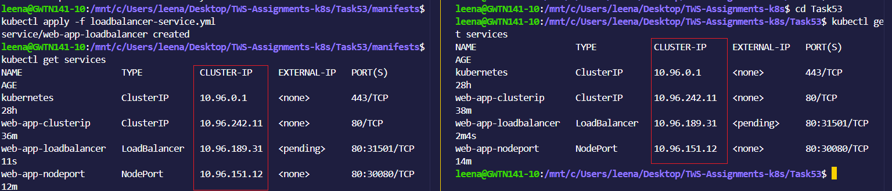 


---

### Task 6: Understand the Service Types Side by Side
Check all three services:

```bash
kubectl get services -o wide
```

Compare them:

| Type | Accessible From | Use Case |
|------|----------------|----------|
| ClusterIP | Inside the cluster only | Internal communication between services |
| NodePort | Outside via `<NodeIP>:<NodePort>` | Development, testing, direct node access |
| LoadBalancer | Outside via cloud load balancer | Production traffic in cloud environments |

Each type builds on the previous one:
- LoadBalancer creates a NodePort, which creates a ClusterIP
- So a LoadBalancer service also has a ClusterIP and a NodePort

Verify this:
```bash
kubectl describe service web-app-loadbalancer
```

You should see all three: a ClusterIP, a NodePort, and the LoadBalancer configuration.

**Verify:** Does the LoadBalancer service also have a ClusterIP and NodePort assigned?

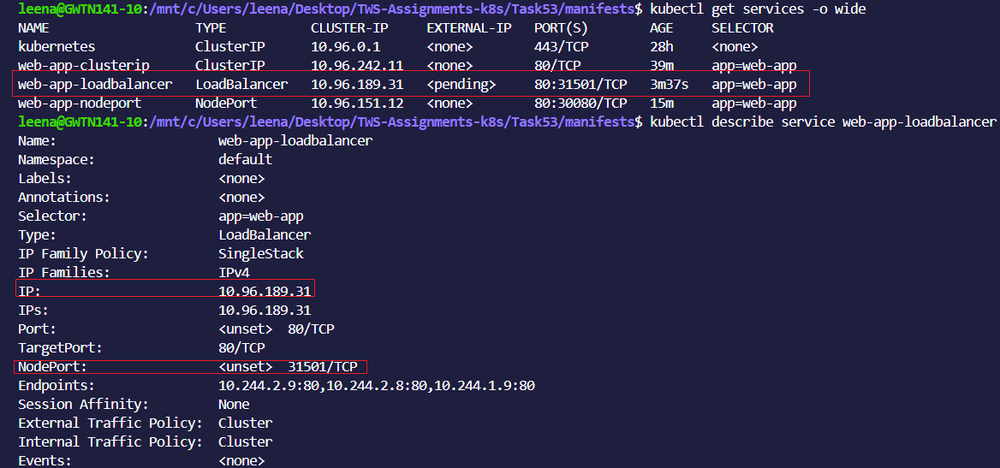 


Yes, Load balancer has both Cluster IP and NodePort.

---

### Task 7: Clean Up
```bash
kubectl delete -f app-deployment.yaml
kubectl delete -f clusterip-service.yaml
kubectl delete -f nodeport-service.yaml
kubectl delete -f loadbalancer-service.yaml

kubectl get pods
kubectl get services
```

Only the built-in `kubernetes` service in the default namespace should remain.

**Verify:** Is everything cleaned up?

Yes, everything has been cleaned up.

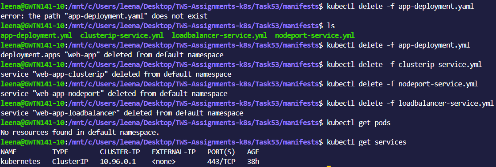 


---


### Documentation

#### Create day-53-services.md with:

- What problem Services solve and how they relate to Pods and Deployments

**Answer**
The pods get new IP address when restarted..They are created,destroyed dynamically by deployment.The service provides a stable IP address(Cluster IP),a stable DNS name and load balancing across the pods.

**Relationship** Services solve the problem of dynamic Pod IPs by providing a stable endpoint and load balancing traffic to Pods managed by Deployments.”


- Your three Service manifests with an explanation of each type
**Answer**
`Cluster ip`
```
apiVersion: v1
kind: Service
metadata:
  name: web-app-clusterip
spec:
  type: ClusterIP
  selector:
    app: web-app
  ports:
    - port: 80
      targetPort: 80

```
- Default service type
- Exposes Pods only inside the cluster
- Not accessible from browser or external users
`Use case:`
- Communication between microservices
- Example: backend ↔ database

`NodePort`
```

apiVersion: v1
kind: Service
metadata:
  name: web-app-nodeport
spec:
  type: NodePort
  selector:
    app: web-app
  ports:
    - port: 80
      targetPort: 80
      nodePort: 30080

```
- Exposes app on a port of the node

- Accessible using:

http://<NODE-IP>:30080
Range: 30000–32767
` Use case:`
- Testing apps externally
- Local Kubernetes setups 
- Mainly used for development and testing

`LoadBalancer Service`
```

apiVersion: v1
kind: Service
metadata:
  name: web-app-loadbalancer
spec:
  type: LoadBalancer
  selector:
    app: web-app
  ports:
    - port: 80
      targetPort: 80


```


- Creates an external load balancer (cloud only)
- Gets a public IP
- Used for production aloowing external traffic
- Also ClusterIP + NodePort

- Accessible like:

http://<EXTERNAL-IP>
` Use case:`
Production apps on cloud (AWS, Azure, GCP)


- The difference between ClusterIP, NodePort, and LoadBalancer


## Difference Between ClusterIP, NodePort, and LoadBalancer

| Feature            | ClusterIP                          | NodePort                                  | LoadBalancer                          |
|------------------|----------------------------------|-------------------------------------------|--------------------------------------|
| Default Type     | Yes (default)                     | No                                        | No                                   |
| Accessibility    | Internal (within cluster only)    | External via Node IP + Port               | External via Public IP               |
| Access Method    | service-name:port                 | http://<NodeIP>:<NodePort>                | http://<External-IP>                 |
| Port Range       | Internal only                     | 30000–32767                               | No restriction                       |
| Use Case         | Internal communication            | Testing / Development                     | Production applications              |
| Internet Access  | No                                | Limited                                   | Yes                                  |
| Load Balancing   | Yes                               | Yes                                       | Yes                                  |
| Cloud Required   | No                                | No                                        | Yes                                  |
| Security         | High (internal only)              | Medium                                    | High (managed by cloud provider)     |
| Complexity       | Low                               | Medium                                    | High                                 |


- How Kubernetes DNS works for service discovery
**Answer**

### Step-by-Step Flow

1. **Deployment creates Pods**
   - Pods are created with labels (e.g., `app: web-app`)
   - Each Pod gets a dynamic IP

2. **Service is created**
   - Service selects Pods using labels
   - Assigns a stable **ClusterIP**

3. **DNS entry is automatically created**
   - Kubernetes DNS (CoreDNS) creates:
     ```
     <service-name>.<namespace>.svc.cluster.local
     ```

4. **Client Pod sends request**
   - Example:
     ```
     http://web-app
     ```

5. **DNS query is triggered**
   - Request goes to CoreDNS

6. **CoreDNS resolves the name**
   - Converts `web-app` → Service ClusterIP

7. **Request reaches the Service**
   - Service receives traffic on its ClusterIP

8. **Service forwards request to Pods**
   - Uses label selector
   - Chooses one Pod (load balancing)

9. **Pod processes the request**
   - Sends response back via Service

10. **Response reaches client Pod**
   - Communication successful without using Pod IPs


- What Endpoints are and how to inspect them

`Endpoints` are the actual pod IPs behind the service as a service doesnot directly store pods..it uses Endpoints.

`Example `
- Service: web-app-clusterip
- Endpoints look like  10.244.0.5:80 , 10.244.0.6:80, 10.244.0.7:80

`Why endpoints matter`They show real backend pods. They update automatically when pods start,stop and restart.

`How to inspect them`
- kubectl get endpoint

- kubectl describe endpoints web-app-clusterip


