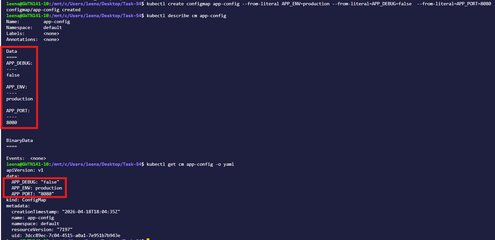
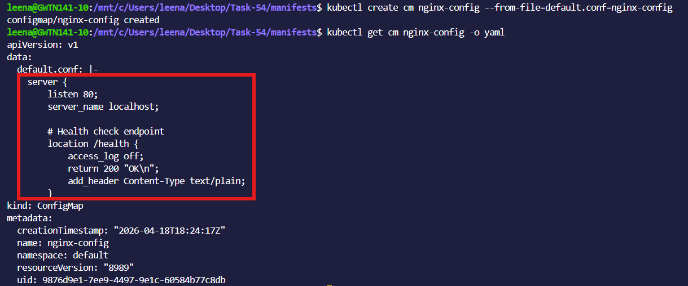
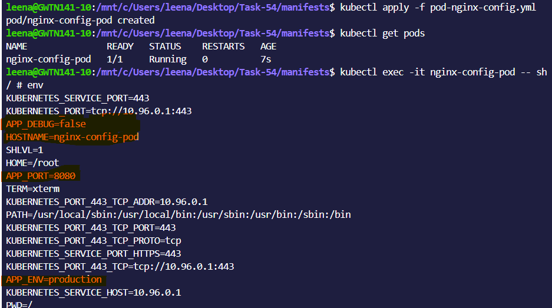
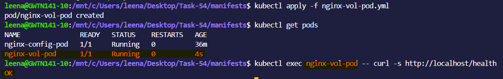
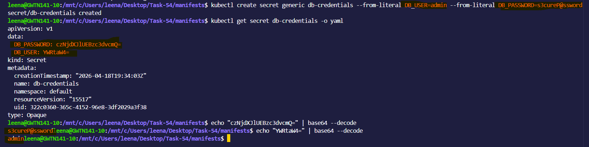
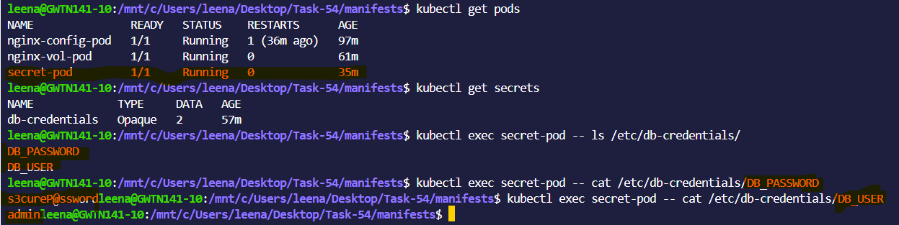
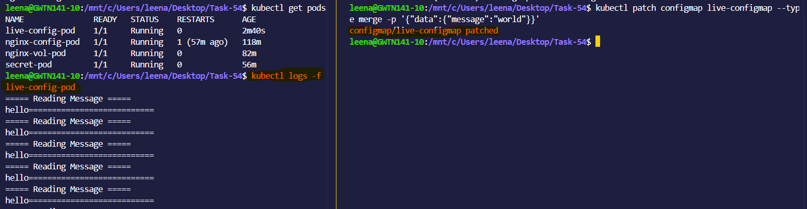
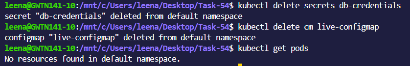

# Day 54 – Kubernetes ConfigMaps and Secrets

## Challenge Tasks

### Task 1: Create a ConfigMap from Literals
1. Use `kubectl create configmap` with `--from-literal` to create a ConfigMap called `app-config` with keys `APP_ENV=production`, `APP_DEBUG=false`, and `APP_PORT=8080`
2. Inspect it with `kubectl describe configmap app-config` and `kubectl get configmap app-config -o yaml`
3. Notice the data is stored as plain text — no encoding, no encryption

**Verify:** Can you see all three key-value pairs?

- Yes,all 3 key-value pairs are visible in plain text
- No encoding, no encryption

---

### Task 2: Create a ConfigMap from a File
1. Write a custom Nginx config file that adds a `/health` endpoint returning "healthy"
2. Create a ConfigMap from this file using `kubectl create configmap nginx-config --from-file=default.conf=<your-file>`
3. The key name (`default.conf`) becomes the filename when mounted into a Pod

**Verify:** Does `kubectl get configmap nginx-config -o yaml` show the file contents?

- Yes file contents are fully visible in YAML

---

### Task 3: Use ConfigMaps in a Pod
1. Write a Pod manifest that uses `envFrom` with `configMapRef` to inject all keys from `app-config` as environment variables. Use a busybox container that prints the values.
2. Write a second Pod manifest that mounts `nginx-config` as a volume at `/etc/nginx/conf.d`. Use the nginx image.
3. Test that the mounted config works: `kubectl exec <pod> -- curl -s http://localhost/health`

Use environment variables for simple key-value settings. Use volume mounts for full config files.

**Verify:** Does the `/health` endpoint respond?

- Yes,/health endpoint respond

---

### Task 4: Create a Secret
1. Use `kubectl create secret generic db-credentials` with `--from-literal` to store `DB_USER=admin` and `DB_PASSWORD=s3cureP@ssw0rd`
2. Inspect with `kubectl get secret db-credentials -o yaml` — the values are base64-encoded
3. Decode a value: `echo '<base64-value>' | base64 --decode`

**base64 is encoding, not encryption.** Anyone with cluster access can decode Secrets. The real advantages are RBAC separation, tmpfs storage on nodes, and optional encryption at rest.

**Verify:** Can you decode the password back to plaintext?

- Yes, decode the password back to plaintext

---

### Task 5: Use Secrets in a Pod
1. Write a Pod manifest that injects `DB_USER` as an environment variable using `secretKeyRef`
2. In the same Pod, mount the entire `db-credentials` Secret as a volume at `/etc/db-credentials` with `readOnly: true`
3. Verify: each Secret key becomes a file, and the content is the decoded plaintext value

**Verify:** Are the mounted file values plaintext or base64?
- Mounted file values planintext

---

### Task 6: Update a ConfigMap and Observe Propagation
1. Create a ConfigMap `live-config` with a key `message=hello`
2. Write a Pod that mounts this ConfigMap as a volume and reads the file in a loop every 5 seconds
3. Update the ConfigMap: `kubectl patch configmap live-config --type merge -p '{"data":{"message":"world"}}'`
4. Wait 30-60 seconds — the volume-mounted value updates automatically
5. Environment variables from earlier tasks do NOT update — they are set at pod startup only

**Verify:** Did the volume-mounted value change without a pod restart?

- Yes, the volume-mounted value does change without restarting the Pod.

---

### Task 7: Clean Up
Delete all pods, ConfigMaps, and Secrets you created.

---

**What ConfigMaps and Secrets are and when to use each**

- `ConfigMap` stores non-sensitive data (e.g., config, URLs)
- `Secret` stores sensitive data (e.g., passwords, tokens)
- Secrets use base64 (not secure by itself)

**The difference between environment variables and volume mounts**

`Environment Variables:`
- Injected at Pod startup
- Do NOT update if ConfigMap/Secret changes

`Volume Mounts:`
- Data is available as files inside container
- Auto-updates (after ~30–60 seconds)

**Why base64 is encoding, not encryption**

- Base64 is just encoding, not secure
- It can be easily decoded by anyone (no key needed)
- In `Kubernetes Secrets:`
  - Data is base64 only for safe storage in YAML
  - Anyone with access can decode it

**How ConfigMap updates propagate to volumes but not env vars**

- `ConfigMap as volume` updates automatically without restart
- `ConfigMap as env var` stays same until Pod restart