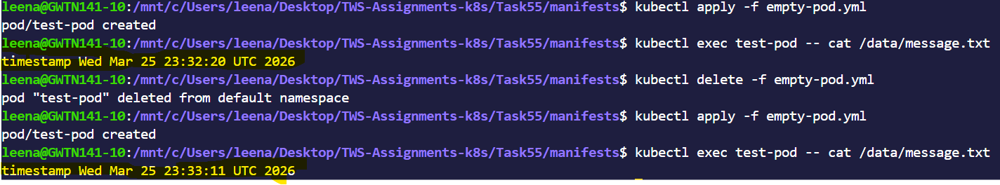
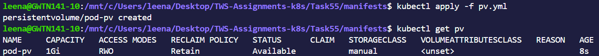
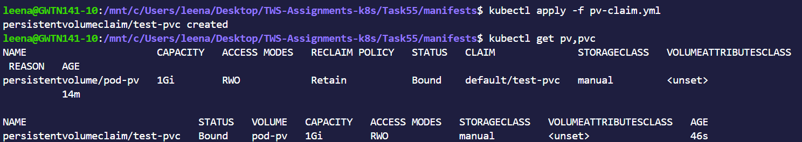
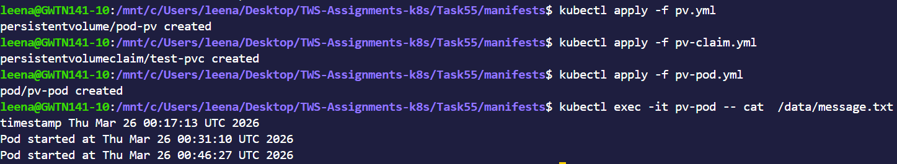
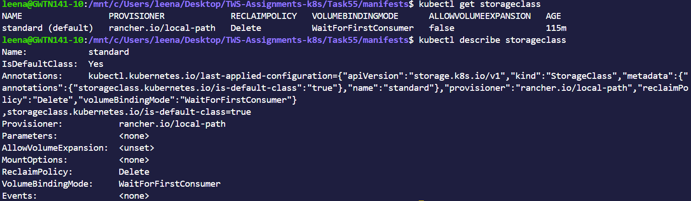
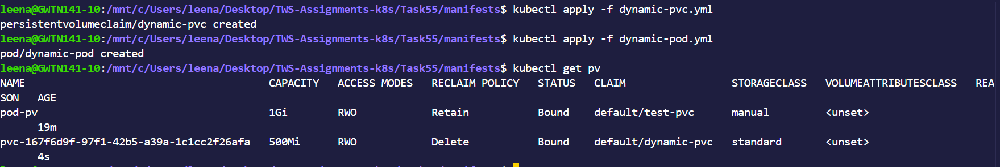
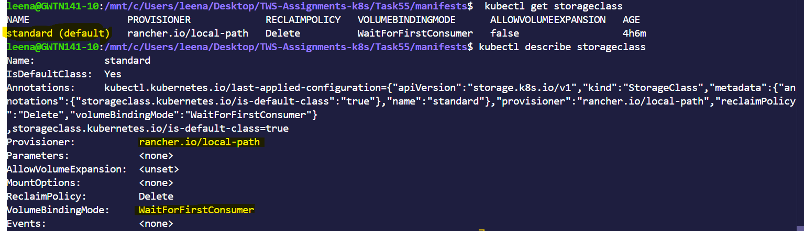

# Day 55 – Persistent Volumes (PV) and Persistent Volume Claims (PVC)

## Challenge Tasks

### Task 1: See the Problem — Data Lost on Pod Deletion
1. Write a Pod manifest that uses an `emptyDir` volume and writes a timestamped message to `/data/message.txt`
2. Apply it, verify the data exists with `kubectl exec`
3. Delete the Pod, recreate it, check the file again — the old message is gone

**Verify:** Is the timestamp the same or different after recreation?

- Yes,timstamp is different after recreation

---

### Task 2: Create a PersistentVolume (Static Provisioning)
1. Write a PV manifest with `capacity: 1Gi`, `accessModes: ReadWriteOnce`, `persistentVolumeReclaimPolicy: Retain`, and `hostPath` pointing to `/tmp/k8s-pv-data`
2. Apply it and check `kubectl get pv` — status should be `Available`

Access modes to know:
- `ReadWriteOnce (RWO)` — read-write by a single node
- `ReadOnlyMany (ROX)` — read-only by many nodes
- `ReadWriteMany (RWX)` — read-write by many nodes

`hostPath` is fine for learning, not for production.

**Verify:** What is the STATUS of the PV?

- Status of the PV is `Available`

---

### Task 3: Create a PersistentVolumeClaim
1. Write a PVC manifest requesting `500Mi` of storage with `ReadWriteOnce` access
2. Apply it and check both `kubectl get pvc` and `kubectl get pv`
3. Both should show `Bound` — Kubernetes matched them by capacity and access mode

**Verify:** What does the VOLUME column in `kubectl get pvc` show?

- The VOLUME column in kubectl get pvc shows the name of the PersistentVolume (PV) that the PersistentVolumeClaim (PVC) is bound to.

---

### Task 4: Use the PVC in a Pod — Data That Survives
1. Write a Pod manifest that mounts the PVC at `/data` using `persistentVolumeClaim.claimName`
2. Write data to `/data/message.txt`, then delete and recreate the Pod
3. Check the file — it should contain data from both Pods

**Verify:** Does the file contain data from both the first and second Pod?

- Yes, the file contains data from both the first and second pods.

---

### Task 5: StorageClasses and Dynamic Provisioning
1. Run `kubectl get storageclass` and `kubectl describe storageclass`
2. Note the provisioner, reclaim policy, and volume binding mode
3. With dynamic provisioning, developers only create PVCs — the StorageClass handles PV creation automatically

**Verify:** What is the default StorageClass in your cluster?

- `Default StorageClass:` `standard` This is the automatically used storage when no class is specified in a PVC
- `Provisioner:` `rancher.io/local-path` Uses local node storage to create volumes
- `Reclaim Policy:` `Delete` Storage is deleted automatically when the PVC is deleted
- `Volume Binding Mode:` `WaitForFirstConsumer` Volume is created only when a Pod actually uses it

---

### Task 6: Dynamic Provisioning
1. Write a PVC manifest that includes `storageClassName: standard` (or your cluster's default)
2. Apply it — a PV should appear automatically in `kubectl get pv`
3. Use this PVC in a Pod, write data, verify it works

**Verify:** How many PVs exist now? Which was manual, which was dynamic?

- 2 Pvs exist now
- `manual` test-pv
- `dynamic` dynamic-provsioning

---

### Task 7: Clean Up
1. Delete all pods first
2. Delete PVCs — check `kubectl get pv` to see what happened
3. The dynamic PV is gone (Delete reclaim policy). The manual PV shows `Released` (Retain policy).
4. Delete the remaining PV manually

**Verify:** Which PV was auto-deleted and which was retained? Why?

`Auto-deleted PV`: `pvc-c8e38f7a-b74c-44a0-89a2-b82e8ed5e7ed`

`Why:` It was dynamically provisioned and had a Reclaim Policy = Delete, so Kubernetes automatically deletes the PV when the associated PVC is deleted.

`Retained PV`: `test-pv`

`Why:` It was manually created and had a Reclaim Policy = Retain, so Kubernetes keeps the PV even after the PVC is deleted to prevent accidental data loss.

---

**Why containers need persistent storage**

- Containers are `ephemeral`,so any data inside them is lost on restart.
- `Persistent storage` keeps data outside the container lifecycle for databases, logs, or user files.

**What PVs and PVCs are and how they relate**

`PersistentVolume (PV)`
- A piece of storage in the cluster.
- The admin can allocate storage manually or automatically

`PersistentVolumeClaim (PVC)`
- A request for storage by a user
- Specifies size, access mode, storage class.
- Kubernetes binds a PVC to a PV that matches its request.

`Relation:` PVC requests storage -> bound to a PV -> pod uses PVC to access storage.

**Static vs dynamic provisioning**

`Static Provisioning`
- PV is created manually by admin before the PVC exists.
- PVC claims it later.

`Dynamic Provisioning`
- PV is created automatically when a PVC is created,using a StorageClass.
- Saves time and avoids manual PV management.

`Example` PVC with storageClassName: standard -> Kubernetes automatically provisions a PV.

**Access modes and reclaim policies**

| Mode                    | Meaning                                  | Use Case                         |
| ----------------------- | ---------------------------------------- | -------------------------------- |
| **ReadWriteOnce** | Mounted **read-write by a single node**  | Most databases                   |
| **ReadOnlyMany**  | Mounted **read-only by multiple nodes**  | Config files, shared static data |
| **ReadWriteMany** | Mounted **read-write by multiple nodes** | Shared storage for multiple pods |

| Policy      | What happens when PVC is deleted       | 
| ----------- | -------------------------------------- | 
| **Delete**  | PV is automatically deleted            |               
| **Retain**  | PV is kept (data persists)             |

---
