# Day 57 – Resource Requests, Limits, and Probes

## Challenge Tasks

### Task 1: Resource Requests and Limits
1. Write a Pod manifest with `resources.requests` (cpu: 100m, memory: 128Mi) and `resources.limits` (cpu: 250m, memory: 256Mi)
2. Apply and inspect with `kubectl describe pod` — look for the Requests, Limits, and QoS Class sections
3. Since requests and limits differ, the QoS class is `Burstable`. If equal, it would be `Guaranteed`. If missing, `BestEffort`.

CPU is in millicores: `100m` = 0.1 CPU. Memory is in mebibytes: `128Mi`.

**Requests** = guaranteed minimum (scheduler uses this for placement). **Limits** = maximum allowed (kubelet enforces at runtime).

**Verify:** What QoS class does your Pod have?

- Pod have Qos Class `Burstable` 

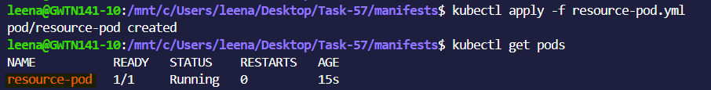

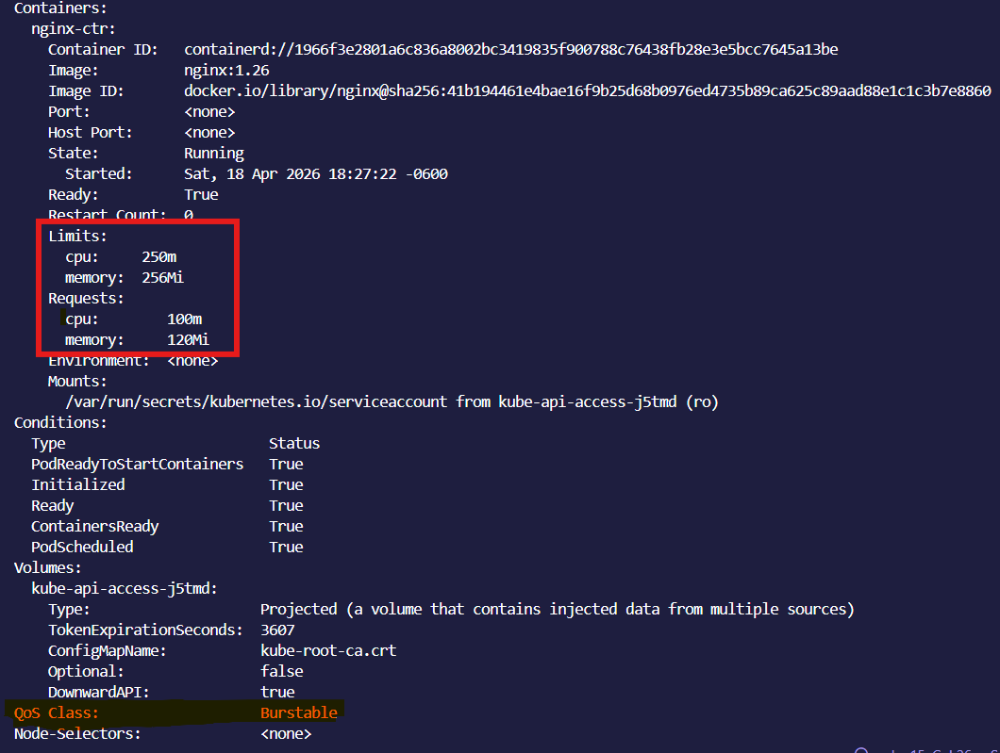

---

### Task 2: OOMKilled — Exceeding Memory Limits
1. Write a Pod manifest using the `polinux/stress` image with a memory limit of `100Mi`
2. Set the stress command to allocate 200M of memory: `command: ["stress"] args: ["--vm", "1", "--vm-bytes", "200M", "--vm-hang", "1"]`
3. Apply and watch — the container gets killed immediately

CPU is throttled when over limit. Memory is killed — no mercy.

Check `kubectl describe pod` for `Reason: OOMKilled` and `Exit Code: 137` (128 + SIGKILL).

**Verify:** What exit code does an OOMKilled container have?

- An OOMKilled container exits with code 137

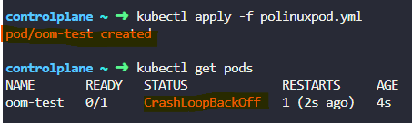

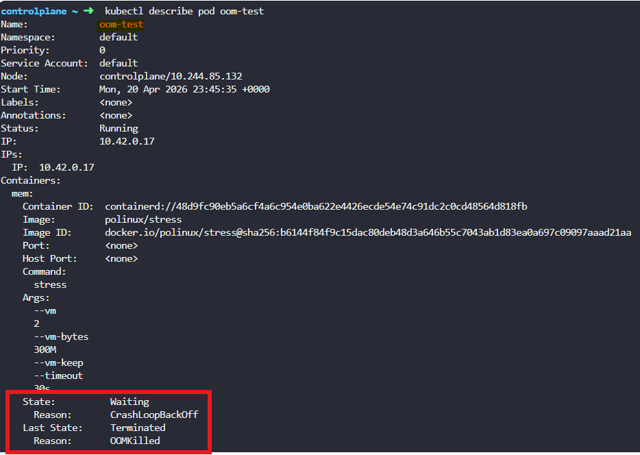

---

### Task 3: Pending Pod — Requesting Too Much
1. Write a Pod manifest requesting `cpu: 100` and `memory: 128Gi`
2. Apply and check — STATUS stays `Pending` forever
3. Run `kubectl describe pod` and read the Events — the scheduler says exactly why: insufficient resources

**Verify:** What event message does the scheduler produce?

- 0/3 nodes are available: Insufficient cpu, Insufficient memory

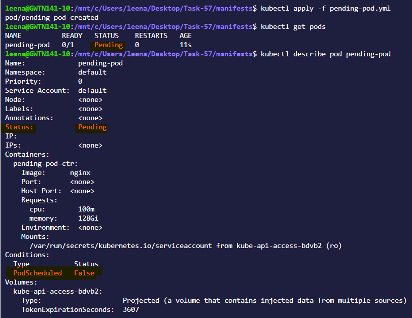

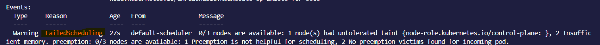
---

### Task 4: Liveness Probe
A liveness probe detects stuck containers. If it fails, Kubernetes restarts the container.

1. Write a Pod manifest with a busybox container that creates `/tmp/healthy` on startup, then deletes it after 30 seconds
2. Add a liveness probe using `exec` that runs `cat /tmp/healthy`, with `periodSeconds: 5` and `failureThreshold: 3`
3. After the file is deleted, 3 consecutive failures trigger a restart. Watch with `kubectl get pod -w`

**Verify:** How many times has the container restarted?
- 4 times container restarted

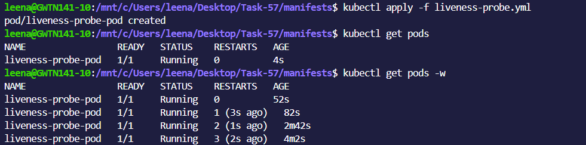

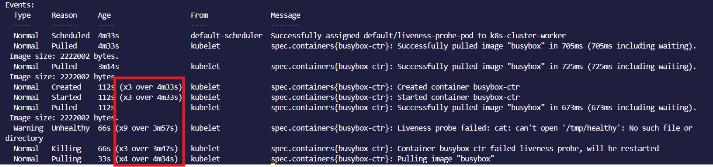

---

### Task 5: Readiness Probe
A readiness probe controls traffic. Failure removes the Pod from Service endpoints but does NOT restart it.

1. Write a Pod manifest with nginx and a `readinessProbe` using `httpGet` on path `/` port `80`
2. Expose it as a Service: `kubectl expose pod <name> --port=80 --name=readiness-svc`
3. Check `kubectl get endpoints readiness-svc` — the Pod IP is listed
4. Break the probe: `kubectl exec <pod> -- rm /usr/share/nginx/html/index.html`
5. Wait 15 seconds — Pod shows `0/1` READY, endpoints are empty, but the container is NOT restarted

**Verify:** When readiness failed, was the container restarted?

- No, the container was NOT restarted.

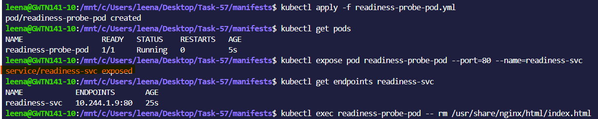

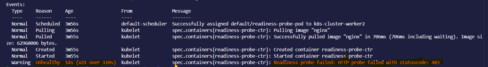

---

### Task 6: Startup Probe
A startup probe gives slow-starting containers extra time. While it runs, liveness and readiness probes are disabled.

1. Write a Pod manifest where the container takes 20 seconds to start (e.g., `sleep 20 && touch /tmp/started`)
2. Add a `startupProbe` checking for `/tmp/started` with `periodSeconds: 5` and `failureThreshold: 12` (60 second budget)
3. Add a `livenessProbe` that checks the same file — it only kicks in after startup succeeds

**Verify:** What would happen if `failureThreshold` were 2 instead of 12?

- If `failureThreshold` is set to `2`,the startup probe allows only 10 seconds (2 × 5s) for the container to start.
- Since the container takes 20 seconds to start, the startupProbe will fail before the app is ready,causing Kubernetes to restart the container repeatedly.

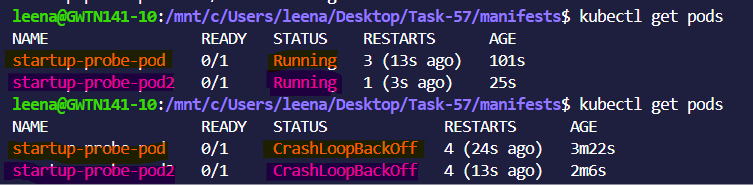

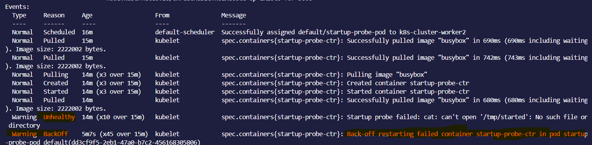

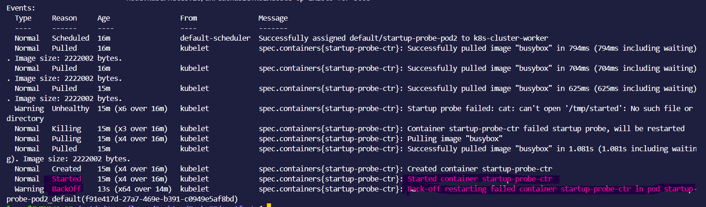

**Explanition**

---

### Task 7: Clean Up
Delete all pods and services you created.

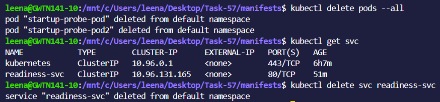

---

**Requests vs limits (scheduling vs enforcement)**

`Requests`
 - Used by Kubernetes scheduler to decide where to place the Pod
 - Guarantees minimum resources

`Limits`
 - Enforced by container runtime
 - Prevents container from using more than defined resources

**What happens when CPU or memory limits are exceeded**

`CPU limit exceeded`
- Container is throttled (slowed down, not killed)

`Memory limit exceeded`
- Container is killed (OOMKilled) and restarted

**Liveness vs readiness vs startup probes**

| Probe Type          | Purpose                        | When it Runs           | If it Fails                       | Simple Meaning            |
| ------------------- | ------------------------------ | ---------------------- | --------------------------------- | ------------------------- |
| **Startup Probe**   | Check if app has started       | At container startup   | Container is restarted            | “Has app started?”        |
| **Liveness Probe**  | Check if app is still alive    | After startup succeeds | Container is restarted            | “Is app alive?”           |
| **Readiness Probe** | Check if app can serve traffic | Throughout lifecycle   | Removed from service (no traffic) | “Is app ready for users?” |

---