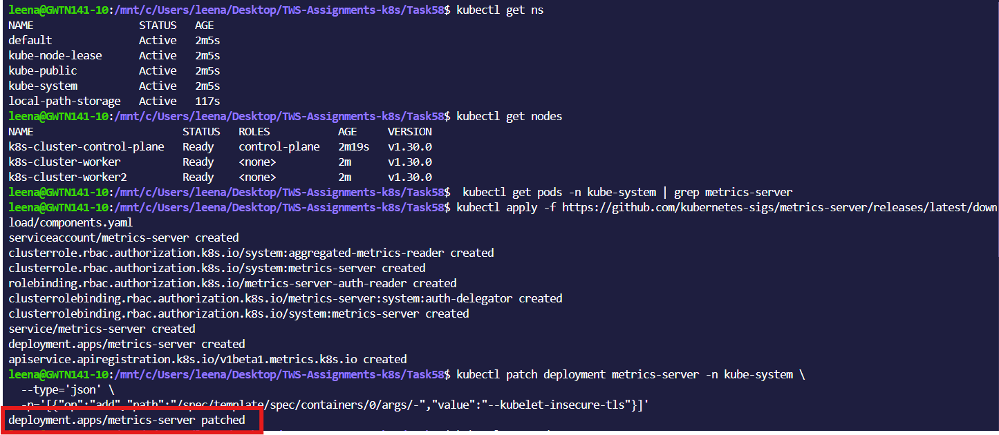
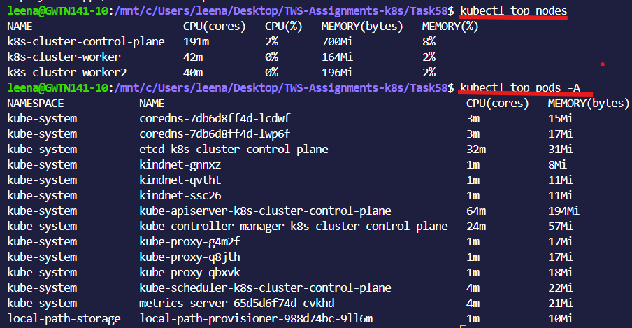
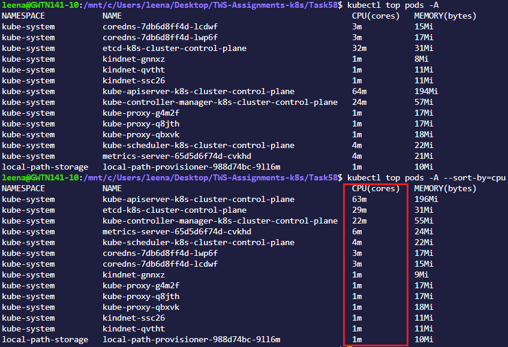
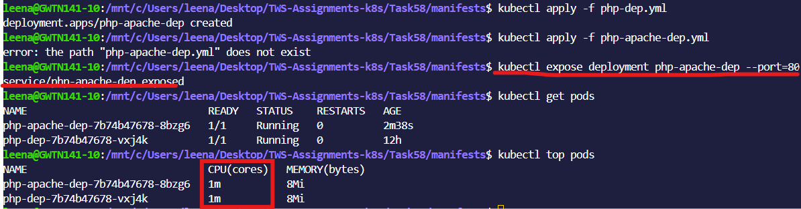
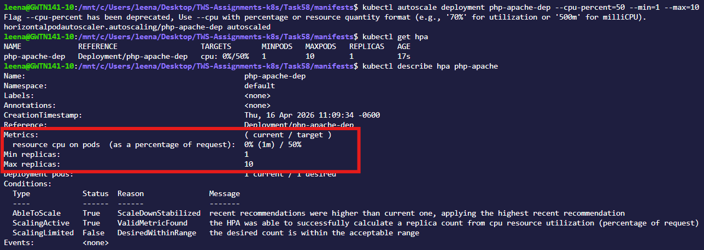
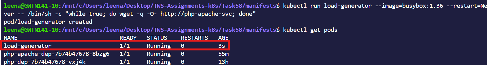
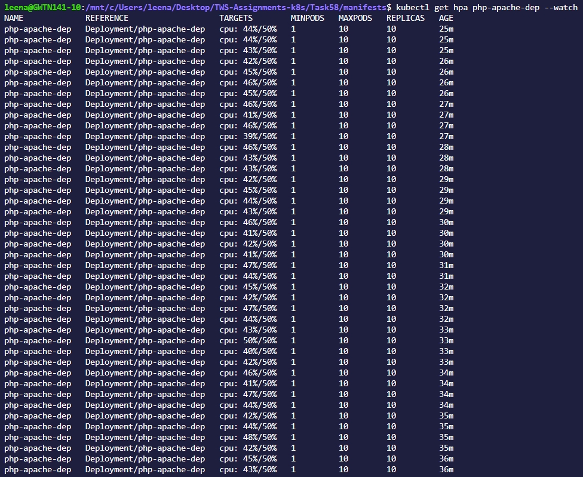
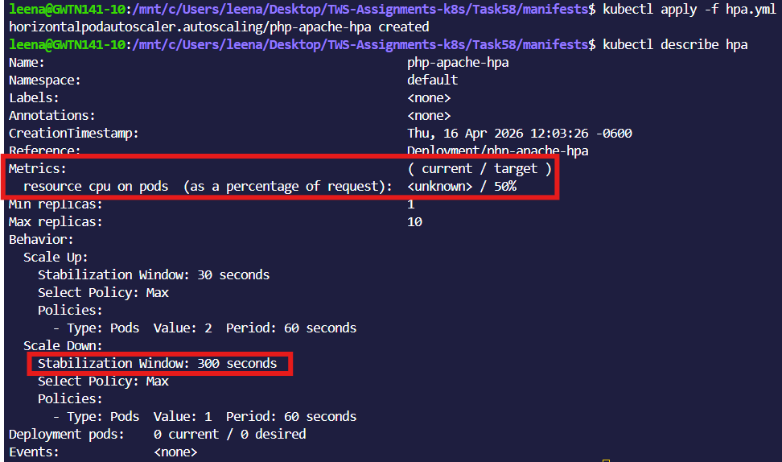
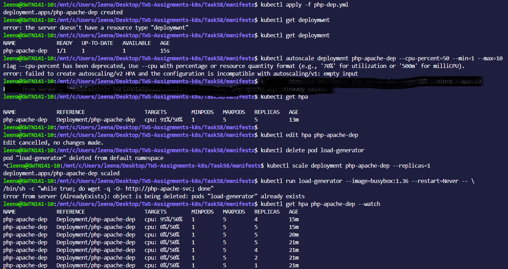
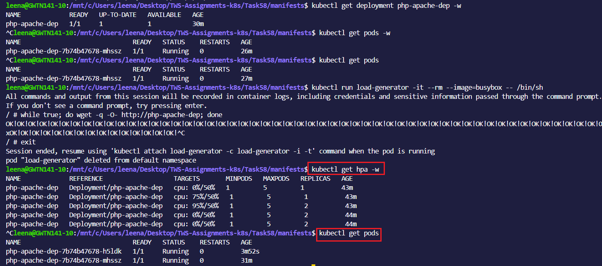

# Day 58 – Metrics Server and Horizontal Pod Autoscaler (HPA)
---
## Challenge Tasks

The following formula is used to calculate for **CPU Utilization**
**CPU utilization % = (current CPU / requested CPU) × 100**

### Task 1: Install the Metrics Server
1. Check if it is already running: `kubectl get pods -n kube-system | grep metrics-server`
2. If not, install it:
   - Minikube: `minikube addons enable metrics-server`
   - Kind/kubeadm: apply the official manifest from the metrics-server GitHub releases
3. On local clusters, you may need the `--kubelet-insecure-tls` flag (never in production)
4. Wait 60 seconds, then verify: `kubectl top nodes` and `kubectl top pods -A`

**Verify:** What is the current CPU and memory usage of your node?

- Current node utilization is low: CPU usage is 0–2% and memory usage is 2–8% across nodes.

---

### Task 2: Explore kubectl top
1. Run `kubectl top nodes`, `kubectl top pods -A`, `kubectl top pods -A --sort-by=cpu`
2. `kubectl top` shows real-time usage, not requests or limits — these are different things
3. Data comes from the Metrics Server, which polls kubelets every 15 seconds

**Verify:** Which pod is using the most CPU right now?

- `kube-apiserver-devops-cluster-control-plane` Pod using the most CPU

---

### Task 3: Create a Deployment with CPU Requests
1. Write a Deployment manifest using the `registry.k8s.io/hpa-example` image (a CPU-intensive PHP-Apache server)
2. Set `resources.requests.cpu: 200m` — HPA needs this to calculate utilization percentages
3. Expose it as a Service: `kubectl expose deployment php-apache --port=80`

Without CPU requests, HPA cannot work — this is the most common HPA setup mistake.

**Verify:** What is the current CPU usage of the Pod?
- Current CPU Usage is: 1m

.png)

---

### Task 4: Create an HPA (Imperative)
1. Run: `kubectl autoscale deployment php-apache --cpu=50 --min=1 --max=10`
2. Check: `kubectl get hpa` and `kubectl describe hpa php-apache`
3. TARGETS may show `<unknown>` initially — wait 30 seconds for metrics to arrive

This scales up when average CPU exceeds 50% of requests, and down when it drops below.

**Verify:** What does the TARGETS column show?
- `TARGETS column show:` current usage (1m) vs desired target(50m)

---

### Task 5: Generate Load and Watch Autoscaling
1. Start a load generator: `kubectl run load-generator --image=busybox:1.36 --restart=Never -- /bin/sh -c "while true; do wget -q -O- http://php-apache; done"`
2. Watch HPA: `kubectl get hpa php-apache --watch`
3. Over 1-3 minutes, CPU climbs above 50%, replicas increase, CPU stabilizes
4. Stop the load: `kubectl delete pod load-generator`
5. Scale-down is slow (5-minute stabilization window) — you do not need to wait

**Verify:** How many replicas did HPA scale to under load?
- It scaled to max=10 replicas under load.

- `after load removed`

---

### Task 6: Create an HPA from YAML (Declarative)
1. Delete the imperative HPA: `kubectl delete hpa php-apache`
2. Write an HPA manifest using `autoscaling/v2` API with CPU target at 50% utilization
3. Add a `behavior` section to control scale-up speed (no stabilization) and scale-down speed (300 second window)
4. Apply and verify with `kubectl describe hpa`

`autoscaling/v2` supports multiple metrics and fine-grained scaling behavior that the imperative command cannot configure.

**Verify:** What does the `behavior` section control?

- The behavior section controls how the HPA scales pods up and down.
- `Stabilization window:` how long to wait before scaling up or down
- `Policies:` limit how many pods can be added or removed
- `Percent:` scale based on percentage
- `Pods:` scale by a fixed number
- `periodSeconds:` minimum time between scaling actions

---

### Task 7: Clean Up
Delete the HPA, Service, Deployment, and load-generator pod. Leave the Metrics Server installed.

---

**What the Metrics Server is and why HPA needs it**

- Metrics Server collects real-time CPU and memory usage from nodes and pods.
- HPA uses this data to decide when to scale pods up or down based on actual resource usage.

**How HPA calculates desired replicas**

- desiredReplicas = ceil(currentReplicas * (currentUsage / targetUsage))

**The difference between `autoscaling/v1` and `v2`**

`autoscaling/v1`
- Supports only CPU-based scaling
- Basic configuration

`autoscaling/v2`
- Supports multiple metrics (CPU,memory,custom)
- Advanced behavior control (scale-up/down rules)

---