# Day 59 – Helm — Kubernetes Package Manager
---

## Challenge Tasks

### Task 1: Install Helm
1. Install Helm (brew, curl script, or chocolatey depending on your OS)

```bash
curl -LO https://get.helm.sh/helm-v4.1.3-linux-amd64.tar.gz
tar -zxvf helm-v4.1.3-linux-amd64.tar.gz
sudo mv linux-amd64/helm /usr/local/bin/helm
```
2. Verify with `helm version` and `helm env`

Three core concepts:
- **Chart** — a package of Kubernetes manifest templates
- **Release** — a specific installation of a chart in your cluster
- **Repository** — a collection of charts (like a package repo)

**Verify:** What version of Helm is installed?
- v4.1.3

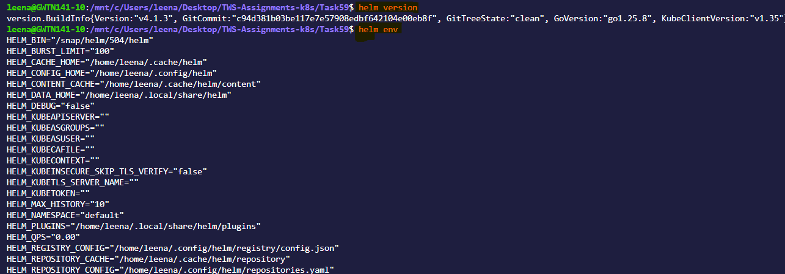
---

### Task 2: Add a Repository and Search
1. Add the Bitnami repository: `helm repo add bitnami https://charts.bitnami.com/bitnami`
2. Update: `helm repo update`
3. Search: `helm search repo nginx` and `helm search repo bitnami`

**Verify:** How many charts does Bitnami have?


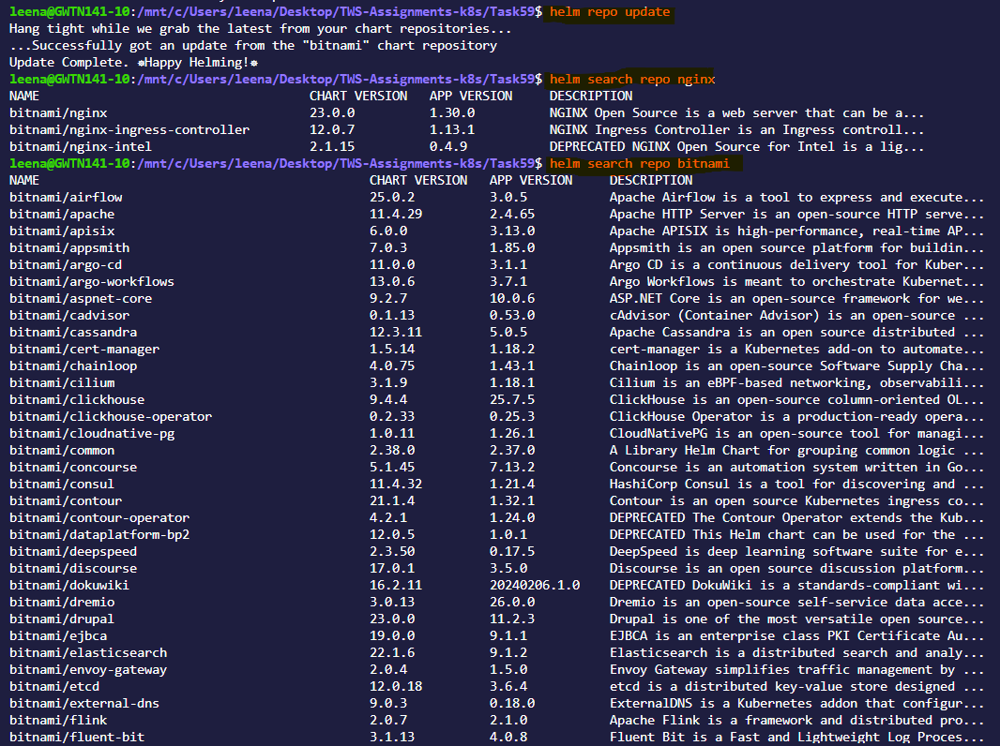


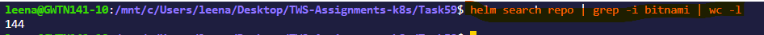

---

### Task 3: Install a Chart
1. Deploy nginx: `helm install my-nginx bitnami/nginx`

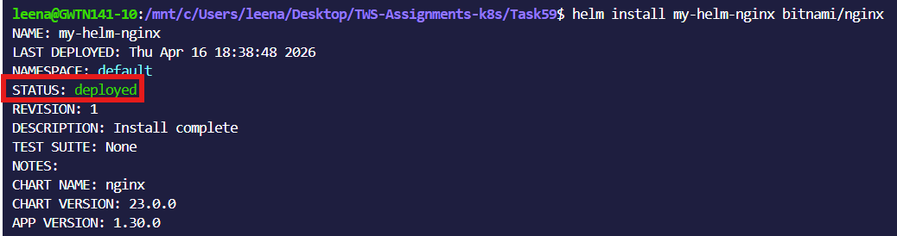

2. Check what was created: `kubectl get all`

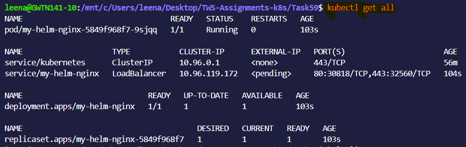

3. Inspect the release: `helm list`, `helm status my-nginx`, `helm get manifest my-nginx`

- `helm list` Lists all Helm releases in the current namespace
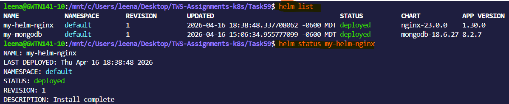


- `helm status my-nginx` Shows the current status (deployed, failed, etc.) of the my-nginx


- `helm get manifest my-nginx` Displays the Kubernetes YAML manifests generated for the my-nginx release

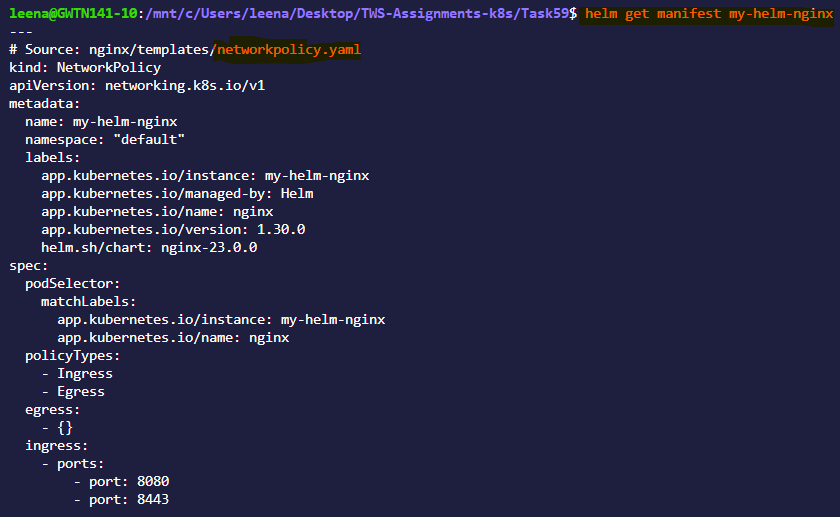


One command replaced writing a Deployment, Service, and ConfigMap by hand.

**Verify:** How many Pods are running? What Service type was created?

- One pod is running, LoadBalancer service type is created.

---

### Task 4: Customize with Values
1. View defaults: `helm show values bitnami/nginx`
2. Install a custom release with `--set replicaCount=3 --set service.type=NodePort`

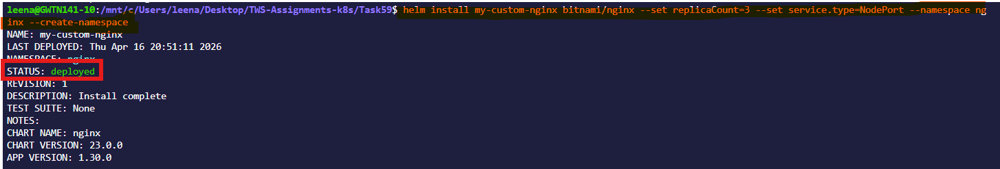


1. Create a `custom-values.yaml` file with replicaCount, service type, and resource limits
2. Install another release using `-f custom-values.yaml`

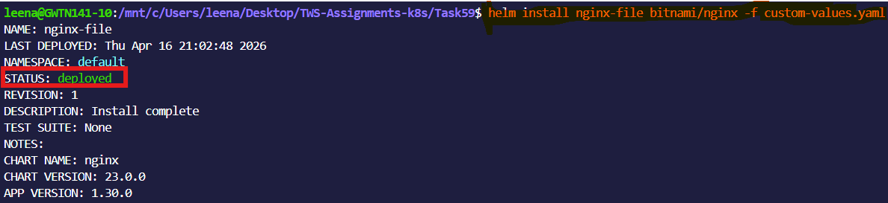

5. Check overrides: `helm get values <release-name>`

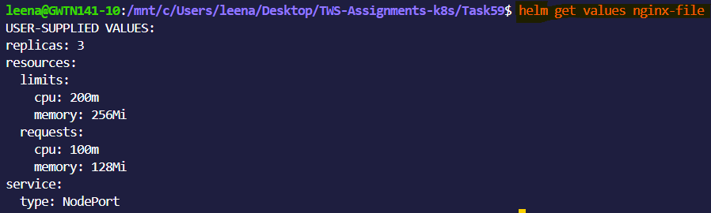

**Verify:** Does the values file release have the correct replicas and service type? 
- Yes
---

### Task 5: Upgrade and Rollback
1. Upgrade: `helm upgrade my-nginx bitnami/nginx --set replicaCount=5`

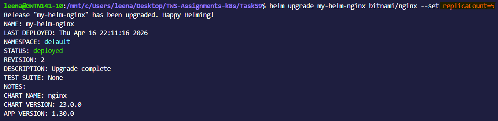

2. Check history: `helm history my-nginx`
3. Rollback: `helm rollback my-nginx 1`
4. Check history again — rollback creates a new revision (3), not overwriting revision 2

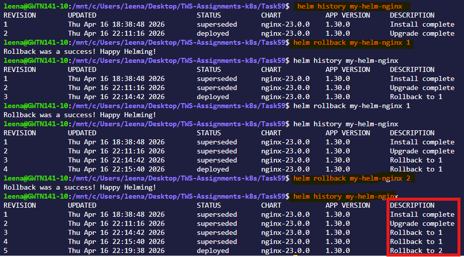

Same concept as Deployment rollouts from Day 52, but at the full stack level.

**Verify:** How many revisions after the rollback?
- 3 revisions
---

### Task 6: Create Your Own Chart
1. Scaffold: `helm create my-app`
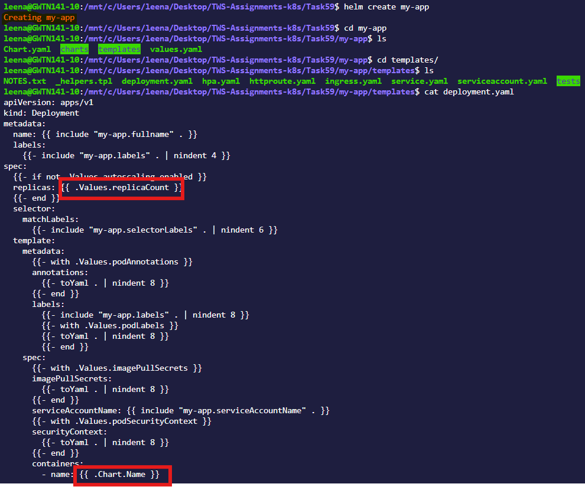
2. Explore the directory: `Chart.yaml`, `values.yaml`, `templates/deployment.yaml`


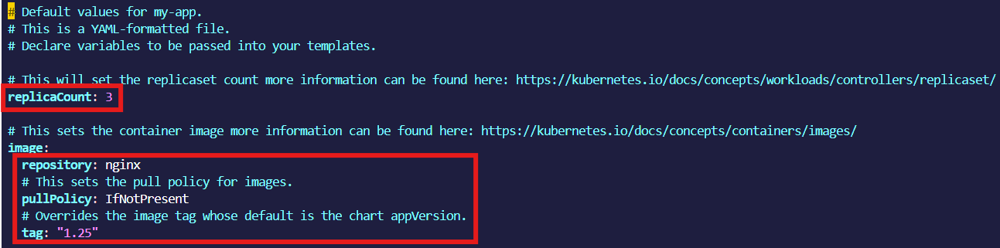

3. Look at the Go template syntax in templates: `{{ .Values.replicaCount }}`, `{{ .Chart.Name }}`

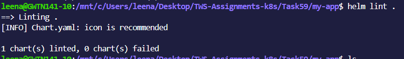

4. Edit `values.yaml` — set replicaCount to 3 and image to nginx:1.25
5. Validate: `helm lint my-app`


6. Preview: `helm template my-release ./my-app`
7. Install: `helm install my-release ./my-app`
8. Upgrade: `helm upgrade my-release ./my-app --set replicaCount=5`

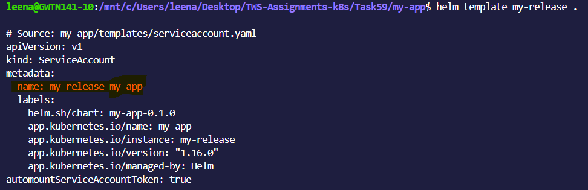

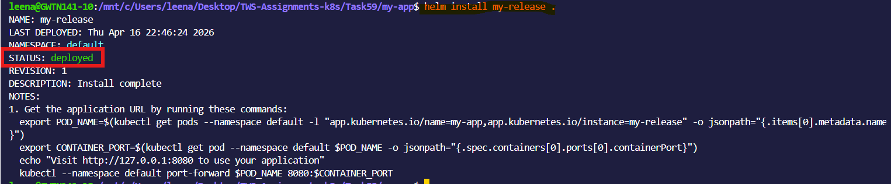


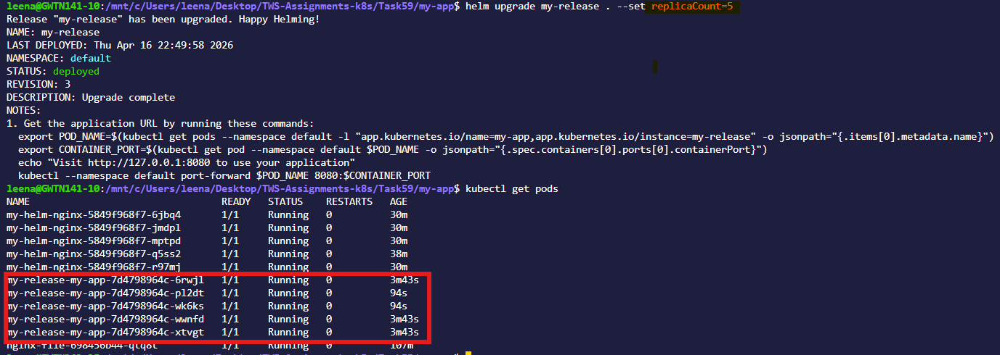

**Verify:** After installing, 3 replicas? After upgrading, 5?
- Yes
---

### Task 7: Clean Up
1. Uninstall all releases: `helm uninstall <name>` for each
2. Remove chart directory and values file
3. Use `--keep-history` if you want to retain release history for auditing

**Verify:** Does `helm list` show zero releases?
- Yes

---

`What Helm is and the three core concepts`
  - Helm package manager for Kubernetes applications includes templating and lifecycle management functionality.
  - It is a package manager for Kubernetes manifests (such as Deployments, ConfigMaps, Services, etc.)

`Three core concepts:`
    - **Chart** — a package of Kubernetes manifest templates
    - **Release** — a specific installation of a chart in your cluster
    - **Repository** — a collection of charts (like a package repo)


**How to install, customize, upgrade, and rollback**

1. `Install`
```bash
helm install my-app ./my-chart
```
`With custom values:`
```bash
helm install my-app ./my-chart -f values.yaml
```
1. `Customize`

`Method 1: values.yaml`
```bash
replicaCount: 3

image:
  repository: nginx
  tag: "1.25"
```
`Method 2: CLI override`
```bash
helm install my-app ./my-chart \
  --set replicaCount=5 \
  --set image.tag=latest
```
3. `Upgrade`
```bash
helm upgrade my-app ./my-chart -f values.yaml
```
`Helm tracks changes and applies only diffs.`

4. `Rollback`
```bash
helm rollback my-app 1
```
`Check revisions:`
```bash
helm history my-app
```


**The structure of a Helm chart and how Go templating works**
```bash
nginx-chart/
├── Chart.yaml
├── values.yaml
├── charts/
├── templates/
│   ├── deployment.yaml
│   ├── service.yaml
│   ├── _helpers.tpl
│   └── ingress.yaml
└── .helmignore
```

`Chart.yaml` metadata

`values.yaml` (default config) This is where all configurable variables live.

`templates/` Contains Kubernetes manifests with Go templating

`charts/` Used for dependencies (subcharts)

`Go templating in Helm`
- Helm uses Go-based templates to turn parameterized files into valid Kubernetes YAML.
- Placeholders inside {{ ... }} are replaced with actual values during rendering.
- Configuration values are sourced from:
    - Default values.yaml
    - User-provided files via -f
    - Command-line overrides using --set

- This allows the same chart to be reused across environments with different configurations.

**`custom-values.yaml` with explanations**

```bash
# Number of pod replicas to run (scaling)
replicaCount: 3 

service:
  type: NodePort  # Exposes service externally via <NodeIP>:<NodePort>
  port: 80        # Internal service port inside the cluster

resources:
  requests:
    cpu: "100m"     # Minimum CPU guaranteed
    memory: "128Mi" # Minimum memory guaranteed
  limits:
    cpu: "250m"     # Max CPU allowed
    memory: "256Mi" # Max memory allowed
```