# Day 60 – Capstone: Deploy WordPress + MySQL on Kubernetes

---
## Challenge Tasks

### Task 1: Create the Namespace (Day 52)
1. Create a `capstone` namespace
2. Set it as your default: `kubectl config set-context --current --namespace=capstone`

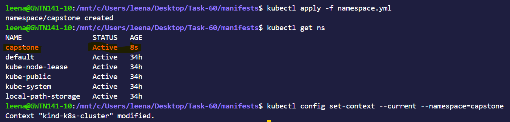

---

### Task 2: Deploy MySQL (Days 54-56)
1. Create a Secret with `MYSQL_ROOT_PASSWORD`, `MYSQL_DATABASE`, `MYSQL_USER`, and `MYSQL_PASSWORD` using `stringData`
2. Create a Headless Service (`clusterIP: None`) for MySQL on port 3306
3. Create a StatefulSet for MySQL with:
   - Image: `mysql:8.0`
   - `envFrom` referencing the Secret
   - Resource requests (cpu: 250m, memory: 512Mi) and limits (cpu: 500m, memory: 1Gi)
   - A `volumeClaimTemplates` section requesting 1Gi of storage, mounted at `/var/lib/mysql`
4. Verify MySQL works: `kubectl exec -it mysql-0 -- mysql -u <user> -p<password> -e "SHOW DATABASES;"`

>**Verify:** Can you see the `wordpress` database?

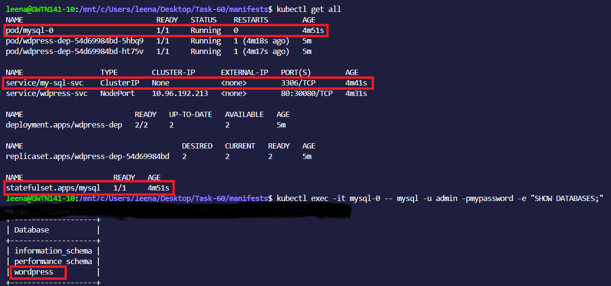

---

### Task 3: Deploy WordPress (Days 52, 54, 57)
1. Create a ConfigMap with `WORDPRESS_DB_HOST` set to `mysql-0.mysql.capstone.svc.cluster.local:3306` and `WORDPRESS_DB_NAME`
2. Create a Deployment with 2 replicas using `wordpress:latest` that:
   - Uses `envFrom` for the ConfigMap
   - Uses `secretKeyRef` for `WORDPRESS_DB_USER` and `WORDPRESS_DB_PASSWORD` from the MySQL Secret
   - Has resource requests and limits
   - Has a liveness probe and readiness probe on `/wp-login.php` port 80
3. Wait until both pods show `1/1 Running`

>**Verify:** Are both WordPress pods running and ready?

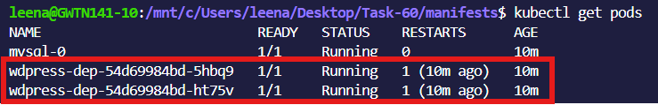

---

### Task 4: Expose WordPress (Day 53)
1. Create a NodePort Service on port 30080 targeting the WordPress pods
2. Access WordPress in your browser:
   - Minikube: `minikube service wordpress -n capstone`
   - Kind: `kubectl port-forward svc/wordpress 8080:80 -n capstone`
3. Complete the setup wizard and create a blog post

>**Verify:** Can you see the WordPress setup page?

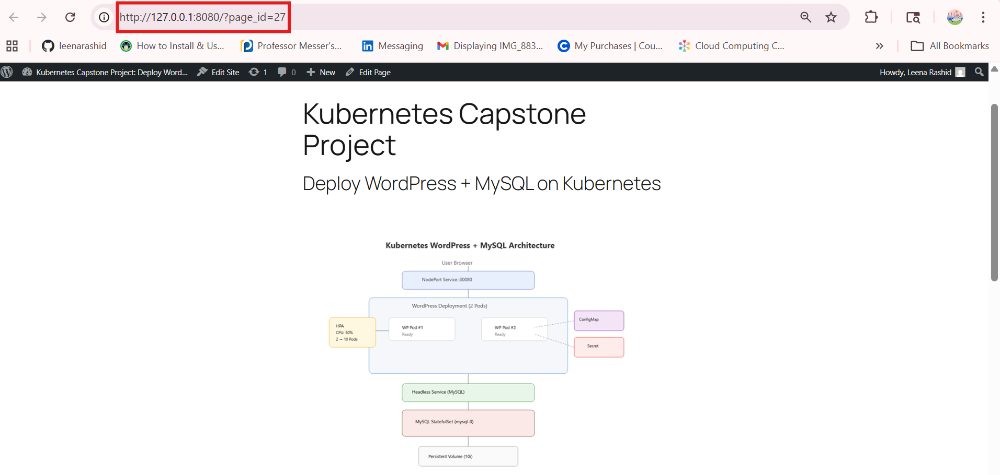

---

### Task 5: Test Self-Healing and Persistence
1. Delete a WordPress pod — watch the Deployment recreate it within seconds. Refresh the site.
2. Delete the MySQL pod: `kubectl delete pod mysql-0 -n capstone` — watch the StatefulSet recreate it
3. After MySQL recovers, refresh WordPress — your blog post should still be there

>**Verify:** After deleting both pods, is your blog post still there?

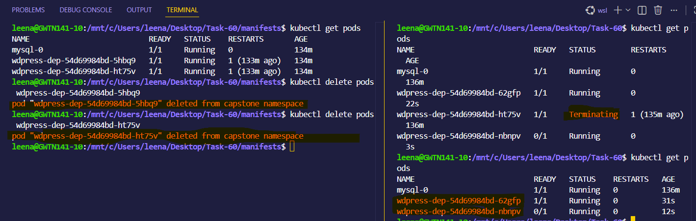
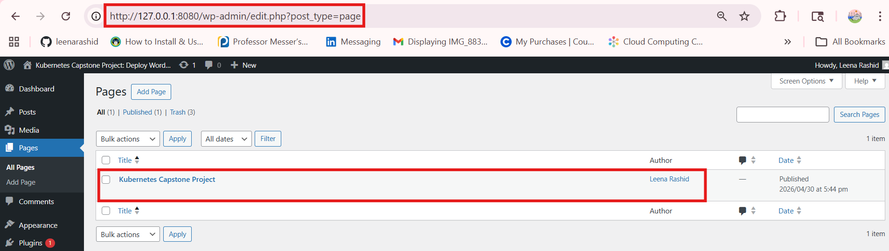

---

### Task 6: Set Up HPA (Day 58)
1. Write an HPA manifest targeting the WordPress Deployment with CPU at 50%, min 2, max 10 replicas
2. Apply and check: `kubectl get hpa -n capstone`
3. Run `kubectl get all -n capstone` for the complete picture

>**Verify:** Does the HPA show correct min/max and target?

---

### Task 7: (Bonus) Compare with Helm (Day 59)
1. Install WordPress using `helm install wp-helm bitnami/wordpress` in a separate namespace

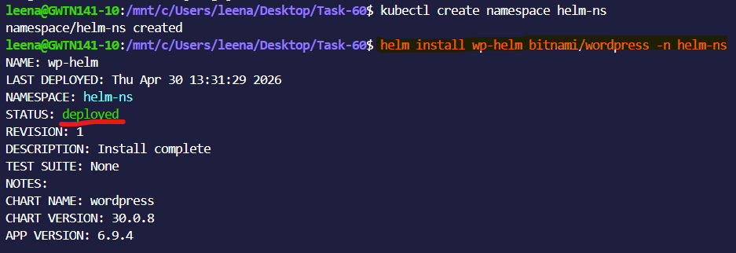

2. Compare: how many resources did each approach create? Which gives more control?

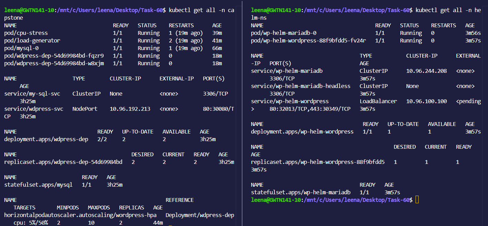

1. Clean up the Helm deployment

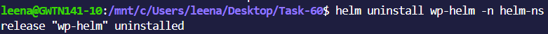

---

### Task 8: Clean Up and Reflect
1. Take a final look: `kubectl get all -n capstone`
2. Count the concepts you used: Namespace, Secret, ConfigMap, PVC, StatefulSet, Headless Service, Deployment, NodePort Service, Resource Limits, Probes, HPA, Helm — twelve concepts in one deployment
3. Delete the namespace: `kubectl delete namespace capstone`
4. Reset default: `kubectl config set-context --current --namespace=default`

>**Verify:** Did deleting the namespace remove everything?

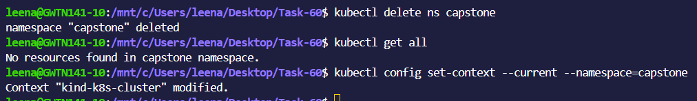

---
>- Architecture of your deployment (which resources connect to which)

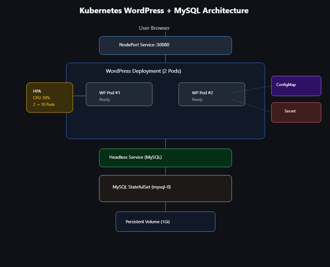

>- Results of self-healing and persistence tests

**Self-Healing Test Results** 
- Pods are automatically recreated after deletion or failure
- Desired replica count is maintained by Deployment/ReplicaSet
- Containers are restarted automatically on crash
- Unhealthy pods are replaced using liveness probes
- Pods are rescheduled on other nodes if a node fails

**Persistence Test Results**
- Data remains intact after pod restart or deletion
- Persistent Volume (PV) is reattached to new pod via PVC
- No data loss during container crash or rescheduling
- Stateful applications retain data and identity

>- Reflection: what was hardest, what clicked, what you would add for production

The **hardest** part was 
- Noticing **stress** on cpu to notice the desired behavior, i had to add a couple of things.
- Also noticing the start/restart behavior of pods, maintaining proper delay seconds.
- Mainting proper secrets, in encrypted form

**For Production**

- Use **RBAC** to restrict access to **Secrets**.

- Integrate external secret managers (e.g., HashiCorp Vault)

-Implement regular secret rotation (passwords, tokens, keys)

- Avoid storing secrets in Git, YAML (plain text)
Prefer mounting secrets as volumes instead of environment variables

Enable audit logging and monitoring for secret access
Never rely on base64 encoding as security (it is not encryption)