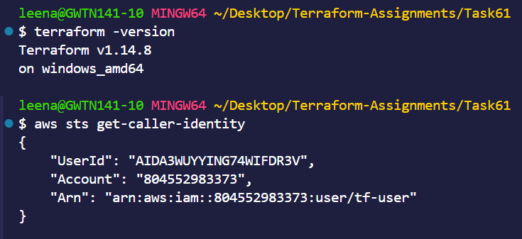
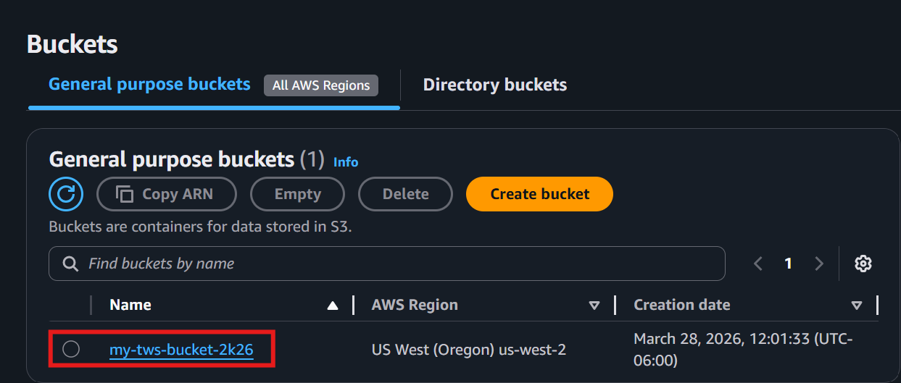
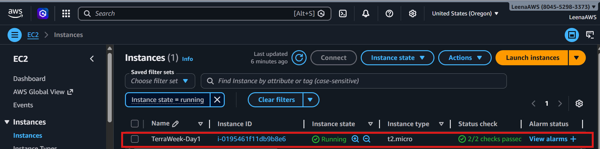
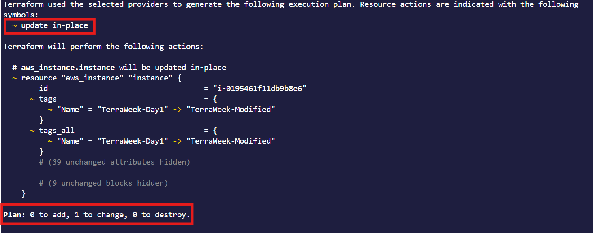

# Day 61 -- Introduction to Terraform and Your First AWS Infrastructure


---


### Task 1: Understand Infrastructure as Code
Before touching the terminal, research and write short notes on:

1. What is Infrastructure as Code (IaC)? Why does it matter in DevOps?
**Answer**
Infrastructure as Code (IaC) is the practice of managing and provisioning infrastructure (servers, networks, storage, etc.) using code and configuration files instead of manual processes.

`Automation:` Eliminates manual setup, saving time and reducing errors
`Consistency:` Same environment can be recreated reliably every time
`Version Control:` Infrastructure changes can be tracked like code
`Scalability:` Easily replicate and scale systems
`Faster Deployments:` Speeds up delivery pipelines


2. What problems does IaC solve compared to manually creating resources in the AWS console?
**Answer**

`Human errors:` Manual clicks can lead to misconfigurations; IaC uses predefined code → fewer mistakes

`Inconsistency:` Environments may differ when created manually; IaC ensures identical setups every time

`No version tracking:` Console changes aren’t easily tracked; IaC can be stored in Git with full history

`Time-consuming:` Recreating infrastructure manually is slow; IaC automates and speeds it up

`Hard to scale:` Manual setup doesn’t scale well; IaC can replicate environments instantly

`Lack of documentation:` Manual steps are often not recorded; IaC itself acts as documentation

`Difficult rollback:` Undoing manual changes is tricky; IaC allows easy rollback to previous versions



3. How is Terraform different from AWS CloudFormation, Ansible, and Pulumi?

| Tool              | Provider           | Language Used              | Scope                        | Cloud Support      |
|-------------------|-------------------|----------------------------|------------------------------|--------------------|
| Terraform         | HashiCorp         | HCL                        | Infrastructure Provisioning   | Multi-cloud        |
| AWS CloudFormation| AWS               | YAML / JSON                | Infrastructure Provisioning   | AWS only           |
| Ansible           | Red Hat           | YAML                       | Configuration Management      | Multi-cloud / On-prem |
| Pulumi            | Pulumi Corp       | Python, JS, TS, Go, .NET   | Infra + Application Logic     | Multi-cloud        |


4. What does it mean that Terraform is "declarative" and "cloud-agnostic"?
**Answer**
`Declarative`
- You define what you want, not how to create it
- Example: “I need 2 EC2 instances” → Terraform figures out the steps automatically
- Focus is on desired state, not step-by-step commands
`Cloud-agnostic`
- Works across multiple cloud providers like Amazon Web Services, Microsoft Azure, and Google Cloud Platform
- Same tool and syntax can manage infrastructure in different clouds
- Avoids vendor lock-in

---

### Task 2: Install Terraform and Configure AWS
1. Install Terraform:
```bash
# macOS
brew tap hashicorp/tap
brew install hashicorp/tap/terraform

# Linux (amd64)
wget -O - https://apt.releases.hashicorp.com/gpg | sudo gpg --dearmor -o /usr/share/keyrings/hashicorp-archive-keyring.gpg
echo "deb [signed-by=/usr/share/keyrings/hashicorp-archive-keyring.gpg] https://apt.releases.hashicorp.com $(lsb_release -cs) main" | sudo tee /etc/apt/sources.list.d/hashicorp.list
sudo apt update && sudo apt install terraform

# Windows
choco install terraform
```

2. Verify:
```bash
terraform -version
```

3. Install and configure the AWS CLI:
```bash
aws configure
# Enter your Access Key ID, Secret Access Key, default region (e.g., ap-south-1), output format (json)
```

4. Verify AWS access:
```bash
aws sts get-caller-identity
```

You should see your AWS account ID and ARN.

---

### Task 3: Your First Terraform Config -- Create an S3 Bucket
Create a project directory and write your first Terraform config:

```bash
mkdir terraform-basics && cd terraform-basics
```

Create a file called `main.tf` with:
1. A `terraform` block with `required_providers` specifying the `aws` provider
2. A `provider "aws"` block with your region
3. A `resource "aws_s3_bucket"` that creates a bucket with a globally unique name

Run the Terraform lifecycle:
```bash
terraform init      # Download the AWS provider
terraform plan      # Preview what will be created
terraform apply     # Create the bucket (type 'yes' to confirm)
```

Go to the AWS S3 console and verify your bucket exists.




[View main.tf](terraform-basics/main.tf)

**Document:** What did `terraform init` download? What does the `.terraform/` directory contain?
**Answer**

- `terraform init` downloads and prepares everything Terraform needs before you run `plan` or `apply`.

- It downloads `Provider Plugins` `Modules` `Backend Configuration` `Provider Dependency Lockfile` and `.terraform Directory`.

- The `.terraform/` directory is created by terraform init and stores all the local working data Terraform needs.


---

### Task 4: Add an EC2 Instance
In the same `main.tf`, add:
1. A `resource "aws_instance"` using AMI `ami-0f5ee92e2d63afc18` (Amazon Linux 2 in ap-south-1 -- use the correct AMI for your region)
2. Set instance type to `t2.micro`
3. Add a tag: `Name = "TerraWeek-Day1"`

Run:
```bash
terraform plan      # You should see 1 resource to add (bucket already exists)
terraform apply
```

Go to the AWS EC2 console and verify your instance is running with the correct name tag.





[View main.tf](terraform-basics/main.tf)

How does Terraform know the S3 bucket already exists and only the EC2 instance needs to be created?

Terraform state file (terraform.tfstate) keeps the record of already created resources.In the above case it contains resource IDs like s3 bucket name, EC2instance ID, also the current infrastructure state. `terraform apply` the terraform checks whether the resource is already present or not.
---

### Task 5: Understand the State File
Terraform tracks everything it creates in a state file. Time to inspect it.

1. Open `terraform.tfstate` in your editor -- read the JSON structure
2. Run these commands and document what each returns:
```bash
terraform show                          # Human-readable view of current state
terraform state list                    # List all resources Terraform manages
terraform state show aws_s3_bucket.<name>   # Detailed view of a specific resource
terraform state show aws_instance.<name>
```

3. Answer these questions in your notes:
   - What information does the state file store about each resource?
   **Answer**
   The Terraform state file stores each resource’s ID, attributes, dependencies, provider information, and metadata, allowing Terraform to track and manage the current state of infrastructure.
  
   - Why should you never manually edit the state file?
**Answer**
You should never manually edit the Terraform state file because it can corrupt state, break resource tracking, and cause Terraform to lose sync with real infrastructure, leading to unexpected changes or failures during plan and apply.

   - Why should the state file not be committed to Git?
   **Answer**
   The Terraform state file should not be committed to Git because it can contain sensitive data (like secrets), and is constantly changing, which can cause merge conflicts, data exposure, and inconsistencies when shared across teams.

---

### Task 6: Modify, Plan, and Destroy
1. Change the EC2 instance tag from `"TerraWeek-Day1"` to `"TerraWeek-Modified"` in your `main.tf`
2. Run `terraform plan` and read the output carefully:
   - What do the `~`, `+`, and `-` symbols mean?
- `~`: Denotes there is some change in terraform resource.

- `+`: A resource has been created/added.
- `-`: A resource has been removed.


   - Is this an in-place update or a destroy-and-recreate?
The tag change was `update in place`


3. Apply the change
4. Verify the tag changed in the AWS console
5. Finally, destroy everything:
```bash
terraform destroy
```


6. Verify in the AWS console -- both the S3 bucket and EC2 instance should be gone
After `terraform destroy` both od the resources have been destroyed.

---

## Hints
- S3 bucket names must be globally unique -- use something like `terraweek-<yourname>-2026`
- AMI IDs are region-specific -- search "Amazon Linux 2 AMI" in your region's EC2 launch wizard
- `terraform fmt` auto-formats your `.tf` files -- run it before committing
- `terraform validate` checks for syntax errors without connecting to AWS
- The `.terraform/` directory contains downloaded provider plugins
- Add `*.tfstate`, `*.tfstate.backup`, and `.terraform/` to your `.gitignore`

---


