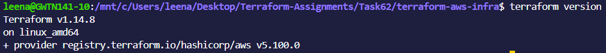
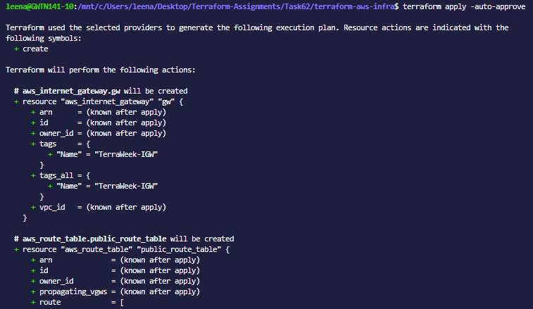
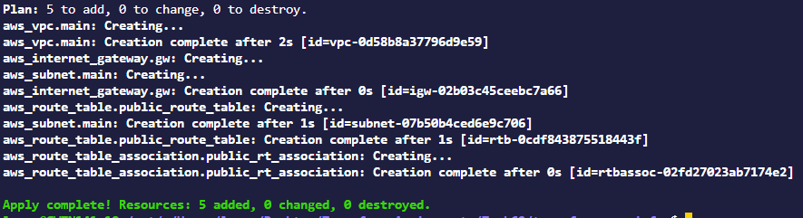
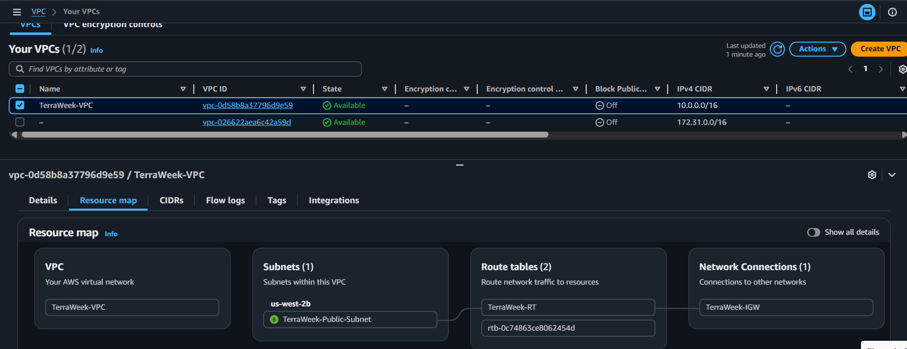
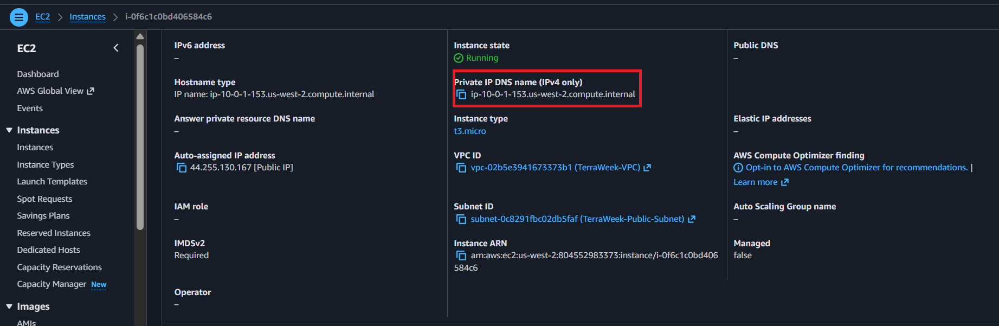
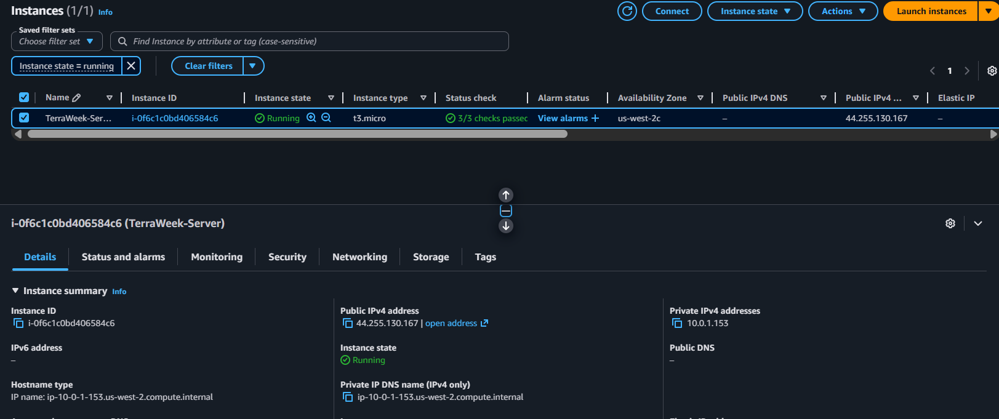
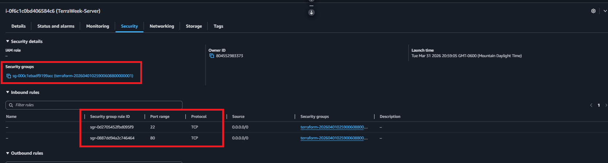
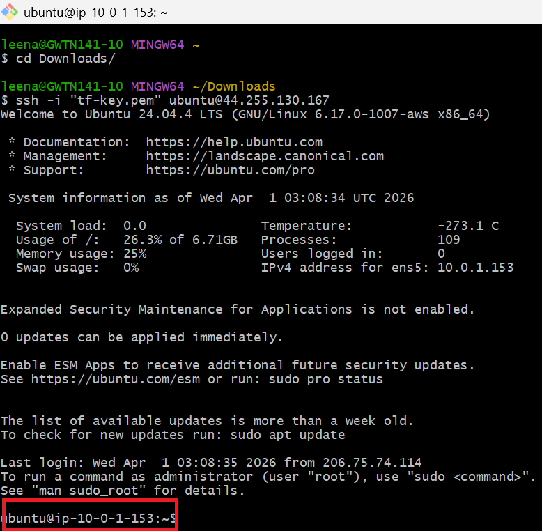
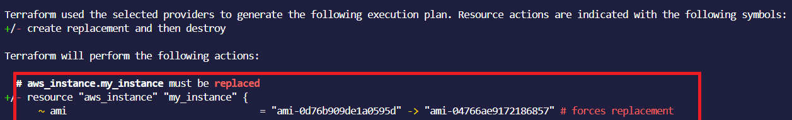
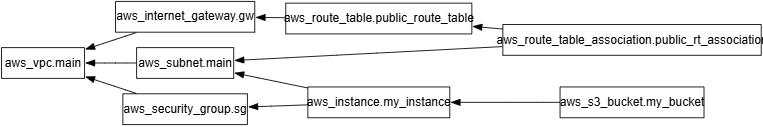

## Day 62 -- Providers, Resources and Dependencies

---


### Task 1: Explore the AWS Provider
1. Create a new project directory: `terraform-aws-infra`
2. Write a `providers.tf` file:
   - Define the `terraform` block with `required_providers` pinning the AWS provider to version `~> 5.0`
   - Define the `provider "aws"` block with your region
3. Run `terraform init` and check the output -- what version was installed?




>Installed Version: v1.14.8

4. Read the provider lock file `.terraform.lock.hcl` -- what does it do?

- Locks provider versions → ensures same version is reused
- Maintains consistency across team & environments
- Stores checksums → verifies provider integrity (security)
- Updated only when running terraform init -upgrade
- Should be committed to Git


**Document:** What does `~> 5.0` mean? How is it different from `>= 5.0` and `= 5.0.0`?

- `>~= 5.0` Called the "pessimistic constraint" can accept verions 5.0, 5.1, 5.2.3 but not 6 or higher.

- `=>5.0` Accepts versions 5 or higher than 6 like 6.0, 7.0.
- `=5.0.0`Allows exactly 5.0.0 version.
---

### Task 2: Build a VPC from Scratch
Create a `main.tf` and define these resources one by one:

1. `aws_vpc` -- CIDR block `10.0.0.0/16`, tag it `"TerraWeek-VPC"`
2. `aws_subnet` -- CIDR block `10.0.1.0/24`, reference the VPC ID from step 1, enable public IP on launch, tag it `"TerraWeek-Public-Subnet"`
3. `aws_internet_gateway` -- attach it to the VPC
4. `aws_route_table` -- create it in the VPC, add a route for `0.0.0.0/0` pointing to the internet gateway
5. `aws_route_table_association` -- associate the route table with the subnet

Run `terraform plan` -- you should see 5 resources to create.

  
**Verify:** Apply and check the AWS VPC console. Can you see all five resources connected?
- Yes all the five resources are connected
   
   
   


---

### Task 3: Understand Implicit Dependencies
Look at your `main.tf` carefully:

1. The subnet references `aws_vpc.main.id` -- this is an implicit dependency
2. The internet gateway references the VPC ID -- another implicit dependency
3. The route table association references both the route table and the subnet

Answer these questions:
- How does Terraform know to create the VPC before the subnet?
- What would happen if you tried to create the subnet before the VPC existed?
- Find all implicit dependencies in your config and list them

---

### Task 4: Add a Security Group and EC2 Instance
Add to your config:

1. `aws_security_group` in the VPC:
   - Ingress rule: allow SSH (port 22) from `0.0.0.0/0`
   - Ingress rule: allow HTTP (port 80) from `0.0.0.0/0`
   - Egress rule: allow all outbound traffic
   - Tag: `"TerraWeek-SG"`

 


2. `aws_instance` in the subnet:
   - Use Amazon Linux 2 AMI for your region
   - Instance type: `t2.micro`
   - Associate the security group
   - Set `associate_public_ip_address = true`
   - Tag: `"TerraWeek-Server"`

Apply and verify -- your EC2 instance should have a public IP and be reachable.
Yes the instance instance is accessible.







---

### Task 5: Explicit Dependencies with depends_on
Sometimes Terraform cannot detect a dependency automatically.

1. Add a second `aws_s3_bucket` resource for application logs
2. Add `depends_on = [aws_instance.main]` to the S3 bucket -- even though there is no direct reference, you want the bucket created only after the instance
3. Run `terraform plan` and observe the order

Now visualize the entire dependency tree:
```bash
terraform graph | dot -Tpng > graph.png
```
If you don't have `dot` (Graphviz) installed, use:
```bash
terraform graph
```
and paste the output into an online Graphviz viewer.






**Document:** When would you use `depends_on` in real projects? Give two examples.


- Amazon EC2, Amazon RDS, and Elastic Load Balancing depend on foundational resources like IAM roles, security groups, subnets, and target groups for proper networking and permissions.
- Amazon ECS and AWS Lambda depend on IAM roles (and load balancers for ECS) to securely run workloads and access other AWS services.
---

### Task 6: Lifecycle Rules and Destroy
1. Add a `lifecycle` block to your EC2 instance:
```hcl
lifecycle {
  create_before_destroy = true
}
```
2. Change the AMI ID to a different one and run `terraform plan` -- observe that Terraform plans to create the new instance before destroying the old one

3. Destroy everything:
```bash
terraform destroy
```
4. Watch the destroy order -- Terraform destroys in reverse dependency order. Verify in the AWS console that everything is cleaned up.


- Since the resources are dependant on each other therefore they are destroyed in reverse order. 


**Document:** What are the three lifecycle arguments (`create_before_destroy`, `prevent_destroy`, `ignore_changes`) and when would you use each?
`create_before_destroy`
- Creates the new resource first, then deletes the old one → avoids downtime.
- Use when replacing critical resources like EC2, Load Balancers, etc.

`prevent_destroy`
- Blocks accidental deletion of a resource.
Use for important resources like databases (e.g., Amazon RDS) or production infrastructure.


`ignore_changes`

- Terraform ignores specific attribute changes and won’t update them.
Use when changes are made outside Terraform (e.g., tags, auto-scaling updates).
---


