# Day 63 -- Variables, Outputs, Data Sources and Expressions


---


### Task 1: Extract Variables
Take your Day 62 infrastructure config and refactor it:

1. Create a `variables.tf` file with input variables for:
   - `region` (string, default: your preferred region)
   - `vpc_cidr` (string, default: `"10.0.0.0/16"`)
   - `subnet_cidr` (string, default: `"10.0.1.0/24"`)
   - `instance_type` (string, default: `"t2.micro"`)
   - `project_name` (string, no default -- force the user to provide it)
   - `environment` (string, default: `"dev"`)
   - `allowed_ports` (list of numbers, default: `[22, 80, 443]`)
   - `extra_tags` (map of strings, default: `{}`)

2. Replace every hardcoded value in `main.tf` with `var.<name>` references
 
 

3. Run `terraform plan` -- it should prompt you for `project_name` since it has no default

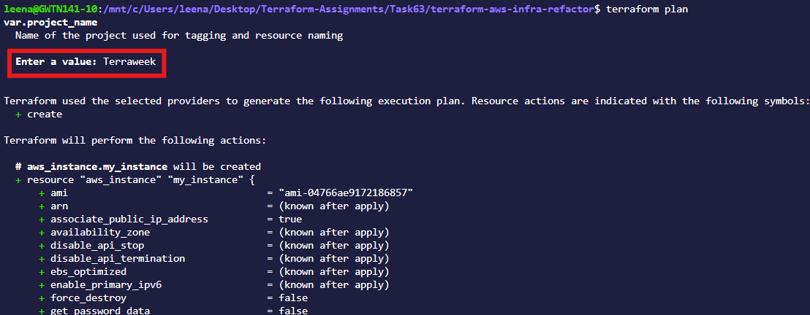


**Document:** What are the five variable types in Terraform? (`string`, `number`, `bool`, `list`, `map`)

>string A variable that stores text (sequence of characters)
```
  variable "instance_type" {
  type    = string
  default = "t2.micro"
}
```

>number A variable that stores numeric values (integer or decimal).
```
variable "instance_count" {
  type    = number
  default = 2
}
```

>bool A variable that stores true or false values.
```
variable "create_instance" {
  type    = bool
  default = true
}
```
>list A variable that stores an ordered collection of values.
```
  variable "azs" {
  type    = list(string)
  default = ["us-west-1a", "us-west-1b"]
}
```

>map A variable that stores key-value pairs.
```
variable "tags" {
  type = map(string)
  default = {
    Name = "MyInstance"
    Env  = "Dev"
  }
}
```


---

### Task 2: Variable Files and Precedence
1. Create `terraform.tfvars`:
```hcl
project_name = "terraweek"
environment  = "dev"
instance_type = "t2.micro"
```

2. Create `prod.tfvars`:
```hcl
project_name = "terraweek"
environment  = "prod"
instance_type = "t3.small"
vpc_cidr     = "10.1.0.0/16"
subnet_cidr  = "10.1.1.0/24"
```

3. Apply with the default file:
```bash
terraform plan                              # Uses terraform.tfvars automatically
```


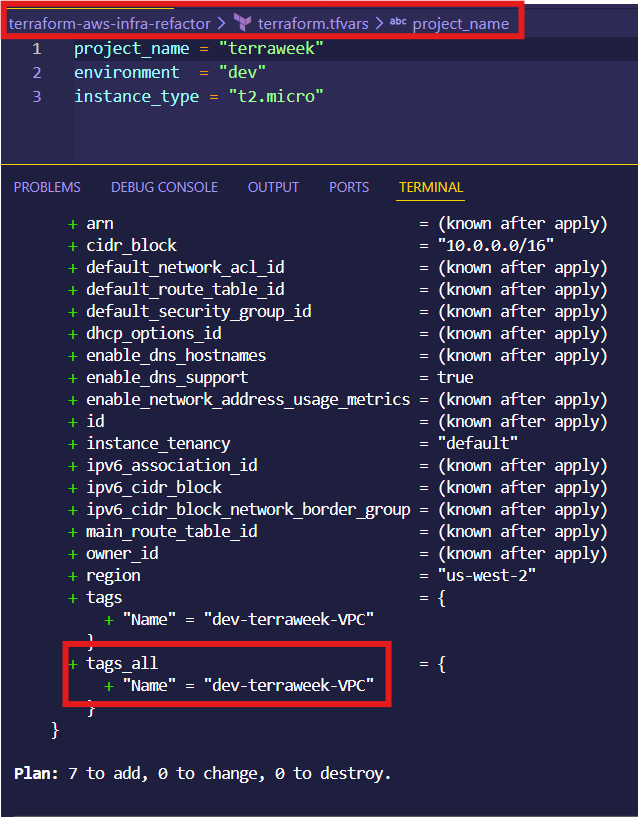


4. Apply with the prod file:
```bash
terraform plan -var-file="prod.tfvars"      # Uses prod.tfvars
```

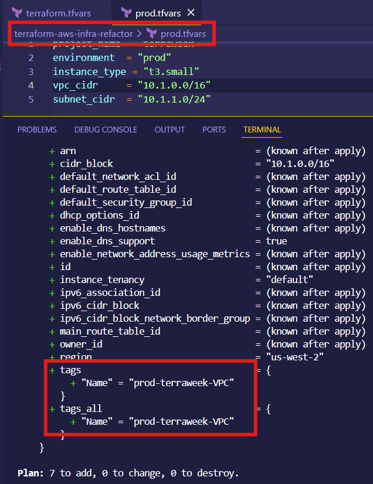

5. Override with CLI:
```bash
terraform plan -var="instance_type=t2.nano"  # CLI overrides everything
```

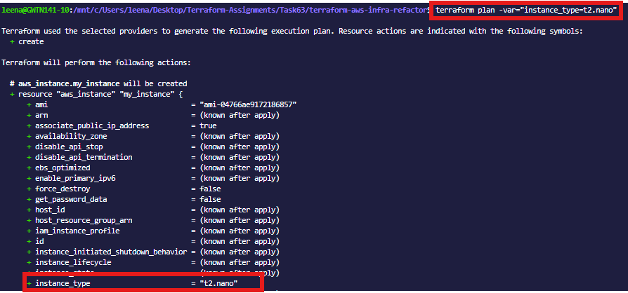


6. Set an environment variable:
```bash
export TF_VAR_environment="staging"
terraform plan                              # env var overrides default but not tfvars
```


**Document:** Write the variable precedence order from lowest to highest priority.

| Priority (High → Low) | Source                     | Example                                    |  Value       |
| --------------------- | -------------------------- | ------------------------------------------ | ------------ |
| 1 (Highest)           | Command-line (`-var`)      | `terraform plan -var="environment=qa"`     | `qa`         |
| 2                     | Command-line (`-var-file`) | `terraform plan -var-file="prod.tfvars"`   | `prod`       |
| 3                     | Auto-loaded tfvars         | `terraform.tfvars → environment = "stage"` | `stage`      |
| 4                     | Environment variable       | `TF_VAR_environment=uat`                   | `uat`        |
| 5 (Lowest)            | Default value              | `default = "dev"`                          | `dev`        |


**The difference between `variable`, `local`, `output`, and `data`**

   `variable:` Used to take input values from the user.

   `local:` Used to define internal reusable values or expressions.
   
   `data:` Used to fetch existing resources from the provider (read-only).
   
   `output:` Used to display or export values after execution.


---

### Task 3: Add Outputs
Create an `outputs.tf` file with outputs for:

1. `vpc_id` -- the VPC ID
2. `subnet_id` -- the public subnet ID
3. `instance_id` -- the EC2 instance ID
4. `instance_public_ip` -- the public IP of the EC2 instance
5. `instance_public_dns` -- the public DNS name
6. `security_group_id` -- the security group ID

Apply your config and verify the outputs are printed at the end:
```bash
terraform apply


# After apply, you can also run:
terraform output                          # Show all outputs
terraform output instance_public_ip       # Show a specific output
terraform output -json                   # JSON format for scripting

```


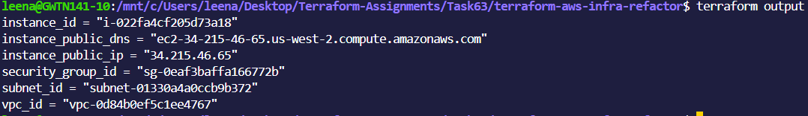
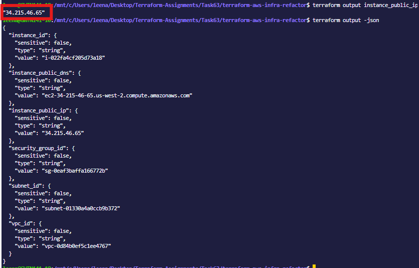


**Verify:** Does `terraform output instance_public_ip` return the correct IP?


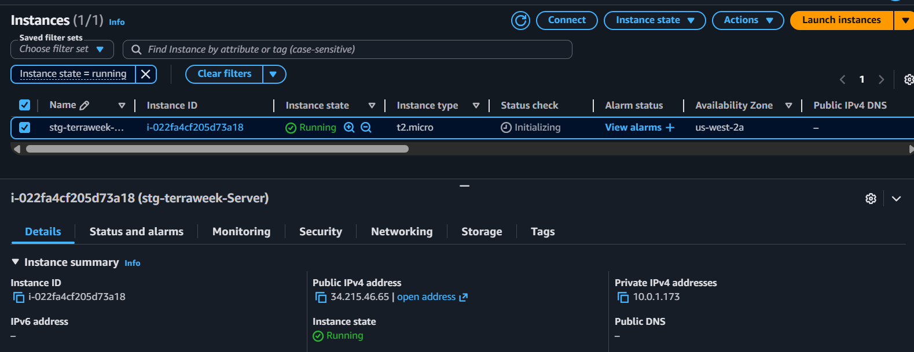

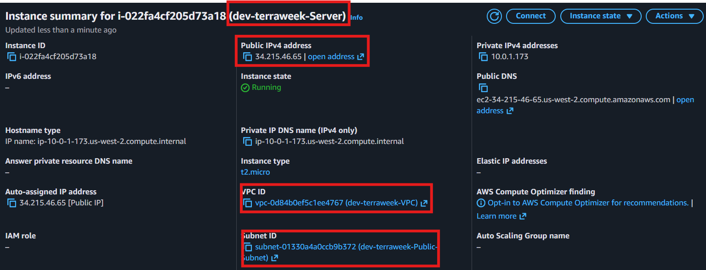


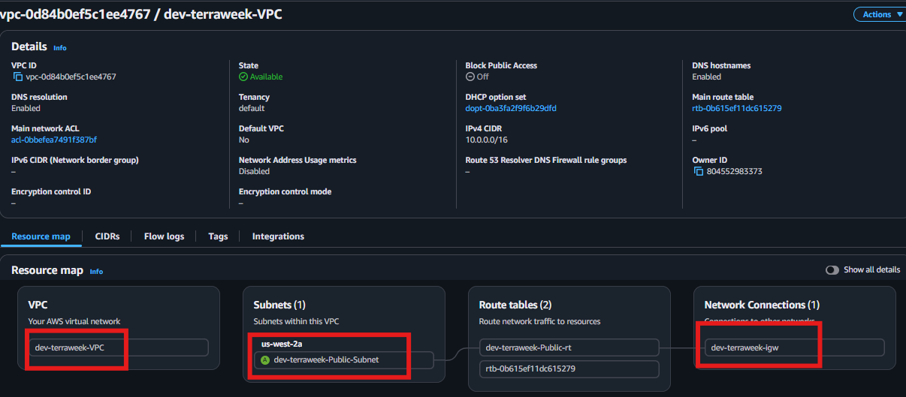


Yes the public ip is same and can be seen in the above image.


---

### Task 4: Use Data Sources
Stop hardcoding the AMI ID. Use a data source to fetch it dynamically.

1. Add a `data "aws_ami"` block that:
   - Filters for Amazon Linux 2 images
   - Filters for `hvm` virtualization and `gp2` root device
   - Uses `owners = ["amazon"]`
   - Sets `most_recent = true`

2. Replace the hardcoded AMI in your `aws_instance` with `data.aws_ami.amazon_linux.id`

3. Add a `data "aws_availability_zones"` block to fetch available AZs in your region

4. Use the first AZ in your subnet: `data.aws_availability_zones.available.names[0]`


Apply and verify -- your config now works in any region without changing the AMI.


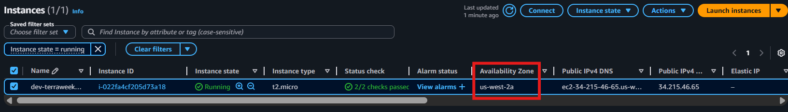


**Document:** What is the difference between a `resource` and a `data` source?

`resource` Used to create and manage infrastructure in Terraform.

```

resource "aws_instance" "my_ec2" {
  ami           = "ami-123456"
  instance_type = "t2.micro"
}
```

`data`
Used to fetch/read existing infrastructure without creating it.
```
data "aws_ami" "latest" {
  most_recent = true
  owners      = ["amazon"]
}
```
---

### Task 5: Use Locals for Dynamic Values
1. Add a `locals` block:
```hcl
locals {
  name_prefix = "${var.project_name}-${var.environment}"
  common_tags = {
    Project     = var.project_name
    Environment = var.environment
    ManagedBy   = "Terraform"
  }
}
```


2. Replace all Name tags with `local.name_prefix`:
   - VPC: `"${local.name_prefix}-vpc"`
   - Subnet: `"${local.name_prefix}-subnet"`
   - Instance: `"${local.name_prefix}-server"`

3. Merge common tags with resource-specific tags:
```hcl
tags = merge(local.common_tags, {
  Name = "${local.name_prefix}-server"
})
```

Apply and check the tags in the AWS console -- every resource should have consistent tagging.

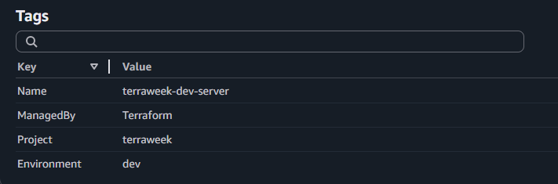


---

### Task 6: Built-in Functions and Conditional Expressions
Practice these in `terraform console`:
```bash
terraform console
```

1. **String functions:**
   - `upper("terraweek")` -> `"TERRAWEEK"`
   - `join("-", ["terra", "week", "2026"])` -> `"terra-week-2026"`
   - `format("arn:aws:s3:::%s", "my-bucket")`
  


2. **Collection functions:**
   - `length(["a", "b", "c"])` -> `3`
   - `lookup({dev = "t2.micro", prod = "t3.small"}, "dev")` -> `"t2.micro"`
   - `toset(["a", "b", "a"])` -> removes duplicates


3. **Networking function:**
   - `cidrsubnet("10.0.0.0/16", 8, 1)` -> `"10.0.1.0/24"`


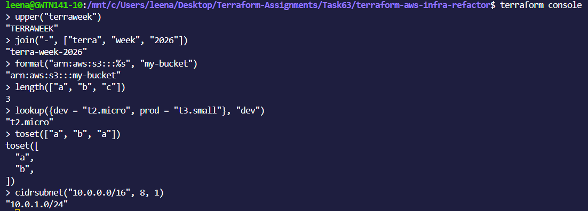

4. **Conditional expression** -- add this to your config:
```hcl
instance_type = var.environment == "prod" ? "t3.small" : "t2.micro"
```

Apply with `environment = "prod"` and verify the instance type changes.


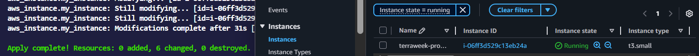


**Document:** Pick five functions you find most useful and explain what each does.

- `upper()` used for string formatting
      - upper(var.environment)   `"dev" → "DEV"`
-  `join()`  used to combine values
      - join("-", ["app", var.environment, "2026"])   `"app-dev-2026"`
 - `format()` used to build structured strings (like ARNs)
    - format("arn:aws:s3:::%s", my-bucket) `"arn:aws:s3:::my-bucket"`
-  `lookup()` used for environment-based selection
      - lookup({dev = "t2.micro", prod = "t3.small"}, "dev") `"t2.micro"`
-  `cidrsubnet()` used for network/subnet creation
      - cidrsubnet("10.0.0.0/16", 8, 1)  `creates "10.0.1.0/24"`


---


