# Day 64 -- Terraform State Management and Remote Backends


---

### Task 1: Inspect Your Current State
Use your Day 63 config (or create a small config with a VPC and EC2 instance). Apply it and then explore the state:

```bash
terraform show  


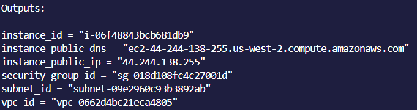                                  


terraform state list                              
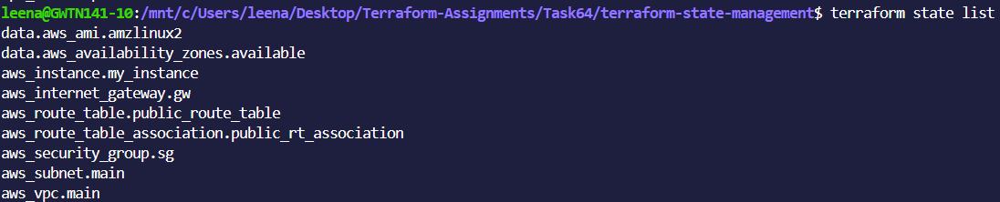

terraform state show aws_instance.<name>   


       
terraform state show aws_vpc.<name>    


```


Answer:
1. How many resources does Terraform track?
- Terraform tracked 8 resources and two data resources.
2. What attributes does the state store for an EC2 instance? (hint: way more than what you defined)
- For an EC2 instance the attributes stored in state file are 
- instance_id, instance_type, ami, key_name,tags
- root_block_device
- subnet_id, vpc_securitygroup_ids, public_ip, private ip, public_dns

3. Open `terraform.tfstate` in an editor -- find the `serial` number. What does it represent?
  The serial number in terraform.tfstate indicates the number of times it has been opened and increases with each action.

---

### Task 2: Set Up S3 Remote Backend
Storing state locally is dangerous -- one deleted file and you lose everything. Time to move it to S3.

1. First, create the backend infrastructure (do this manually or in a separate Terraform config):
```bash
# Create S3 bucket for state storage
aws s3api create-bucket \
  --bucket terraweek-state-<yourname> \
  --region ap-south-1 \
  --create-bucket-configuration LocationConstraint=ap-south-1

# Enable versioning (so you can recover previous state)
aws s3api put-bucket-versioning \
  --bucket terraweek-state-<yourname> \
  --versioning-configuration Status=Enabled

# Create DynamoDB table for state locking
aws dynamodb create-table \
  --table-name terraweek-state-lock \
  --attribute-definitions AttributeName=LockID,AttributeType=S \
  --key-schema AttributeName=LockID,KeyType=HASH \
  --billing-mode PAY_PER_REQUEST \
  --region ap-south-1
```

2. Add the backend block to your Terraform config:
```hcl
terraform {
  backend "s3" {
    bucket         = "terraweek-state-<yourname>"
    key            = "dev/terraform.tfstate"
    region         = "ap-south-1"
    dynamodb_table = "terraweek-state-lock"
    encrypt        = true
  }
}
```

3. Run:
```bash
terraform init
```
Terraform will ask: "Do you want to copy existing state to the new backend?" -- say yes.


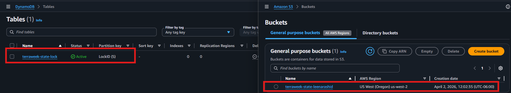
4. Verify:
   - Check the S3 bucket -- you should see `dev/terraform.tfstate`

 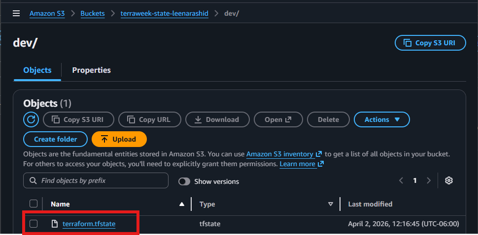

- Your local `terraform.tfstate` should now be empty or 

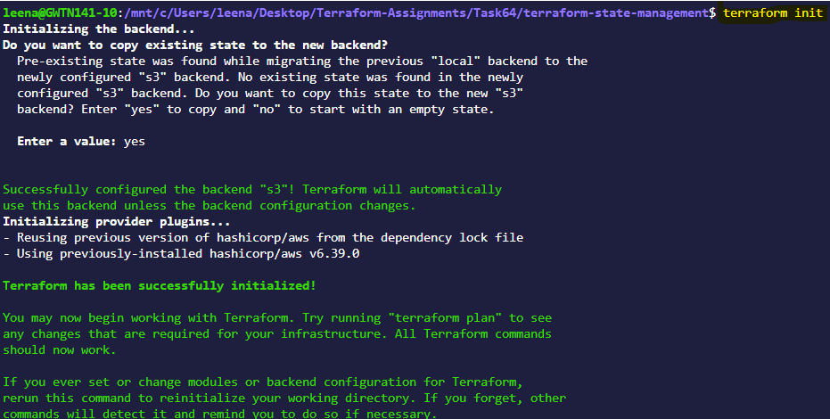

   - Run `terraform plan` -- it should show no changes (state migrated correctly)

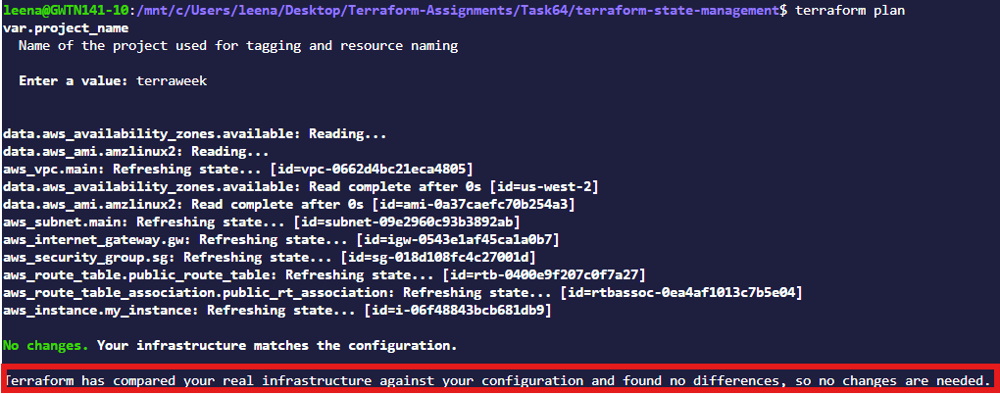


---

### Task 3: Test State Locking
State locking prevents two people from running `terraform apply` at the same time and corrupting the state.

1. Open **two terminals** in the same project directory
2. In Terminal 1, run:
```bash
terraform apply
```
3. While Terminal 1 is waiting for confirmation, in Terminal 2 run:
```bash
terraform plan
```
4. Terminal 2 should show a **lock error** with a Lock ID

**Document:** What is the error message? Why is locking critical for team environments?

5. After the test, if you get stuck with a stale lock:
```bash
terraform force-unlock <LOCK_ID>


```

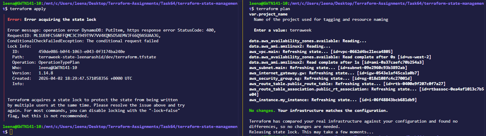


---

### Task 4: Import an Existing Resource
Not everything starts with Terraform. Sometimes resources already exist in AWS and you need to bring them under Terraform management.

1. Manually create an S3 bucket in the AWS console -- name it `terraweek-import-test-<yourname>`
2. Write a `resource "aws_s3_bucket"` block in your config for this bucket (just the bucket name, nothing else)
3. Import it:
```bash
terraform import aws_s3_bucket.imported terraweek-import-test-<yourname>

```

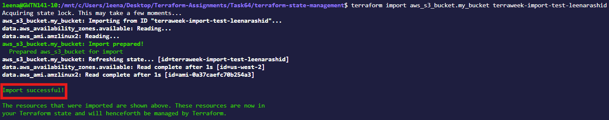


4. Run `terraform plan`:
   - If you see "No changes" -- the import was perfect
   - If you see changes -- your config does not match reality. Update your config to match, then plan again until you get "No changes"

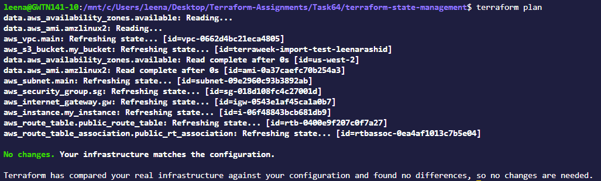

5. Run `terraform state list` -- the imported bucket should now appear alongside your other resources

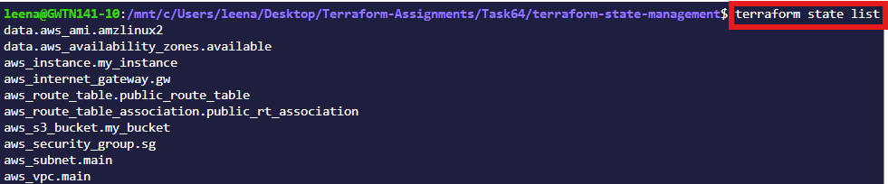

**Document:** What is the difference between `terraform import` and creating a resource from scratch?

`terrafprm import`  terraform import maps an existing AWS resource to a Terraform resource address so it can be managed going forward while `terraform apply` is used to create a new resource from scratch.
---

### Task 5: State Surgery -- mv and rm
Sometimes you need to rename a resource or remove it from state without destroying it in AWS.

1. **Rename a resource in state:**
```bash
terraform state list                              # Note the current resource names
terraform state mv aws_s3_bucket.imported aws_s3_bucket.logs_bucket
```
Update your `.tf` file to match the new name. Run `terraform plan` -- it should show no changes.


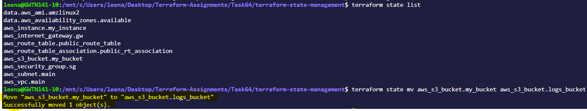


2. **Remove a resource from state (without destroying it):**
```bash
terraform state rm aws_s3_bucket.logs_bucket
```
Run `terraform plan` -- Terraform no longer knows about the bucket, but it still exists in AWS.


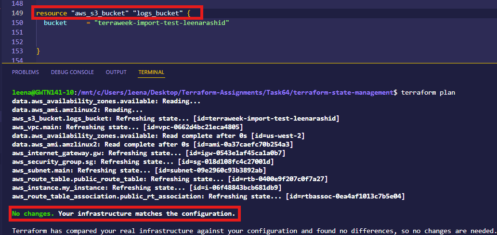

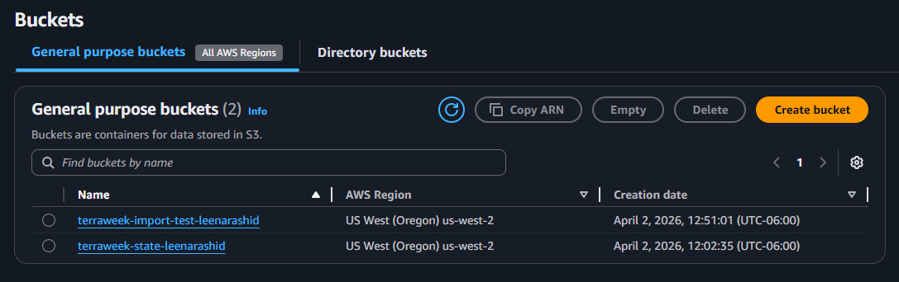

- The bucket still exists, no change has been noticed.


3. **Re-import it** to bring it back:
```bash
terraform import aws_s3_bucket.logs_bucket terraweek-import-test-<yourname>
```


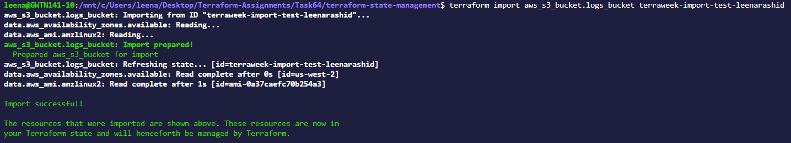

**Document:** When would you use `state mv` in a real project? When would you use `state rm`?
`state mv` Use when you want to rename or move a resource WITHOUT recreating it
`state rm` Use when you want Terraform to stop managing a resource. 
---

### Task 6: Simulate and Fix State Drift
State drift happens when someone changes infrastructure outside of Terraform -- through the AWS console, CLI, or another tool.

1. Apply your full config so everything is in sync
2. Go to the **AWS console** and manually:
   - Change the Name tag of your EC2 instance to `"ManuallyChanged"`
   - Change the instance type if it's stopped (or add a new tag)
3. Run:
```bash
terraform plan
```
You should see a **diff** -- Terraform detects that reality no longer matches the desired state.

4. You have two choices:
   - **Option A:** Run `terraform apply` to force reality back to match your config (reconcile)
   - **Option B:** Update your `.tf` files to match the manual change (accept the drift)

5. Choose Option A -- apply and verify the tags are restored.


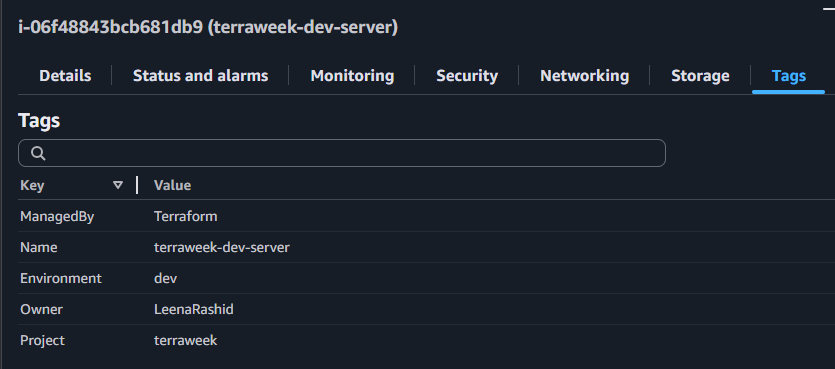


6. Run `terraform plan` again -- it should show "No changes." Drift resolved.


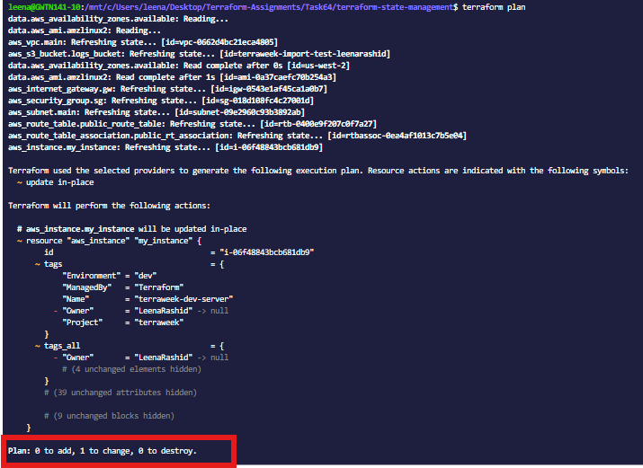


**Performing Option B:**


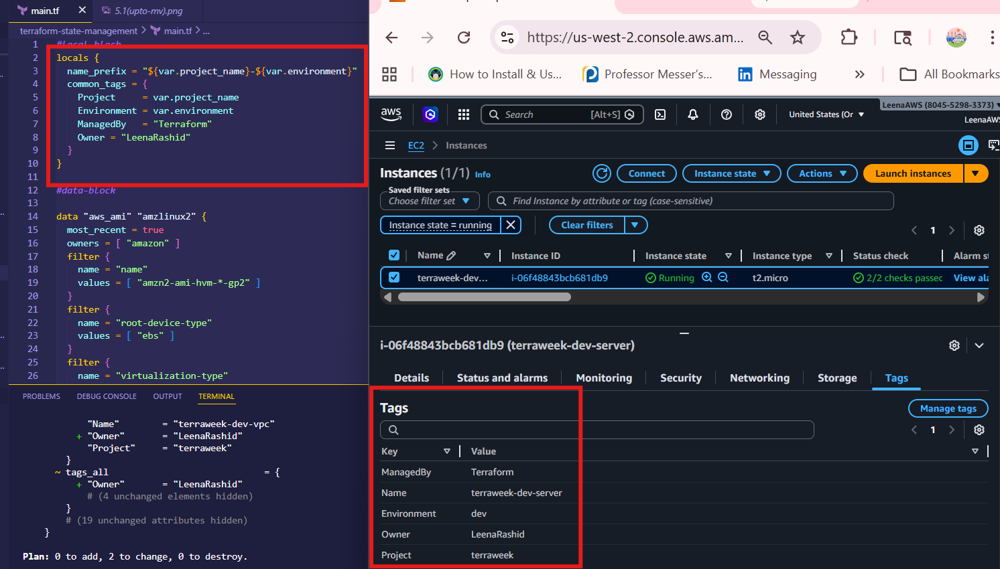

**Document:** How do teams prevent state drift in production? (hint: restrict console access, use CI/CD for all changes)
- State drift happens when the real infrastructure (AWS) is different from what Terraform expects (state file)
  It acn be prevented adopting the following measures
  - By restricting direct access to AWS console by using IAM service of AWS.
  - By enforcing all the changes through CI/CD pipelines, so that whenever terraform plan is run, the team can review the changes then after the approval terraform apply is run.In other word any change that needs to be done has to go through CI/CD pipeline.
  - Use of git,version control policy where history of changes can be seen and can also be rolled-back if needed.
---


