# Day 67 -- TerraWeek Capstone: Multi-Environment Infrastructure with Workspaces and Modules


## Challenge Tasks

### Task 1: Learn Terraform Workspaces
Before building the project, understand workspaces:

```bash
mkdir terraweek-capstone && cd terraweek-capstone
terraform init

# See current workspace
terraform workspace show                    # default

# Create new workspaces
terraform workspace new dev
terraform workspace new staging
terraform workspace new prod

# List all workspaces
terraform workspace list

# Switch between them
terraform workspace select dev
terraform workspace select staging
terraform workspace select prod
```

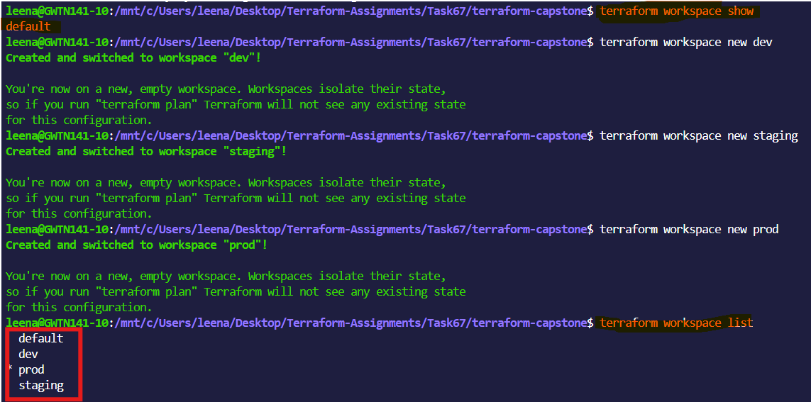


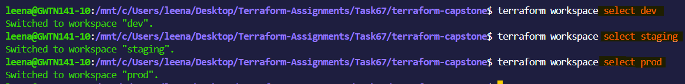


Answer:
1. What does `terraform.workspace` return inside a config?
**Answer**
Terraform supports multiple workspaces, which lets a user separate environments (like dev, staging, prod) using the same code.
Inside a Terraform configuration, terraform.workspace returns the name of the currently active workspace.


2. Where does each workspace store its state file?

**Answer** 

Each Terraform workspace stores its own separate state file. Non-default workspaces store state inside terraform.tfstate.d/<workspace-name>/terraform.tfstate, while the default workspace stores state in terraform.tfstate.

  
3. How is this different from using separate directories per environment?


**Workspaces:** Use a single codebase for all environments (dev/staging/prod). Each workspace maintains its own separate state file, but the configuration code is shared. Environments are isolated only through state.

**Separate directories:** Each environment has its own folder with its own Terraform configuration, variables, and state. Environments are fully independent in both code and state.

Key difference:
- Workspaces = same code, different state
- Directories = different code, different state (stronger isolation)

---

### Task 2: Set Up the Project Structure
Create this layout:

```
terraweek-capstone/
  main.tf                   # Root module -- calls child modules
  variables.tf              # Root variables
  outputs.tf                # Root outputs
  providers.tf              # AWS provider and backend
  locals.tf                 # Local values using workspace
  dev.tfvars                # Dev environment values
  staging.tfvars            # Staging environment values
  prod.tfvars               # Prod environment values
  .gitignore                # Ignore state, .terraform, tfvars with secrets
  modules/
    vpc/
      main.tf
      variables.tf
      outputs.tf
    security-group/
      main.tf
      variables.tf
      outputs.tf
    ec2-instance/
      main.tf
      variables.tf
      outputs.tf
```

Create the `.gitignore`:
```
.terraform/
*.tfstate
*.tfstate.backup
*.tfvars
.terraform.lock.hcl
```


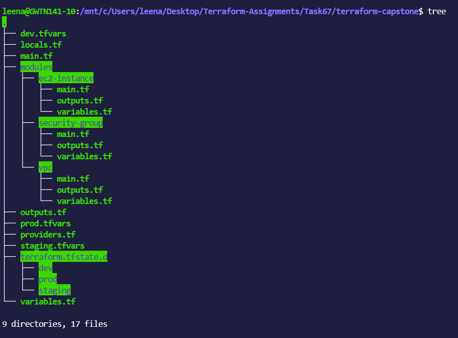


**Document:** Why is this file structure considered best practice?

**Answer**

This file structure is considered a best practice in Terraform because it makes infrastructure easier to manage, safer to modify, and more scalable as projects grow.

When environments such as dev, staging, and prod are organized properly using separate directories or reusable modules, each environment becomes isolated and predictable. This prevents accidental changes in one environment from affecting another.
---

### Task 3: Build the Custom Modules
Create three focused modules:

**Module 1: `modules/vpc/`**
- Input: `cidr`, `public_subnet_cidr`, `environment`, `project_name`
- Resources: VPC, public subnet, internet gateway, route table, route table association
- Output: `vpc_id`, `subnet_id`
- All resources tagged with environment and project name

**Module 2: `modules/security-group/`**
- Input: `vpc_id`, `ingress_ports`, `environment`, `project_name`
- Resources: Security group with dynamic ingress rules, allow all egress
- Output: `sg_id`

**Module 3: `modules/ec2-instance/`**
- Input: `ami_id`, `instance_type`, `subnet_id`, `security_group_ids`, `environment`, `project_name`
- Resources: EC2 instance with tags
- Output: `instance_id`, `public_ip`

Write and validate each module:
```bash
terraform validate
```


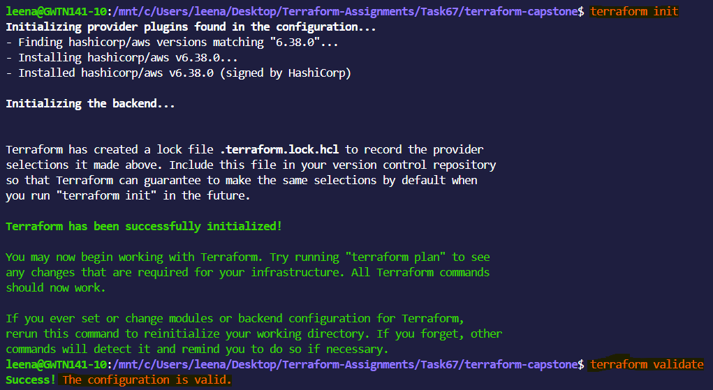


---

### Task 4: Wire It All Together with Workspace-Aware Config
In the root module, use `terraform.workspace` to drive environment-specific behavior.

**`locals.tf`:**
```hcl
locals {
  environment = terraform.workspace
  name_prefix = "${var.project_name}-${local.environment}"

  common_tags = {
    Project     = var.project_name
    Environment = local.environment
    ManagedBy   = "Terraform"
    Workspace   = terraform.workspace
  }
}
```

**`variables.tf`:**
```hcl
variable "project_name" {
  type    = string
  default = "terraweek"
}

variable "vpc_cidr" {
  type = string
}

variable "subnet_cidr" {
  type = string
}

variable "instance_type" {
  type = string
}

variable "ingress_ports" {
  type    = list(number)
  default = [22, 80]
}
```

**`main.tf`** -- call all three modules, passing workspace-aware names and variables.

**Environment-specific tfvars:**

`dev.tfvars`:
```hcl
vpc_cidr      = "10.0.0.0/16"
subnet_cidr   = "10.0.1.0/24"
instance_type = "t2.micro"
ingress_ports = [22, 80]
```

`staging.tfvars`:
```hcl
vpc_cidr      = "10.1.0.0/16"
subnet_cidr   = "10.1.1.0/24"
instance_type = "t2.small"
ingress_ports = [22, 80, 443]
```

`prod.tfvars`:
```hcl
vpc_cidr      = "10.2.0.0/16"
subnet_cidr   = "10.2.1.0/24"
instance_type = "t3.small"
ingress_ports = [80, 443]
```


Notice: dev allows SSH, prod does not. Different CIDRs prevent overlap. Instance types scale up per environment.

---

### Task 5: Deploy All Three Environments
Deploy each environment using its workspace and tfvars file:

**Dev:**
```bash
terraform workspace select dev
terraform plan -var-file="dev.tfvars"
terraform apply -var-file="dev.tfvars"
```

**Staging:**
```bash
terraform workspace select staging
terraform plan -var-file="staging.tfvars"
terraform apply -var-file="staging.tfvars"
```

**Prod:**
```bash
terraform workspace select prod
terraform plan -var-file="prod.tfvars"
terraform apply -var-file="prod.tfvars"
```

After all three are deployed, verify:
```bash
# Check each workspace's resources
terraform workspace select dev && terraform output
terraform workspace select staging && terraform output
terraform workspace select prod && terraform output
```

Go to the AWS console and verify:
- Three separate VPCs with different CIDR ranges
- Three EC2 instances with different instance types
- Different Name tags per environment: `terraweek-dev-server`, `terraweek-staging-server`, `terraweek-prod-server`

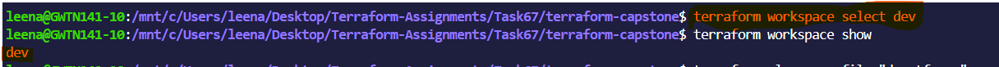

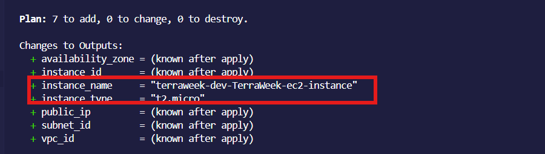

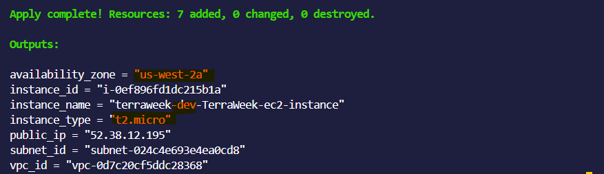

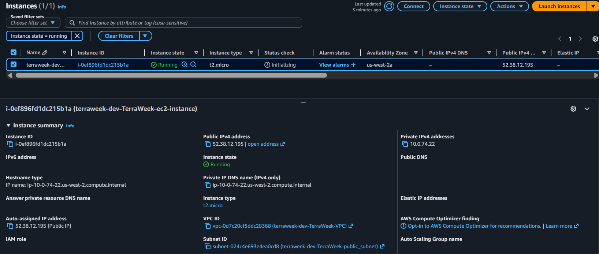

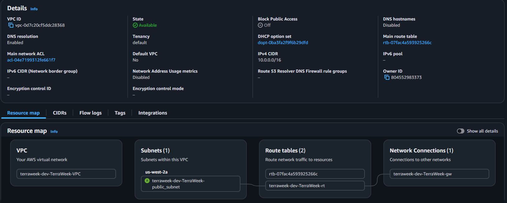


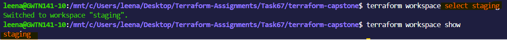

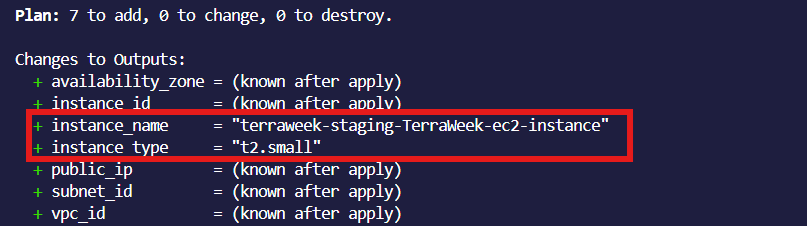

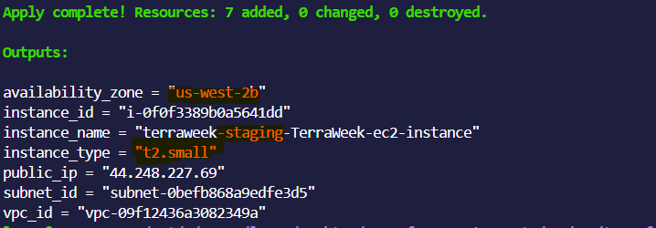

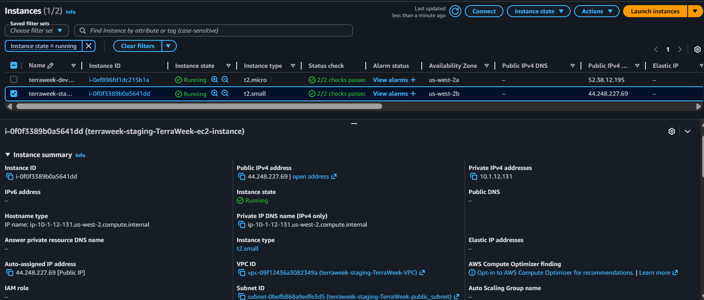

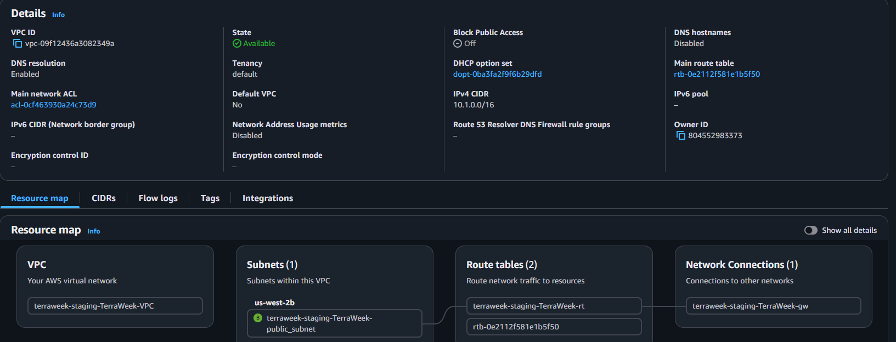

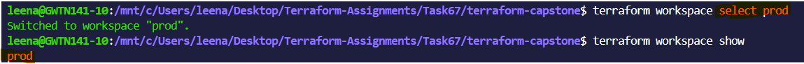

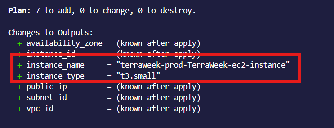

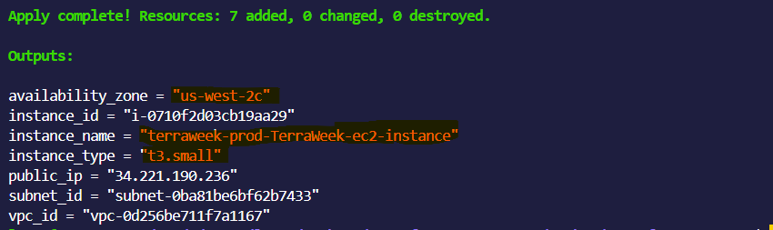

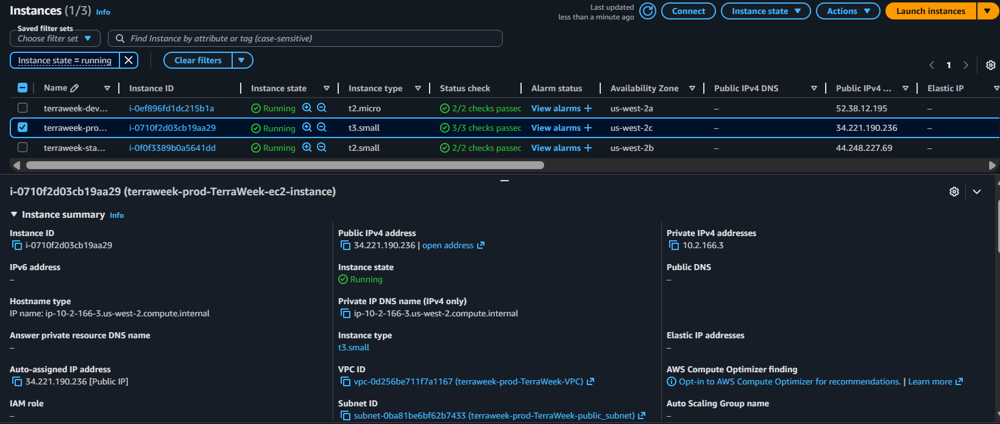

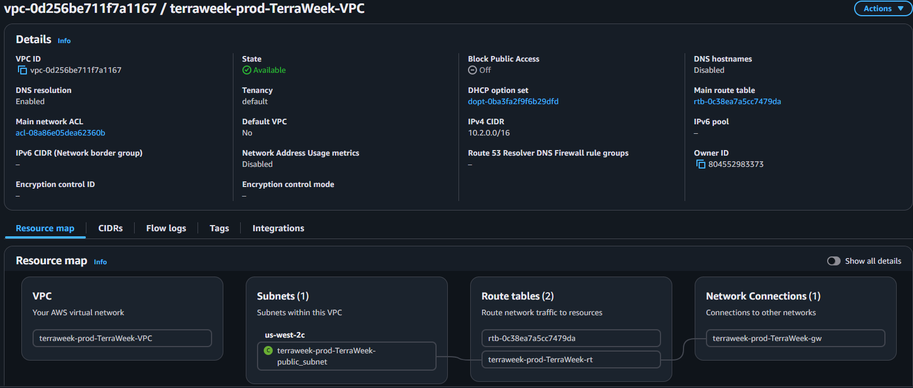


**Outputs**


**Verify:** Are all three environments completely isolated from each other?
**Answer**
Yes — in a properly designed Terraform setup, the dev, staging, and prod environments are intended to be logically isolated from each other, especially when they use separate state files, variables, and resources.

- resources created in dev do not automatically affect staging or prod,
- each environment tracks its own infrastructure separately,
- and Terraform operations in one environment only apply to that environment’s state.


---

### Task 6: Document Best Practices
Write down everything you have learned this week as a Terraform best practices guide:

> **File structure** -- separate files for providers, variables, outputs, main, locals

**File Structure**

Splitting your Terraform code into logical files:

- main.tf → defines actual infrastructure (EC2, VPC, etc.)
- providers.tf → cloud provider setup (AWS, Azure, etc.)
- variables.tf → inputs used in code
- outputs.tf → values shown after apply
- locals.tf → internal computed values

Purpose:Improves readability, debugging, and teamwork.


> **State management** -- always use remote backend, enable locking, enable versioning

Terraform keeps a “memory” of your infrastructure in a state file.


- Use remote backend (not local file)
- Enable locking (prevents 2 people changing at once)
- Enable versioning (rollback if needed)

Purpose: Prevents state corruption and team conflicts.

>**Variables** -- never hardcode, use tfvars per environment, validate with `validation` blocks

Instead of hardcoding values:
Use:

- terraform.tfvars per environment
- validation rules (e.g., allowed instance types)

Purpose: Makes code reusable and environment-specific.


>**Modules** -- one concern per module, always define inputs/outputs, pin registry module versions


Modules are reusable blocks of infrastructure.

Example:

VPC module
EC2 module
Security group module

Rules:

One module = one responsibility
Always define inputs + outputs
Pin version (avoid breaking changes)

Purpose: Reduces duplication and improves scaling.


> **Workspaces** -- use for environment isolation, reference `terraform.workspace` in configs


Workspaces allow multiple environments in one codebase:

- dev
- staging
- prod

Each workspace has its own state.

- terraform.workspace

Purpose:Quick environment separation without duplicating code.


> **Security** -- .gitignore for state and tfvars, encrypt state at rest, restrict backend access

Protect Terraform assets:

- Add .terraform, .tfstate, .tfvars to .gitignore
- Encrypt state files (S3 encryption, etc.)
- Restrict access using IAM roles/policies

Purpose: State files can contain sensitive info.

> **Commands** -- always run `plan` before `apply`, use `fmt` and `validate` before committing


Standard workflow:

- terraform fmt → formats code
- terraform validate → checks syntax
- terraform plan → preview changes
- terraform apply → execute changes

Purpose: Prevents accidental infrastructure changes.

> **Tagging** -- tag every resource with project, environment, and managed-by

Every resource should include tags:

- Project name
- Environment (dev/prod)
- Managed-by = terraform

Purpose:

- cost tracking
- resource identification
- governance compliance


>  **Naming** -- consistent prefix pattern: `<project>-<environment>-<resource>`
Use consistent naming:

<project>-<environment>-<resource>

Example:

- myapp-dev-vpc
- myapp-prod-ec2

Purpose: Avoids confusion in large infrastructures.

> **Cleanup** -- always `terraform destroy` non-production environments when not in use

Always remove unused environments:

terraform destroy

Purpose:

- avoids cloud cost waste
- removes unused resources
- keeps environment clean

---

### Task 7: Destroy All Environments
Clean up all three environments in reverse order:

```bash
terraform workspace select prod
terraform destroy -var-file="prod.tfvars"

terraform workspace select staging
terraform destroy -var-file="staging.tfvars"

terraform workspace select dev
terraform destroy -var-file="dev.tfvars"
```

Verify in the AWS console -- all VPCs, instances, security groups, and gateways should be gone.

Delete the workspaces:
```bash
terraform workspace select default
terraform workspace delete dev
terraform workspace delete staging
terraform workspace delete prod
```

**Verify:** Is your AWS account completely clean?

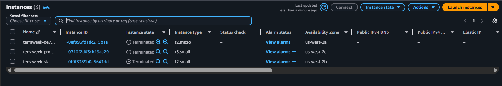


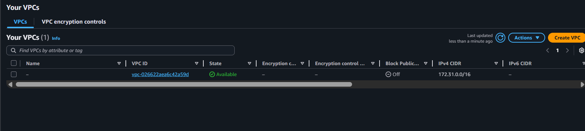


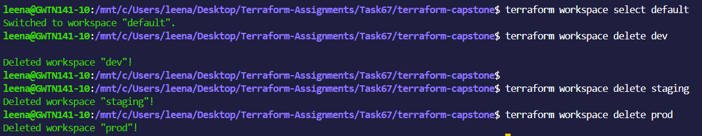
