# Day 68 -- Introduction to Ansible and Inventory Setup

## Challenge Tasks

### Task 1: Understand Ansible
Research and write short notes on:

>1. What is configuration management? Why do we need it?

**Answer**

Configuration is the management and mintainance of servers, in an automated way, according to the desired state.
Instead of manually performing the tasks, for e.g. 
- installing packages
- creating users
- configuring services
- updating servers
  Ansible allows to perform it in an automated way.

>Why do we need it?
- Ensures consistency across all servers
-  Automates software installation and configuration
- Eliminates manual errors during setup
- Makes systems repeatable (same setup every time)
-  Helps in fast server provisioning
- Supports scalability 
- Enables quick recovery after failures
- Maintains standard configuration across environments (dev, test, prod)
- Reduces time and effort for system administration
- Improves reliability and stability of infrastructure


>2. How is Ansible different from Chef, Puppet, and Salt?

**Answer**

Ansible differs from Chef, Puppet, and Salt because it is agentless, uses simple YAML syntax, and communicates over SSH. Chef and Puppet use agent-based architectures and more complex DSLs, while Salt is optimized for high-speed automation and scalability. Ansible is generally considered easier to learn and faster to set up


1. What does "agentless" mean? How does Ansible connect to managed nodes?

**Answer**

Tools like Puppet and Chef require background services/dedicated softwares on each of the target servers.Contrary to this Ansible
is "agentless", the control system communicated with the nodes directly.The communication i done  over the SSH connection. The main command responsible to establish connection is
"ansible all -m ping". The required module is transferred and then can be executed on the node.


3. Draw or describe the Ansible architecture:
   - **Control Node** -- the machine where Ansible runs (your laptop or a jump server)
   - **Managed Nodes** -- the servers Ansible configures (your EC2 instances)
   - **Inventory** -- the list of managed nodes
   - **Modules** -- units of work Ansible executes (install a package, copy a file, start a service)
   - **Playbooks** -- YAML files that define what to do on which hosts

>**Control Node**
- The machine where Ansible is installed and executed.
- It runs Ansible commands and playbooks and manages remote servers (managed nodes) by establishing connections using SSH or WinRM.
- It can verify connectivity using the ping module, but actual communication happens via SSH/WinRM.

> **Managed Nodes** 
- These are the servers that are managed and configured by the Ansible control node.
- The control node connects to them (usually via SSH) and executes tasks on them remotely.

>**Inventory** 
- A configuration file (commonly hosts.ini) that contains details of managed nodes such as hostnames, IP addresses, and groups of servers.
- It helps Ansible identify which machines to target for execution and allows grouping of hosts for easier management and scalable automation.

>**Modules**
- Small, reusable programs in Ansible that perform specific tasks on managed nodes.
- Each module is responsible for a single operation like installing packages, managing users, or controlling services.
For example:
- apt → installs packages on Ubuntu/Debian systems
- dnf → installs packages on RedHat-based systems
- user → manages user accounts
- service → starts/stops and manages system services

>**Playbooks**
- YAML files that define automation tasks in Ansible.
- They contain the execution plan for configuring one or more target nodes.
- Playbooks define what should be done using tasks, while Ansible executes them.
- They support features like loops, conditions, variables, and Ansible facts to make automation flexible and efficient.


---

### Task 2: Set Up Your Lab Environment
You need 2-3 EC2 instances to practice on. Choose one approach:

**Option A: Use Terraform (recommended -- you just learned this)**
Use your TerraWeek skills to provision 3 EC2 instances with:
- Amazon Linux 2 or Ubuntu 22.04
- `t2.micro` instance type
- A security group allowing SSH (port 22)
- A key pair for SSH access

**Option B: Launch manually from AWS Console**
Create 3 instances with the same specs above.

Label them mentally:
- **Instance 1:** web server
- **Instance 2:** app server
- **Instance 3:** db server

Verify you can SSH into each one from your control node:
```bash
ssh -i ~/your-key.pem ec2-user@<public-ip-1>
ssh -i ~/your-key.pem ec2-user@<public-ip-2>
ssh -i ~/your-key.pem ec2-user@<public-ip-3>
```
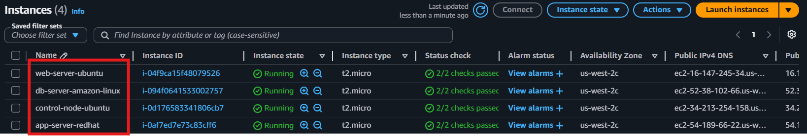


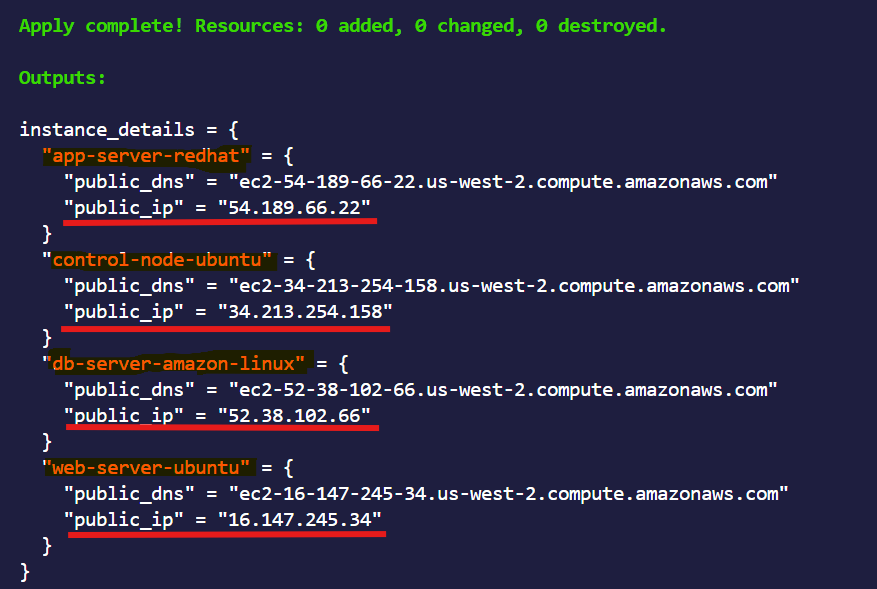


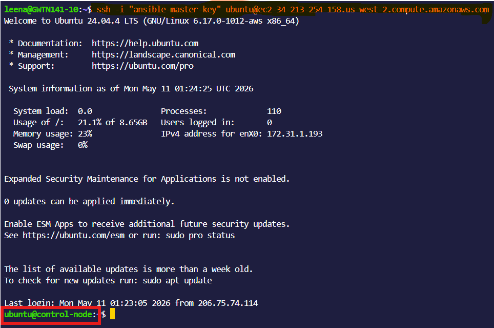

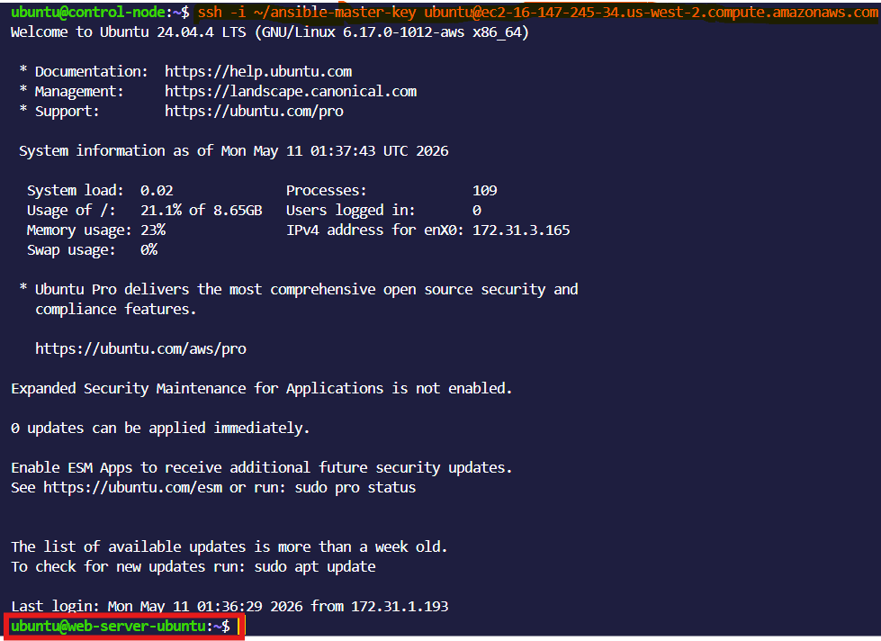

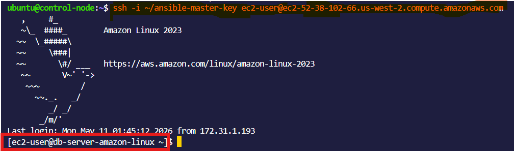


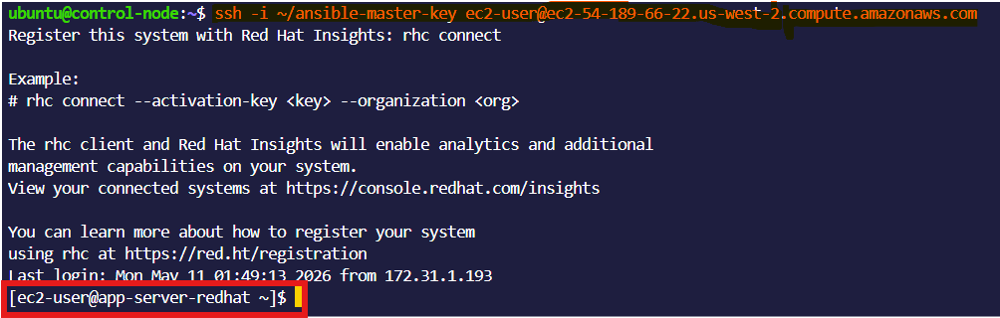
---

### Task 3: Install Ansible
Install Ansible on your **control node** (your laptop or one dedicated EC2 instance):

```bash
# macOS
brew install ansible

# Ubuntu/Debian
sudo apt update
sudo apt install ansible -y

# Amazon Linux / RHEL
sudo yum install ansible -y
# or
pip3 install ansible

# Verify
ansible --version
```

Confirm the output shows the Ansible version, config file path, and Python version.


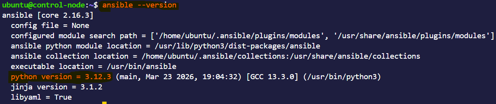

**Document:** On which machine did you install Ansible? Why is it only needed on the control node?

**Answer**
Ansible was installed on ec2-instance, an ubuntu server.It iss only required to be on control-node as:

- Ansible works in an agentless architecture
-  Only the control node runs Ansible commands and playbooks
- Managed nodes (servers) do not need Ansible installed


---

### Task 4: Create Your Inventory File
The inventory tells Ansible which servers to manage. Create a project directory and your first inventory:

```bash
mkdir ansible-practice && cd ansible-practice
```

Create a file called `inventory.ini`:
```ini
[web]
web-server ansible_host=<PUBLIC_IP_1>

[app]
app-server ansible_host=<PUBLIC_IP_2>

[db]
db-server ansible_host=<PUBLIC_IP_3>

[all:vars]
ansible_user=ec2-user
ansible_ssh_private_key_file=~/your-key.pem
```

Verify Ansible can reach all hosts:
```bash
ansible all -i inventory.ini -m ping
```
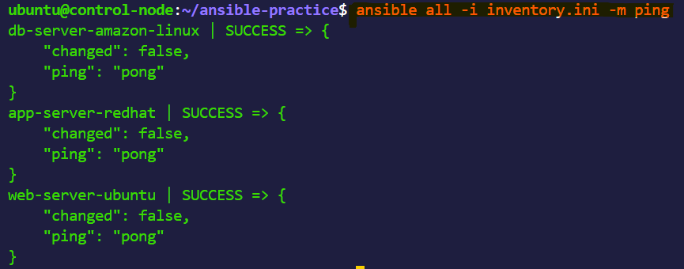


You should see green `SUCCESS` with `"ping": "pong"` for each host.

**Troubleshoot:** If ping fails:
- Check the SSH key path and permissions (`chmod 400 your-key.pem`)
- Check the security group allows SSH from your IP
- Check the `ansible_user` matches your AMI (ec2-user for Amazon Linux, ubuntu for Ubuntu)

---

### Task 5: Run Ad-Hoc Commands
Ad-hoc commands let you run quick one-off tasks without writing a playbook.

1. **Check uptime on all servers:**
```bash
ansible all -i inventory.ini -m command -a "uptime"
```
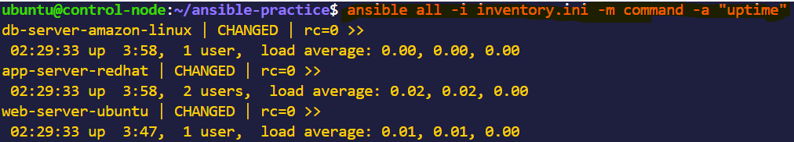


2. **Check free memory on web servers only:**
```bash
ansible web -i inventory.ini -m command -a "free -h"

```
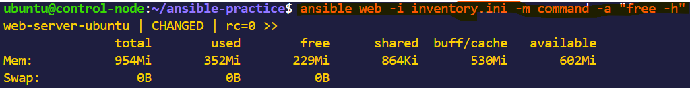

3. **Check disk space on all servers:**
```bash
ansible all -i inventory.ini -m command -a "df -h"
```

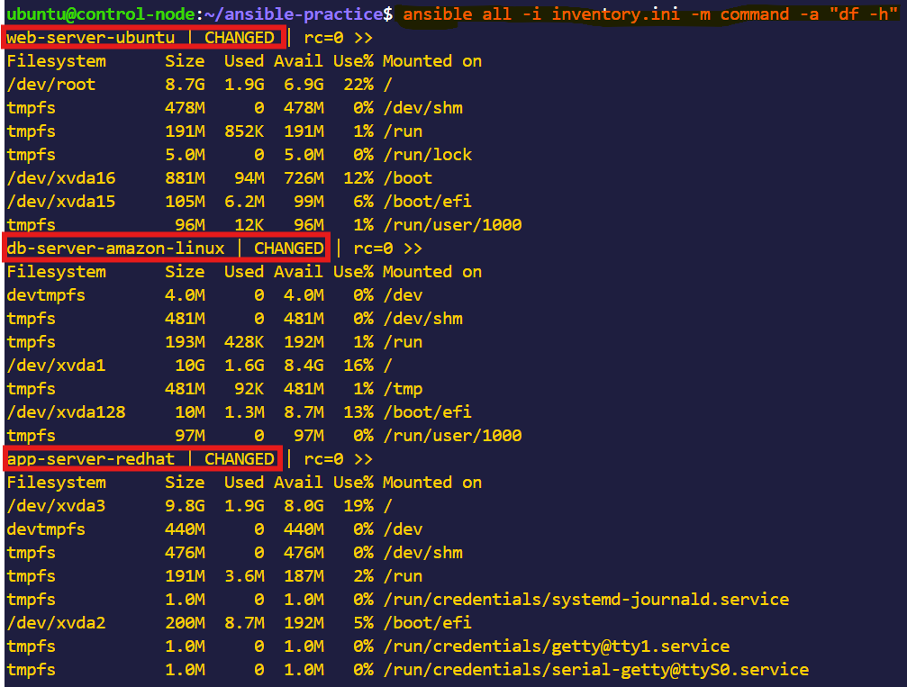


4. **Install a package on the web group:**
```bash
ansible web -i inventory.ini -m yum -a "name=git state=present" --become


```
(Use `apt` instead of `yum` if running Ubuntu)


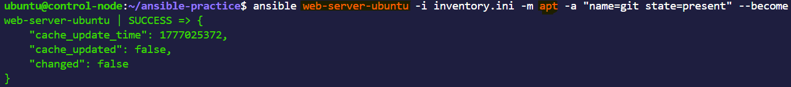

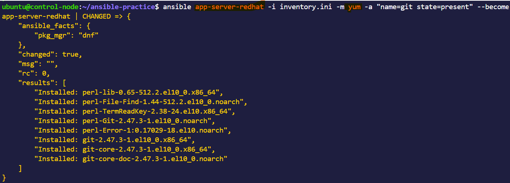


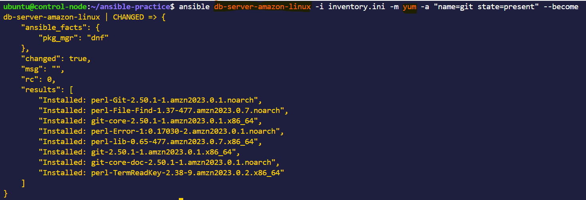

5. **Copy a file to all servers:**
```bash
echo "Hello from Ansible" > hello.txt
ansible all -i inventory.ini -m copy -a "src=hello.txt dest=/tmp/hello.txt"
```


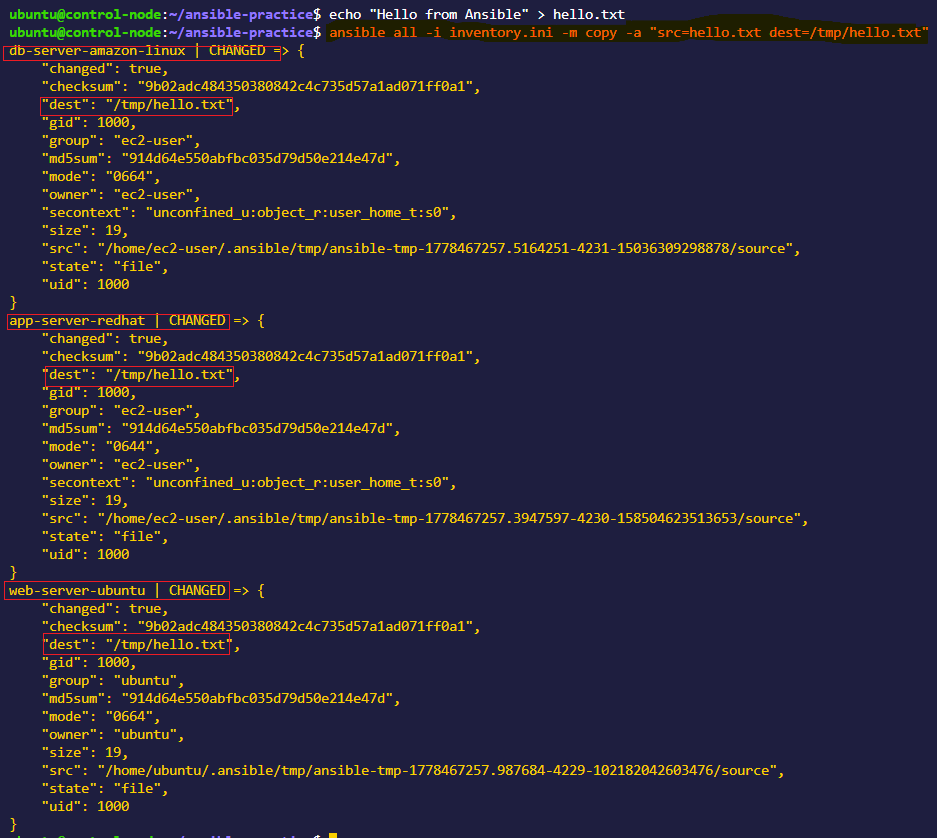


6. **Verify the file was copied:**
```bash
ansible all -i inventory.ini -m command -a "cat /tmp/hello.txt"
```

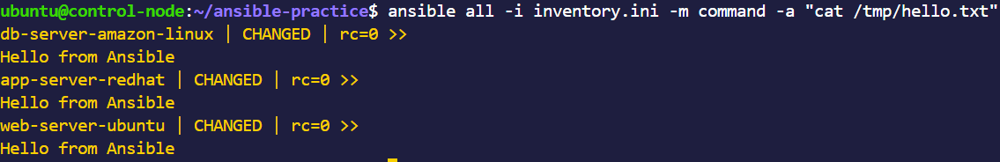


**Document:** What does `--become` do? When do you need it?
**Answer**
--become tells Ansible to run tasks with elevated (admin/root) privileges on the target machine.It is basically Ansible’s way of saying:
“Run this command as sudo (or root).”


---

### Task 6: Explore Inventory Groups and Patterns
1. **Create a group of groups** -- add this to your `inventory.ini`:
```ini
[application:children]
web
app

[all_servers:children]
application
db
```

2. Run commands against different groups:
```bash
ansible application -i inventory.ini -m ping     # web + app servers
ansible db -i inventory.ini -m ping               # only db server
ansible all_servers -i inventory.ini -m ping      # everything
```


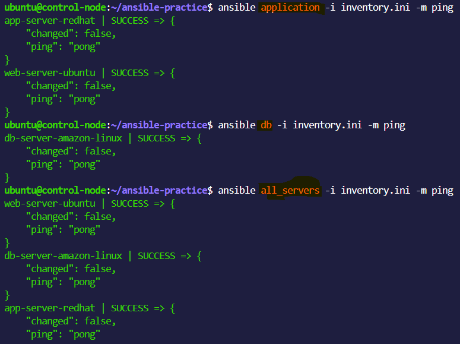


3. **Use patterns:**
```bash
ansible 'web:app' -i inventory.ini -m ping        # OR: web or app
ansible 'all:!db' -i inventory.ini -m ping        # NOT: all except db
```

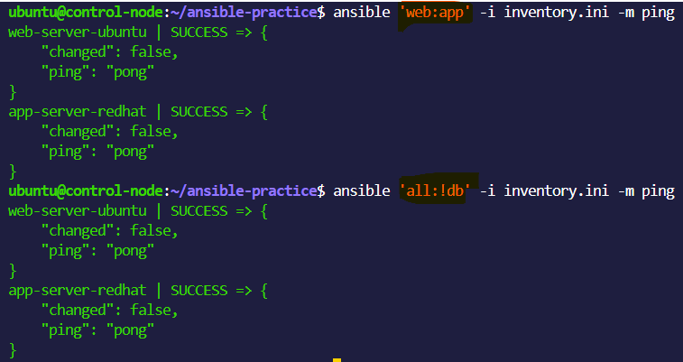


4. **Create an `ansible.cfg`** to avoid typing `-i inventory.ini` every time:
```ini
[defaults]
inventory = inventory.ini
host_key_checking = False
remote_user = ec2-user
private_key_file = ~/your-key.pem
```

Now you can simply run:
```bash
ansible all -m ping
```


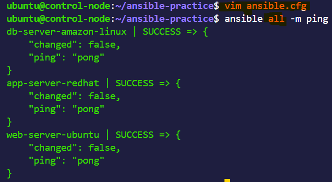

**Verify:** Does `ansible all -m ping` work without specifying the inventory file?
**Answer**

Yes with the ansible.cfg file I was able to ping all the servers.


---

- Difference between `command` and `shell` modules

**Command Module**
- Executes commands directly on the remote system
- Does NOT use a shell
- Safer and more predictable

**Shell Module**
- Executes commands through the shell (/bin/sh)
- Supports full shell features
