# Day 69 -- Ansible Playbooks and Modules

## Challenge Tasks

### Task 1: Your First Playbook
Create `install-nginx.yml`:

```yaml
---
- name: Install and start Nginx on web servers
  hosts: web
  become: true

  tasks:
    - name: Install Nginx
      yum:
        name: nginx
        state: present

    - name: Start and enable Nginx
      service:
        name: nginx
        state: started
        enabled: true

    - name: Create a custom index page
      copy:
        content: "<h1>Deployed by Ansible - TerraWeek Server</h1>"
        dest: /usr/share/nginx/html/index.html
```

(Use `apt` instead of `yum` if your instances run Ubuntu)

Run it:
```bash
ansible-playbook install-nginx.yml
```

Read the output carefully -- every task shows `changed`, `ok`, or `failed`.

Now run it **again**. Notice that tasks show `ok` instead of `changed`. This is **idempotency** -- Ansible only makes changes when needed.

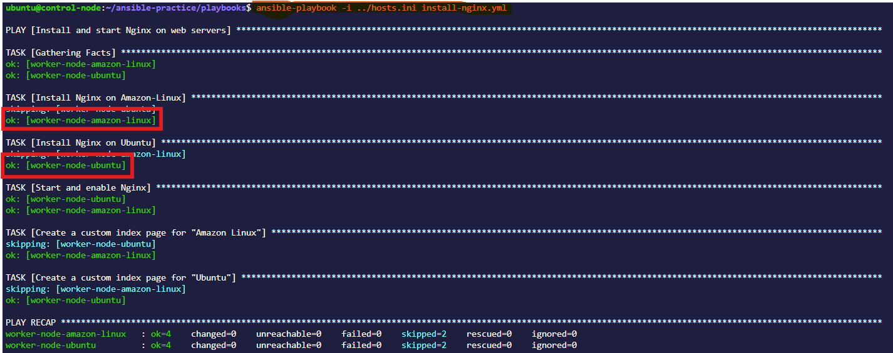


**Verify:** Curl the web server's public IP. Do you see your custom page?
**Answer**
Yes, the curl command is working for both, Amazon Linux server and the Ubuntu Server.

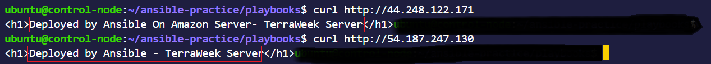


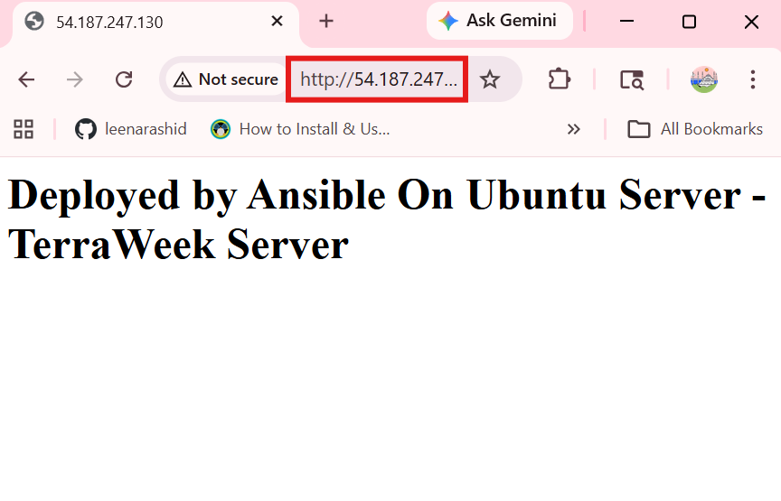


---

### Task 2: Understand the Playbook Structure
Open your playbook and annotate each part in your notes:

```yaml
---                                    # YAML document start
- name: Play name                      # PLAY -- targets a group of hosts
  hosts: web                           # Which inventory group to run on
  become: true                         # Run tasks as root (sudo)

  tasks:                               # List of TASKS in this play
    - name: Task name                  # TASK -- one unit of work
      module_name:                     # MODULE -- what Ansible does
        key: value                     # Module arguments
```

Answer:
1. What is the difference between a play and a task?
**Answer**
- A play is a big block that defines:

 - Which hosts to target
 - What roles or tasks to run on those hosts
 - Overall execution context.

- A task is a single action inside a play.


2. Can you have multiple plays in one playbook?
**Answer**

Yes — you can have multiple plays in one playbook, and it’s actually very common in real DevOps setups.

 What it means

A playbook = collection of plays

So one YAML file can contain:

- Play 1 → web servers
- Play 2 → app servers
- Play 3 → database servers

Each play runs on different hosts.


3. What does `become: true` do at the play level vs the task level?

**Answer**


| Level      | Scope       | Behavior                 |
| ---------- | ----------- | ------------------------ |
| Play level | Whole play  | All tasks use sudo       |
| Task level | Single task | Only that task uses sudo |


4. What happens if a task fails -- do remaining tasks still run?

**Answer**
If Host A's task fail,the remaining tasks for that particular host also stops but the tasks keep on running for the other hosts of the playbook.


---

### Task 3: Learn the Essential Modules
Practice each of these modules by writing a playbook called `essential-modules.yml` with multiple tasks:

1. **`yum`/`apt`** -- Install and remove packages:
```yaml
- name: Install multiple packages
  yum:
    name:
      - git
      - curl
      - wget
      - tree
    state: present
```

2. **`service`** -- Manage services:
```yaml
- name: Ensure Nginx is running
  service:
    name: nginx
    state: started
    enabled: true
```

3. **`copy`** -- Copy files from control node to managed nodes:
```yaml
- name: Copy config file
  copy:
    src: files/app.conf
    dest: /etc/app.conf
    owner: root
    group: root
    mode: '0644'
```

4. **`file`** -- Create directories and manage permissions:
```yaml
- name: Create application directory
  file:
    path: /opt/myapp
    state: directory
    owner: ec2-user
    mode: '0755'
```

5. **`command`** -- Run a command (no shell features):
```yaml
- name: Check disk space
  command: df -h
  register: disk_output

- name: Print disk space
  debug:
    var: disk_output.stdout_lines
```

6. **`shell`** -- Run a command with shell features (pipes, redirects):
```yaml
- name: Count running processes
  shell: ps aux | wc -l
  register: process_count

- name: Show process count
  debug:
    msg: "Total processes: {{ process_count.stdout }}"
```

7. **`lineinfile`** -- Add or modify a single line in a file:
```yaml
- name: Set timezone in environment
  lineinfile:
    path: /etc/environment
    line: 'TZ=Asia/Kolkata'
    create: true
```

Create a `files/` directory with a sample `app.conf` file for the copy task. Run the playbook against all servers.

**Explanition**

Following are the images I took after running all the modules in sequence.Since there are a few differences for "Amazon Linux" and "Ubuntu" so I tailored the modules accordingly where required.

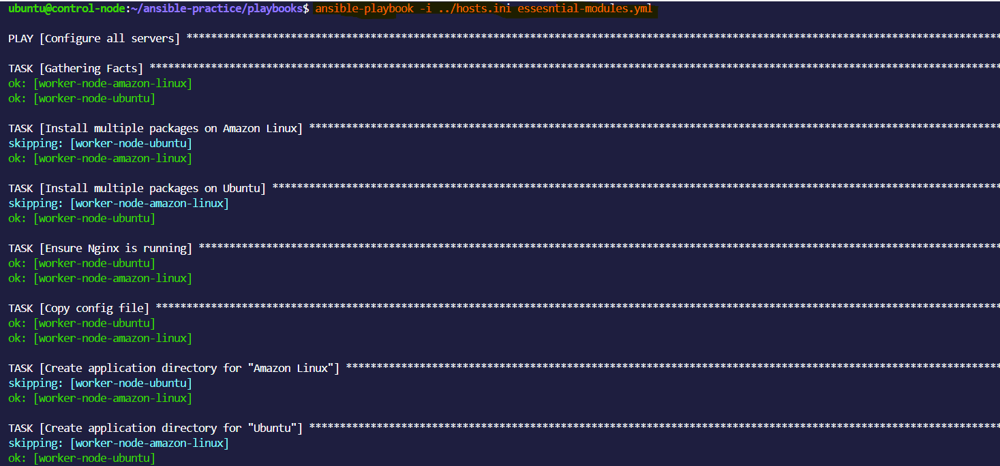


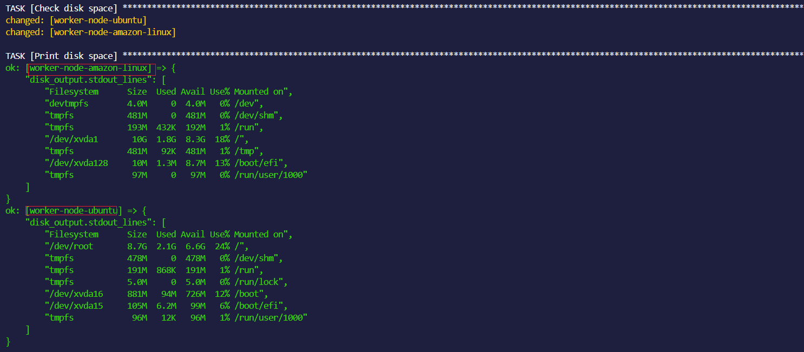


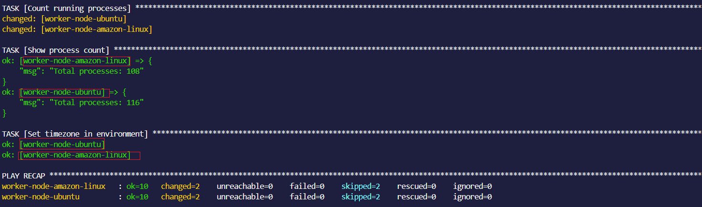


**Document:** What is the difference between `command` and `shell`? When should you use each?

**Answer**
Shell is considerably slower than command and should be avoided unless there is a special need for using shell features, like environment variable expansion or chaining multiple commands using pipes.
Command is afer nad restricted Shell is more flexible and powerful.Sheel is needed when You need pipes, redirection, or chaining.Command is needed when You are running a simple Linux command and no shell features are needed. shell (shell: cat file.txt | grep "error") command (command: ls /tmp).


### Task 4: Handlers -- Restart Services Only When Needed
Handlers are tasks that run only when triggered by a `notify`. This avoids unnecessary service restarts.

Create `nginx-config.yml`:
```yaml
---
- name: Configure Nginx with a custom config
  hosts: web
  become: true

  tasks:
    - name: Install Nginx
      yum:
        name: nginx
        state: present

    - name: Deploy Nginx config
      copy:
        src: files/nginx.conf
        dest: /etc/nginx/nginx.conf
        owner: root
        mode: '0644'
      notify: Restart Nginx

    - name: Deploy custom index page
      copy:
        content: "<h1>Managed by Ansible</h1><p>Server: {{ inventory_hostname }}</p>"
        dest: /usr/share/nginx/html/index.html

    - name: Ensure Nginx is running
      service:
        name: nginx
        state: started
        enabled: true

  handlers:
    - name: Restart Nginx
      service:
        name: nginx
        state: restarted
```

Create `files/nginx.conf` with a basic Nginx config.

Run the playbook:
- First run: handler triggers because the config file is new
- Second run: handler does NOT trigger because nothing changed

**Verify:** Run it twice and compare the output. Does the handler run both times?

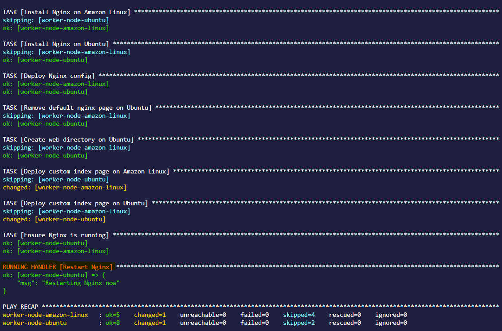


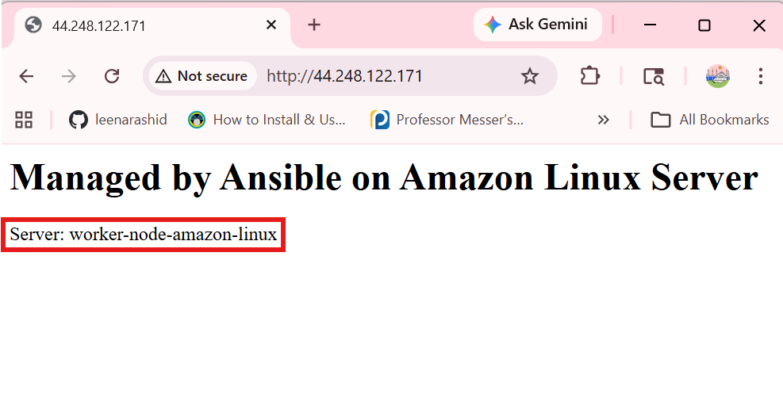


---

### Task 5: Dry Run, Diff, and Verbosity
Before running playbooks on production, always preview changes first.

1. **Dry run (check mode)** -- shows what would change without changing anything:
```bash
ansible-playbook install-nginx.yml --check
```

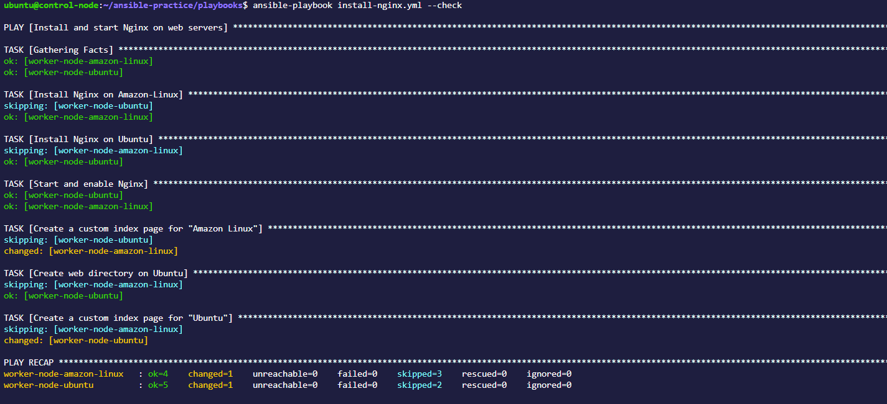


2. **Diff mode** -- shows the actual file differences:
```bash
ansible-playbook nginx-config.yml --check --diff
```


3. **Verbosity** -- increase output detail for debugging:
```bash
ansible-playbook install-nginx.yml -v       # verbose
ansible-playbook install-nginx.yml -vv      # more verbose
ansible-playbook install-nginx.yml -vvv     # connection debugging
```

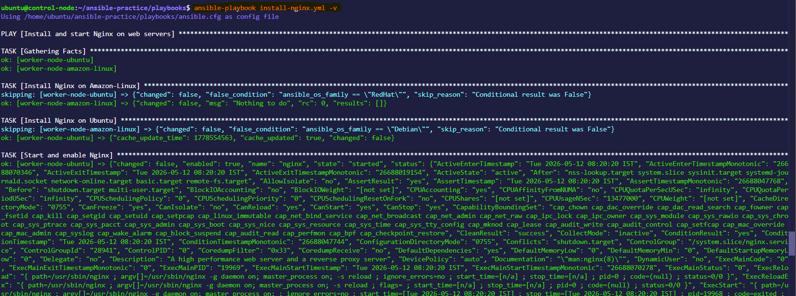

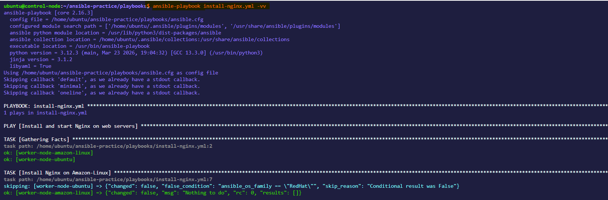


4. **Limit to specific hosts:**
```bash
ansible-playbook install-nginx.yml --limit web-server
```

 

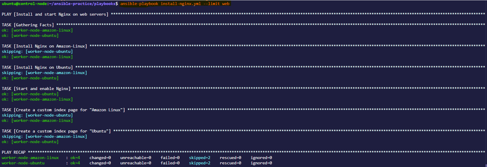


5. **List what would be affected without running:**
```bash
ansible-playbook install-nginx.yml --list-hosts
ansible-playbook install-nginx.yml --list-tasks
```

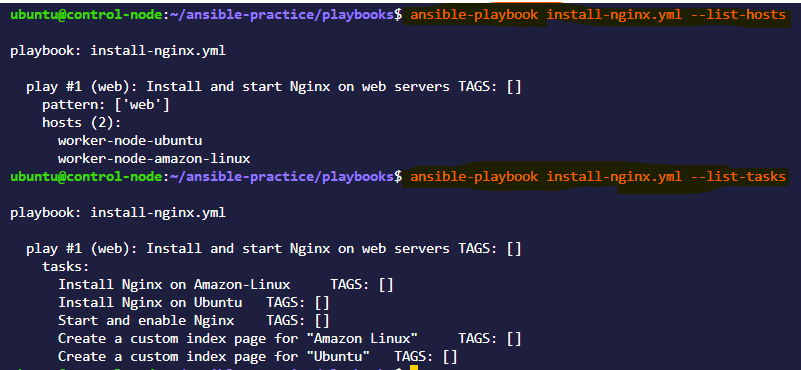


**Document:** Why is `--check --diff` the most important flag combination for production use?

**Answer**

--check --diff is considered one of the most important combinations for production because it lets you preview changes safely before actually modifying anything.


>--check (Dry Run Mode)
- Runs the playbook without making changes
- Shows what would change
- Helps prevent accidental outages
>--diff (Change Preview Mode)
- Shows exact line-by-line differences
- Especially useful for files (configs, templates)
- Highlights before vs after


---

### Task 6: Multiple Plays in One Playbook
Write `multi-play.yml` with separate plays for each server group:

```yaml
---
- name: Configure web servers
  hosts: web
  become: true
  tasks:
    - name: Install Nginx
      yum:
        name: nginx
        state: present
    - name: Start Nginx
      service:
        name: nginx
        state: started
        enabled: true

- name: Configure app servers
  hosts: app
  become: true
  tasks:
    - name: Install Node.js dependencies
      yum:
        name:
          - gcc
          - make
        state: present
    - name: Create app directory
      file:
        path: /opt/app
        state: directory
        mode: '0755'

- name: Configure database servers
  hosts: db
  become: true
  tasks:
    - name: Install MySQL client
      yum:
        name: mysql
        state: present
    - name: Create data directory
      file:
        path: /var/lib/appdata
        state: directory
        mode: '0700'
```

Run it:
```bash
ansible-playbook multi-play.yml
```

Watch the output -- each play targets a different group, and tasks run only on the relevant hosts.

**Verify:** Is Nginx only installed on web servers? Is MySQL only on db servers?

**Answer**

I have [web] --> Worker Amzon and Worker Ubuntu , [db] --> Worker Amazon  and  [app] --> Worker Ubuntu
Since mysql can not be insatlled on Amazon Linux server, I opted ofr Maria DB 
And Node .js dependencies on both i.e. [web]

![Nginx installed on [web]](images/nginx.png)


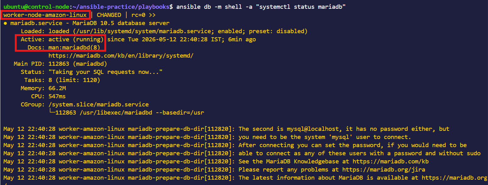


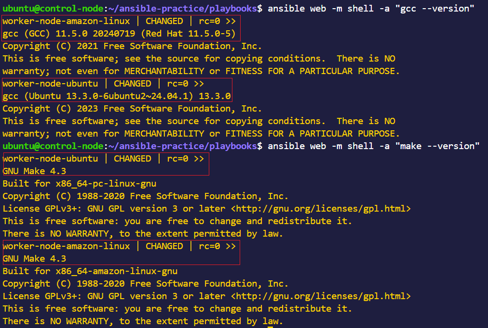


**Commands**
-  ansible web -m shell -a "systemctl status nginx"
-   ansible web -m shell -a "ansible app -m shell -a "node -v && npm -v && gcc --version && make --version"


---


- Difference between  `-v` ,`-vv` ,`-vvv`

`-v` -- Basic extra info

`-vv` -- More detailed output

`-vvv` -- Debug level (very detailed)

`-vvvv` -- Connection + SSH debug 

