# Day 70 -- Variables, Facts, Conditionals and Loops

## Challenge Tasks

### Task 1: Variables in Playbooks
Create `variables-demo.yml`:

```yaml
---
- name: Variable demo
  hosts: all
  become: true

  vars:
    app_name: terraweek-app
    app_port: 8080
    app_dir: "/opt/{{ app_name }}"
    packages:
      - git
      - curl
      - wget

  tasks:
    - name: Print app details
      debug:
        msg: "Deploying {{ app_name }} on port {{ app_port }} to {{ app_dir }}"

    - name: Create application directory
      file:
        path: "{{ app_dir }}"
        state: directory
        mode: '0755'

    - name: Install required packages
      yum:
        name: "{{ packages }}"
        state: present
```

Run it and verify the variables resolve correctly.

Now, override a variable from the command line:
```bash
ansible-playbook variables-demo.yml -e "app_name=my-custom-app app_port=9090"
```
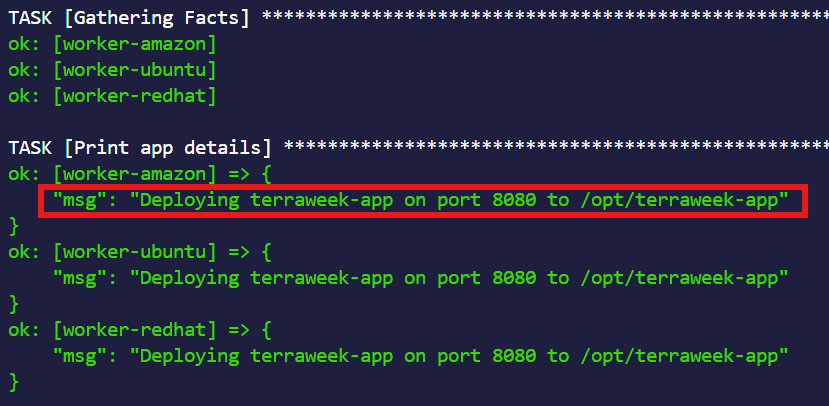

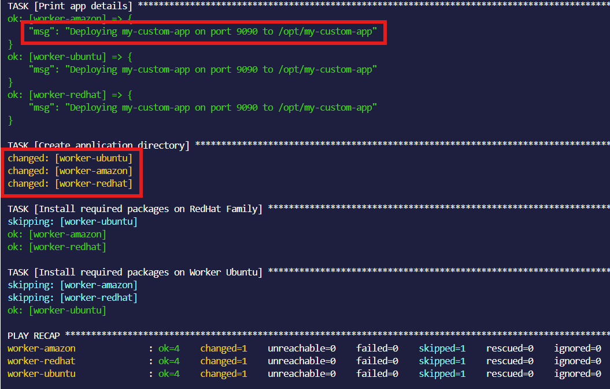


**Verify:** Does the CLI variable override the playbook variable?
**Answer**
Yes. Variables passed via --extra-vars (-e) have the highest precedence and override playbook variables, inventory variables, host_vars, and group_vars.
**Example**
---
- hosts: all
  vars:
    app_name: nginx

  tasks:
    - debug:
        msg: "{{ app_name }}" 
>Run normally 
ansible-playbook site.yml
>Output
nginx
>Run with a CLI variable:
ansible-playbook site.yml -e "app_name=docker"
>Output
docker
>Result
The value passed with -e wins.       


---

### Task 2: group_vars and host_vars
Variables should not live inside playbooks. Move them to dedicated files.

Create this structure:
```
ansible-practice/
  inventory.ini
  ansible.cfg
  group_vars/
    all.yml
    web.yml
    db.yml
  host_vars/
    web-server.yml
  playbooks/
    site.yml
```

**`group_vars/all.yml`** -- applies to every host:
```yaml
---
ntp_server: pool.ntp.org
app_env: development
common_packages:
  - vim
  - htop
  - tree
```

**`group_vars/web.yml`** -- applies only to the web group:
```yaml
---
http_port: 80
max_connections: 1000
web_packages:
  - nginx
```

**`group_vars/db.yml`** -- applies only to the db group:
```yaml
---
db_port: 3306
db_packages:
  - mysql-server
```

**`host_vars/web-server.yml`** -- applies only to this specific host:
```yaml
---
max_connections: 2000
custom_message: "This is the primary web server"
```

Write a playbook `site.yml` that uses these variables:
```yaml
---
- name: Apply common config
  hosts: all
  become: true
  tasks:
    - name: Install common packages
      yum:
        name: "{{ common_packages }}"
        state: present
    - name: Show environment
      debug:
        msg: "Environment: {{ app_env }}"

- name: Configure web servers
  hosts: web
  become: true
  tasks:
    - name: Show web config
      debug:
        msg: "HTTP port: {{ http_port }}, Max connections: {{ max_connections }}"
    - name: Show host-specific message
      debug:
        msg: "{{ custom_message }}"
```

Run it and observe which variables apply to which hosts.

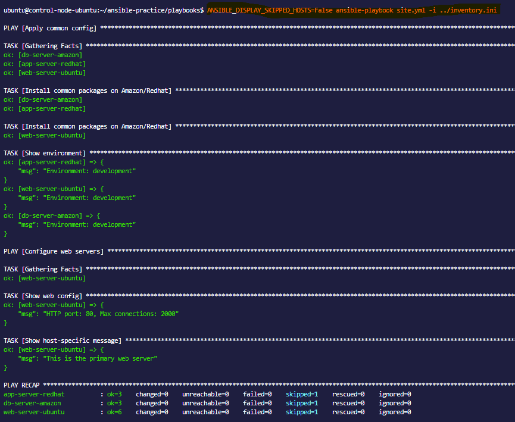


**Document:** What is the variable precedence? (hint: host_vars > group_vars > playbook vars, and `-e` overrides everything)

**Answer**

Variable precedence in Ansible (simplified) is:

group_vars → host_vars → playbook vars → task vars → extra vars (-e)

The variable with higher precedence overrides lower-precedence values, and -e overrides everything.
---

### Task 3: Ansible Facts -- Gathering System Information
Ansible automatically collects "facts" about each managed node -- OS, IP, memory, CPU, disks, and hundreds more.

1. **See all facts for a host:**
```bash
ansible web-server -m setup
```

2. **Filter specific facts:**
```bash
ansible web-server -m setup -a "filter=ansible_os_family"
ansible web-server -m setup -a "filter=ansible_distribution*"
ansible web-server -m setup -a "filter=ansible_memtotal_mb"
ansible web-server -m setup -a "filter=ansible_default_ipv4"
```

3. **Use facts in a playbook** -- create `facts-demo.yml`:
```yaml
---
- name: Facts demo
  hosts: all
  tasks:
    - name: Show OS info
      debug:
        msg: >
          Hostname: {{ ansible_hostname }},
          OS: {{ ansible_distribution }} {{ ansible_distribution_version }},
          RAM: {{ ansible_memtotal_mb }}MB,
          IP: {{ ansible_default_ipv4.address }}

    - name: Show all network interfaces
      debug:
        var: ansible_interfaces
```

Run it and observe the facts printed for each host.

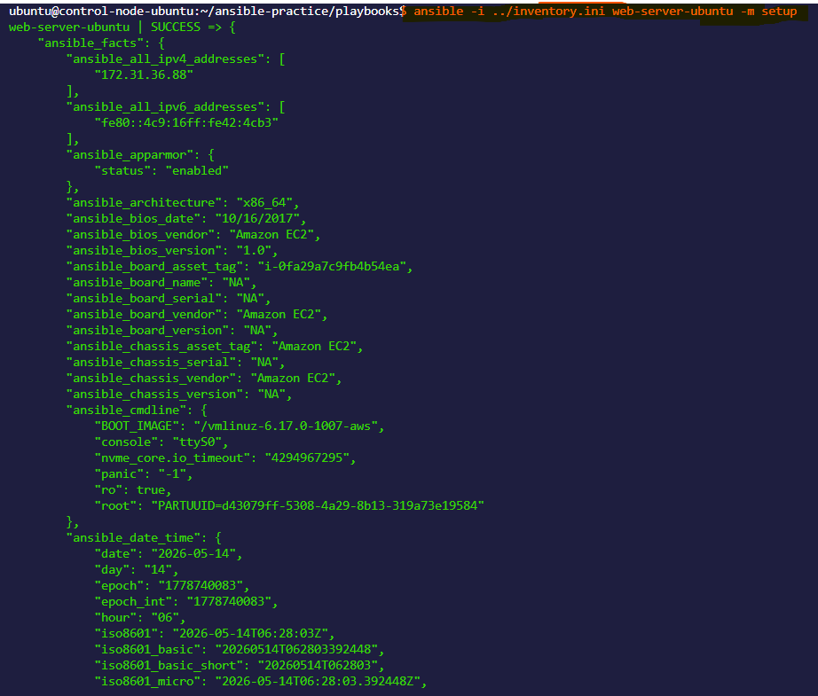

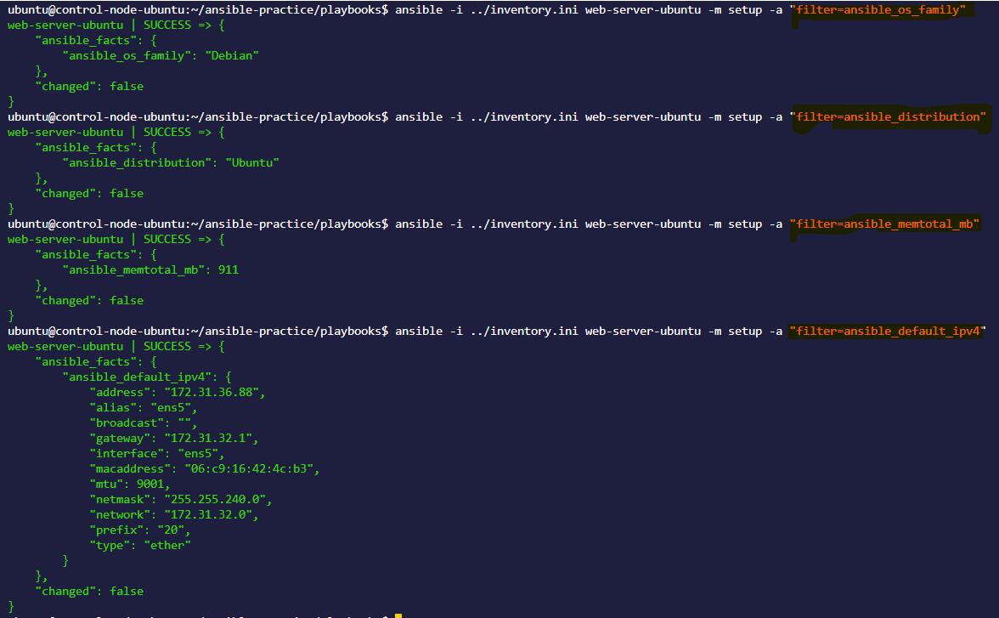


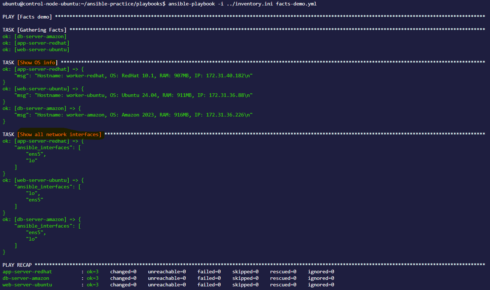


**Document:** Name five facts you would use in real playbooks and why.
**Answer**
I commonly use os_family for OS-specific tasks, distribution to identify the exact Linux distribution, hostname for server identification, default_ipv4.address to obtain the machine's IP address, and memory_mb.real.total to make resource-based configuration decisions.

---

### Task 4: Conditionals with when
Tasks should not always run on every host. Use `when` to control execution.

Create `conditional-demo.yml`:

```yaml
---
- name: Conditional tasks demo
  hosts: all
  become: true

  tasks:
    - name: Install Nginx (only on web servers)
      yum:
        name: nginx
        state: present
      when: "'web' in group_names"

    - name: Install MySQL (only on db servers)
      yum:
        name: mysql-server
        state: present
      when: "'db' in group_names"

    - name: Show warning on low memory hosts
      debug:
        msg: "WARNING: This host has less than 1GB RAM"
      when: ansible_memtotal_mb < 1024

    - name: Run only on Amazon Linux
      debug:
        msg: "This is an Amazon Linux machine"
      when: ansible_distribution == "Amazon"

    - name: Run only on Ubuntu
      debug:
        msg: "This is an Ubuntu machine"
      when: ansible_distribution == "Ubuntu"

    - name: Run only in production
      debug:
        msg: "Production settings applied"
      when: app_env == "production"

    - name: Multiple conditions (AND)
      debug:
        msg: "Web server with enough memory"
      when:
        - "'web' in group_names"
        - ansible_memtotal_mb >= 512

    - name: OR condition
      debug:
        msg: "Either web or app server"
      when: "'web' in group_names or 'app' in group_names"
```

Run it and observe which tasks are skipped on which hosts.

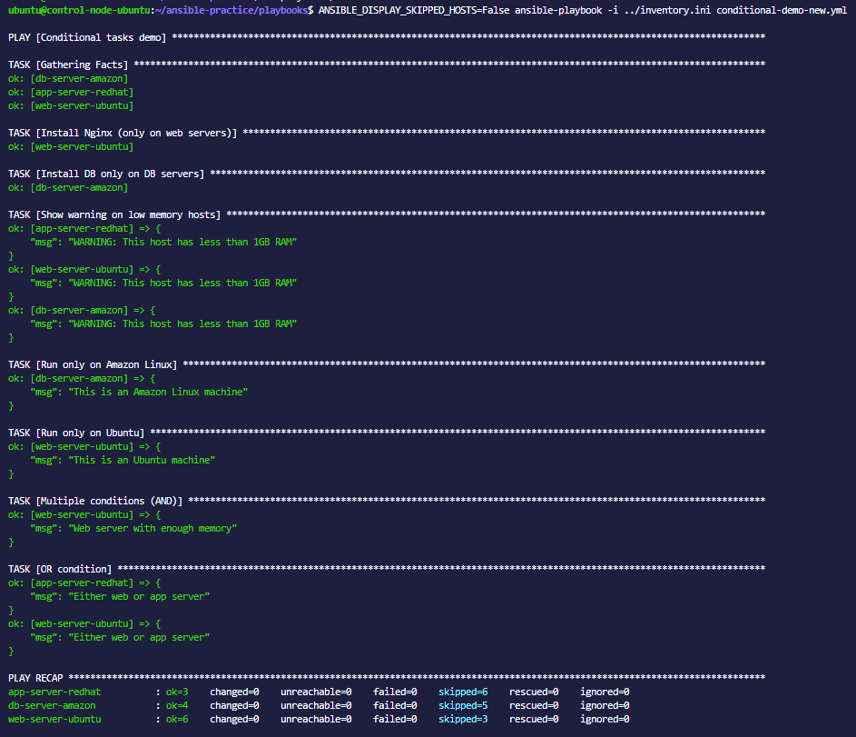


**Verify:** Are tasks correctly skipping on hosts that don't match the condition?
**Answer**
Yes. Ansible correctly skips tasks on hosts that do not satisfy the when condition. The playbook output will show skipping for those hosts, confirming that the condition was evaluated and the task was not executed.
---

### Task 5: Loops
Create `loops-demo.yml`:

```yaml
---
- name: Loops demo
  hosts: all
  become: true

  vars:
    users:
      - name: deploy
        groups: wheel
      - name: monitor
        groups: wheel
      - name: appuser
        groups: users

    directories:
      - /opt/app/logs
      - /opt/app/config
      - /opt/app/data
      - /opt/app/tmp

  tasks:
    - name: Create multiple users
      user:
        name: "{{ item.name }}"
        groups: "{{ item.groups }}"
        state: present
      loop: "{{ users }}"

    - name: Create multiple directories
      file:
        path: "{{ item }}"
        state: directory
        mode: '0755'
      loop: "{{ directories }}"

    - name: Install multiple packages
      yum:
        name: "{{ item }}"
        state: present
      loop:
        - git
        - curl
        - unzip
        - jq

    - name: Print each user created
      debug:
        msg: "Created user {{ item.name }} in group {{ item.groups }}"
      loop: "{{ users }}"
```

Run it and observe the loop output -- each iteration is shown separately.

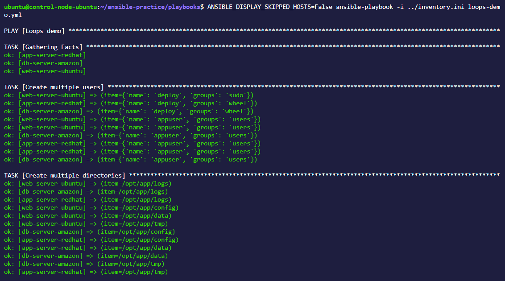

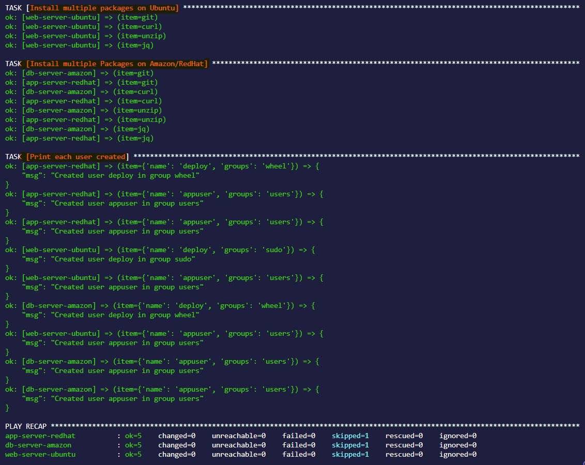


**Document:** What is the difference between `loop` and the older `with_items`? (hint: `loop` is the modern recommended syntax)
**Answer**
`loop` is the modern, recommended syntax for iterating over items in Ansible, while `with_items` is the older legacy syntax. Both can perform similar tasks, but loop is more consistent, flexible, and easier to read.

---

### Task 6: Register, Debug, and Combine Everything
Build a real-world playbook `server-report.yml` that combines variables, facts, conditionals, and register:

```yaml
---
- name: Server Health Report
  hosts: all

  tasks:
    - name: Check disk space
      command: df -h /
      register: disk_result

    - name: Check memory
      command: free -m
      register: memory_result

    - name: Check running services
      shell: systemctl list-units --type=service --state=running | head -20
      register: services_result

    - name: Generate report
      debug:
        msg:
          - "========== {{ inventory_hostname }} =========="
          - "OS: {{ ansible_distribution }} {{ ansible_distribution_version }}"
          - "IP: {{ ansible_default_ipv4.address }}"
          - "RAM: {{ ansible_memtotal_mb }}MB"
          - "Disk: {{ disk_result.stdout_lines[1] }}"
          - "Running services (first 20): {{ services_result.stdout_lines | length }}"

    - name: Flag if disk is critically low
      debug:
        msg: "ALERT: Check disk space on {{ inventory_hostname }}"
      when: "'9[0-9]%' in disk_result.stdout or '100%' in disk_result.stdout"

    - name: Save report to file
      copy:
        content: |
          Server: {{ inventory_hostname }}
          OS: {{ ansible_distribution }} {{ ansible_distribution_version }}
          IP: {{ ansible_default_ipv4.address }}
          RAM: {{ ansible_memtotal_mb }}MB
          Disk: {{ disk_result.stdout }}
          Checked at: {{ ansible_date_time.iso8601 }}
        dest: "/tmp/server-report-{{ inventory_hostname }}.txt"
      become: true
```

Run it and verify the report file is created on each server.

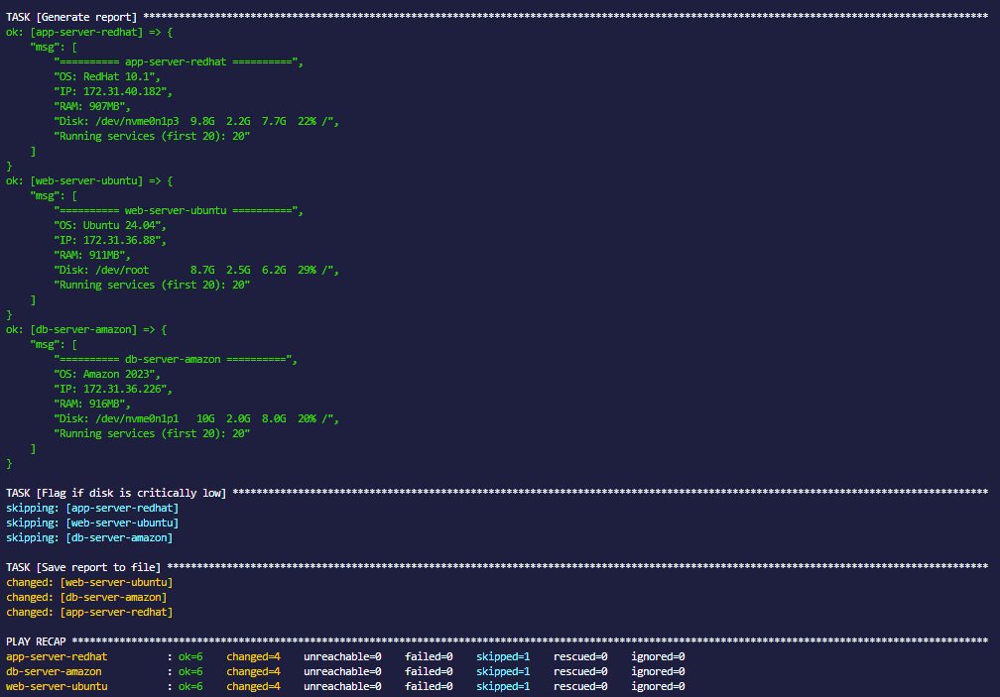

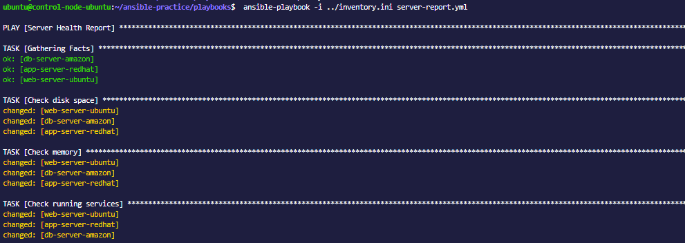

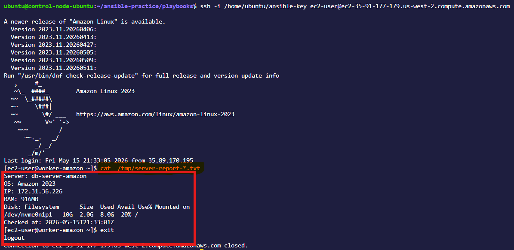

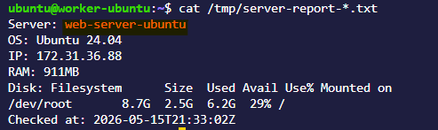

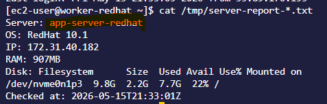


**Verify:** SSH into a server and read `/tmp/server-report-*.txt`. Does it contain accurate information?
**Answer**


---


