# Day 71 -- Roles, Galaxy, Templates and Vault

## Challenge Tasks

### Task 1: Jinja2 Templates
Templates let you generate config files dynamically using variables and facts.

1. Create `templates/nginx-vhost.conf.j2`:
```jinja2
# Managed by Ansible -- do not edit manually
server {
    listen {{ http_port | default(80) }};
    server_name {{ ansible_hostname }};

    root /var/www/{{ app_name }};
    index index.html;

    location / {
        try_files $uri $uri/ =404;
    }

    access_log /var/log/nginx/{{ app_name }}_access.log;
    error_log /var/log/nginx/{{ app_name }}_error.log;
}
```

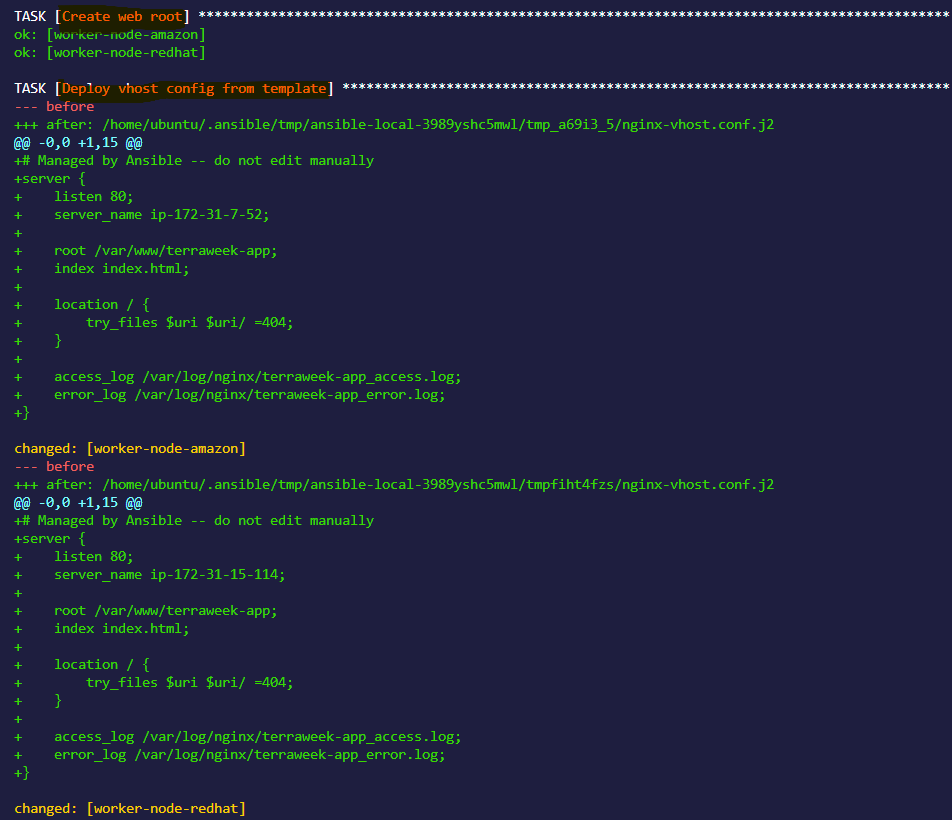


2. Create a playbook `template-demo.yml`:
```yaml
---
- name: Deploy Nginx with template
  hosts: web
  become: true
  vars:
    app_name: terraweek-app
    http_port: 80

  tasks:
    - name: Install Nginx
      yum:
        name: nginx
        state: present

    - name: Create web root
      file:
        path: "/var/www/{{ app_name }}"
        state: directory
        mode: '0755'

    - name: Deploy vhost config from template
      template:
        src: templates/nginx-vhost.conf.j2
        dest: "/etc/nginx/conf.d/{{ app_name }}.conf"
        owner: root
        mode: '0644'
      notify: Restart Nginx

    - name: Deploy index page
      copy:
        content: "<h1>{{ app_name }}</h1><p>Host: {{ ansible_hostname }} | IP: {{ ansible_default_ipv4.address }}</p>"
        dest: "/var/www/{{ app_name }}/index.html"

  handlers:
    - name: Restart Nginx
      service:
        name: nginx
        state: restarted
```

Run it with `--diff` to see the rendered template:
```bash
ansible-playbook template-demo.yml --diff
```

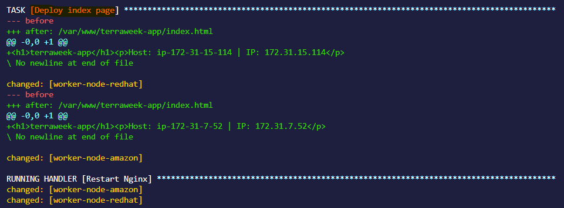


**Verify:** SSH into the web server and read the generated config. Are the variables replaced with actual values?
**Answer:** I was in `ubuntu`  ansible-control-node, on which nginx was not supposed to be installed due to package manager conflict.Therefore `nginx` was only installed in redhat and amazon servers in `web group`. 

Now to monitor the config file I had to use `shell command` to fetch the config file from other servers and `YES` variable have been replaced with the respective ips.


.png)
---

### Task 2: Understand the Role Structure
An Ansible role has a fixed directory structure. Each directory has a specific purpose:

```
roles/
  webserver/
    tasks/
      main.yml         # The main task list
    handlers/
      main.yml         # Handlers (restart services, etc.)
    templates/
      nginx.conf.j2    # Jinja2 templates
    files/
      index.html       # Static files to copy
    vars/
      main.yml         # Role variables (high priority)
    defaults/
      main.yml         # Default variables (low priority, easily overridden)
    meta/
      main.yml         # Role metadata and dependencies
```

Every directory contains a `main.yml` that Ansible loads automatically. You only create the directories you need.

Generate a skeleton with:
```bash
ansible-galaxy init roles/webserver
```


.png)


Explore the generated directory. Read the README.md that Galaxy creates.

**Document:** What is the difference between `vars/main.yml` and `defaults/main.yml`?

**Answer:**
In an Ansible role, both `vars/main.yml` and `defaults/main.yml` define variables — but they are meant for different purposes and have different priority levels.

>vars/main.yml

1)This is for internal role variables that are usually not meant to be overridden.

2)Variables in vars/main.yml have much higher priority than defaults.

So if you put something in vars/main.yml, it becomes harder to override from inventory or playbook vars.


>defaults/main.yml


1)This is for default values that the user can easily override.

2)These values are the lowest-priority variables in Ansible.

---

### Task 3: Build a Custom Webserver Role
Build a complete `webserver` role from scratch:

**`roles/webserver/defaults/main.yml`:**
```yaml
---
http_port: 80
app_name: myapp
max_connections: 512
```

**`roles/webserver/tasks/main.yml`:**
```yaml
---
- name: Install Nginx
  yum:
    name: nginx
    state: present

- name: Deploy Nginx config
  template:
    src: nginx.conf.j2
    dest: /etc/nginx/nginx.conf
    owner: root
    mode: '0644'
  notify: Restart Nginx

- name: Deploy vhost config
  template:
    src: vhost.conf.j2
    dest: "/etc/nginx/conf.d/{{ app_name }}.conf"
    owner: root
    mode: '0644'
  notify: Restart Nginx

- name: Create web root
  file:
    path: "/var/www/{{ app_name }}"
    state: directory
    mode: '0755'

- name: Deploy index page
  template:
    src: index.html.j2
    dest: "/var/www/{{ app_name }}/index.html"
    mode: '0644'

- name: Start and enable Nginx
  service:
    name: nginx
    state: started
    enabled: true
```

**`roles/webserver/handlers/main.yml`:**
```yaml
---
- name: Restart Nginx
  service:
    name: nginx
    state: restarted
```

**`roles/webserver/templates/index.html.j2`:**
```html
<h1>{{ app_name }}</h1>
<p>Server: {{ ansible_hostname }}</p>
<p>IP: {{ ansible_default_ipv4.address }}</p>
<p>Environment: {{ app_env | default('development') }}</p>
<p>Managed by Ansible</p>
```

Create the `vhost.conf.j2` and `nginx.conf.j2` templates yourself based on what you learned in Task 1.

Now call the role from a playbook `site.yml`:
```yaml
---
- name: Configure web servers
  hosts: web
  become: true
  roles:
    - role: webserver
      vars:
        app_name: terraweek
        http_port: 80
```

Run it:
```bash
ansible-playbook site.yml
```
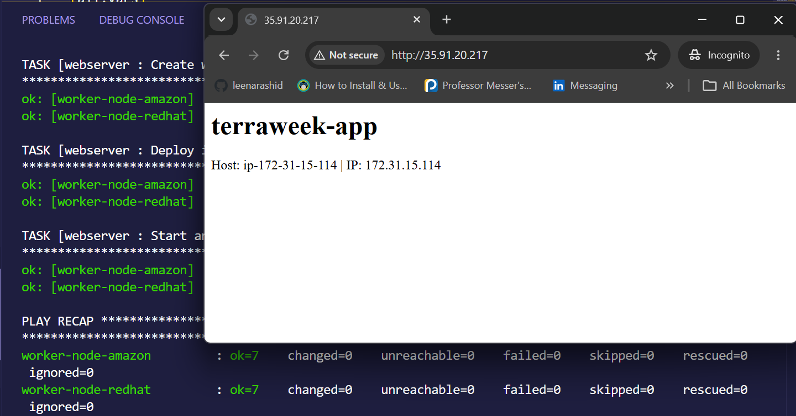


**Verify:** Curl the web server. Does the custom page load?

**Answer**

Yes curling the webserver, loads the same page. 


---

### Task 4: Ansible Galaxy -- Use Community Roles
Ansible Galaxy is a marketplace of pre-built roles.

1. **Search for roles:**
```bash
ansible-galaxy search nginx --platforms EL
ansible-galaxy search mysql
```

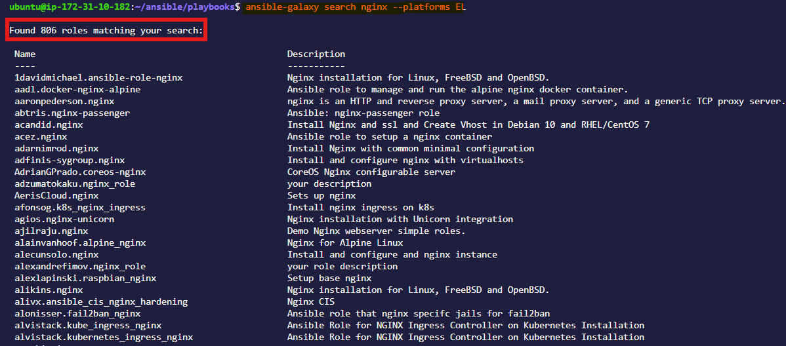

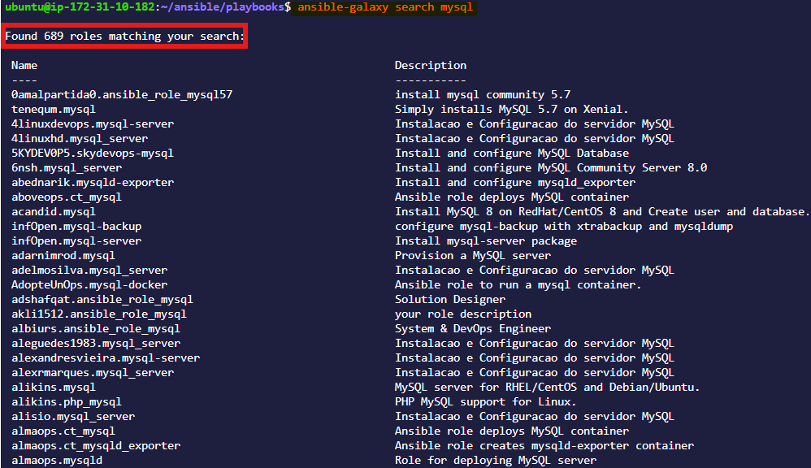

2. **Install a role from Galaxy:**
```bash
ansible-galaxy install geerlingguy.docker
```
.png)


3. **Check where it was installed:**
```bash
ansible-galaxy list
```

.png)

4. **Use the installed role** -- create `docker-setup.yml`:
```yaml
---
- name: Install Docker using Galaxy role
  hosts: app
  become: true
  roles:
    - geerlingguy.docker
```

Run it -- Docker gets installed with a single role call.


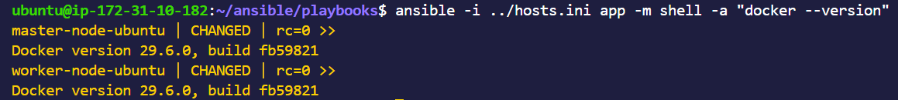


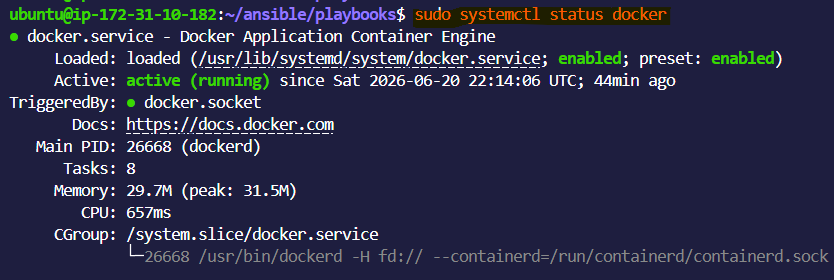

5. **Use a requirements file** for managing multiple roles. Create `requirements.yml`:
```yaml
---
roles:
  - name: geerlingguy.docker
    version: "7.4.1"
  - name: geerlingguy.ntp
```

Install all at once:
```bash
ansible-galaxy install -r requirements.yml
```


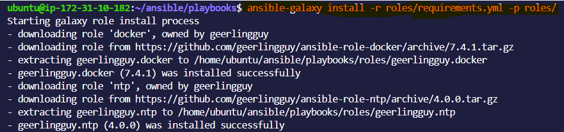

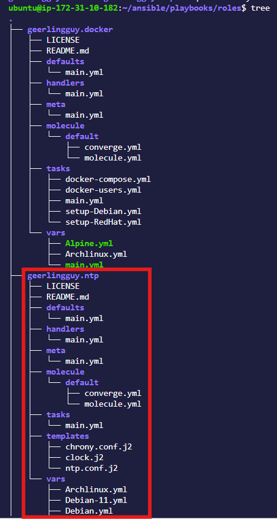

**Document:** Why use a `requirements.yml` instead of installing roles manually?

**Answer:**

Use `requirements.yml` so your Ansible project is repeatable, versioned, and easy for anyone to set up, instead of relying on manual role installs.

In `Manual installs`  people may install different versions.Setup becomes error prone.
---

### Task 5: Ansible Vault -- Encrypt Secrets
Never put passwords, API keys, or tokens in plain text. Ansible Vault encrypts sensitive data.

1. **Create an encrypted file:**
```bash
ansible-vault create group_vars/db/vault.yml
```
It will ask for a vault password, then open an editor. Add:
```yaml
vault_db_password: SuperSecretP@ssw0rd
vault_db_root_password: R00tP@ssw0rd123
vault_api_key: sk-abc123xyz789
```
Save and exit. Open the file with `cat` -- it is fully encrypted.

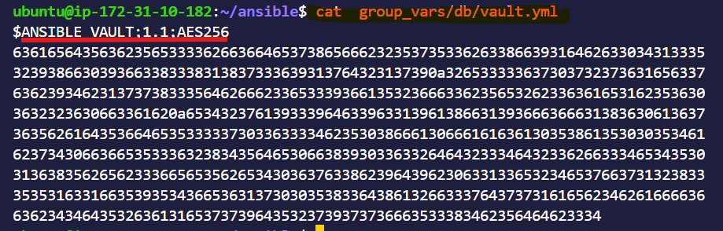


2. **Edit an encrypted file:**
```bash
ansible-vault edit group_vars/db/vault.yml
```

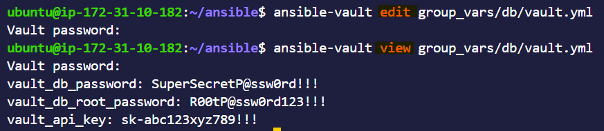

3. **View without editing:**
```bash
ansible-vault view group_vars/db/vault.yml
```


4. **Encrypt an existing file:**
```bash
ansible-vault encrypt group_vars/db/secrets.yml
```

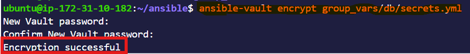


5. **Use vault variables in a playbook** -- create `db-setup.yml`:
```yaml
---
- name: Configure database
  hosts: db
  become: true

  tasks:
    - name: Show DB password (never do this in production)
      debug:
        msg: "DB password is set: {{ vault_db_password | length > 0 }}"
```

Run with the vault password:
```bash
ansible-playbook db-setup.yml --ask-vault-pass
```
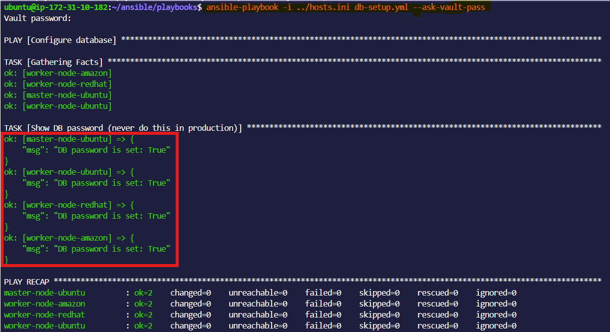


6. **Use a password file** (better for CI/CD):
```bash
echo "YourVaultPassword" > .vault_pass
chmod 600 .vault_pass
echo ".vault_pass" >> .gitignore

ansible-playbook db-setup.yml --vault-password-file .vault_pass
```

Or set it in `ansible.cfg`:
```ini
[defaults]
vault_password_file = .vault_pass
```


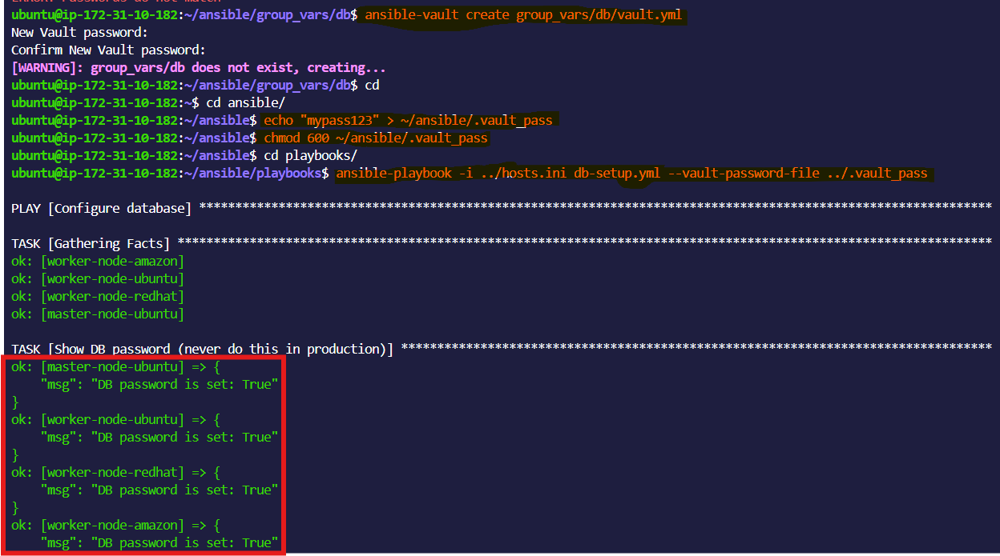

**Document:** Why is `--vault-password-file` better than `--ask-vault-pass` for automated pipelines?
**Answer:**
`--vault-password-file` is better for automation because it lets a pipeline provide the Vault password, no need to ask for the user's input, while `--ask-vault-pass` always waits for a human to type it.

---

### Task 6: Combine Roles, Templates, and Vault
Write a complete `site.yml` that uses everything you learned today:

```yaml
---
- name: Configure web servers
  hosts: web
  become: true
  roles:
    - role: webserver
      vars:
        app_name: terraweek
        http_port: 80

- name: Configure app servers with Docker
  hosts: app
  become: true
  roles:
    - geerlingguy.docker

- name: Configure database servers
  hosts: db
  become: true
  tasks:
    - name: Create DB config with secrets
      template:
        src: templates/db-config.j2
        dest: /etc/db-config.env
        owner: root
        mode: '0600'
```

Create `templates/db-config.j2`:
```jinja2
# Database Configuration -- Managed by Ansible
DB_HOST={{ ansible_default_ipv4.address }}
DB_PORT={{ db_port | default(3306) }}
DB_PASSWORD={{ vault_db_password }}
DB_ROOT_PASSWORD={{ vault_db_root_password }}
```

Run:
```bash
ansible-playbook site.yml
```

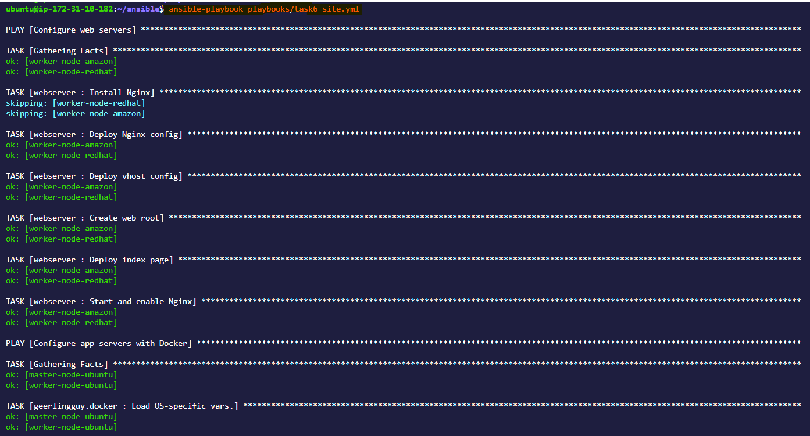

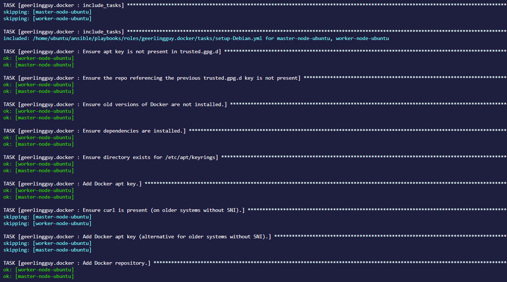

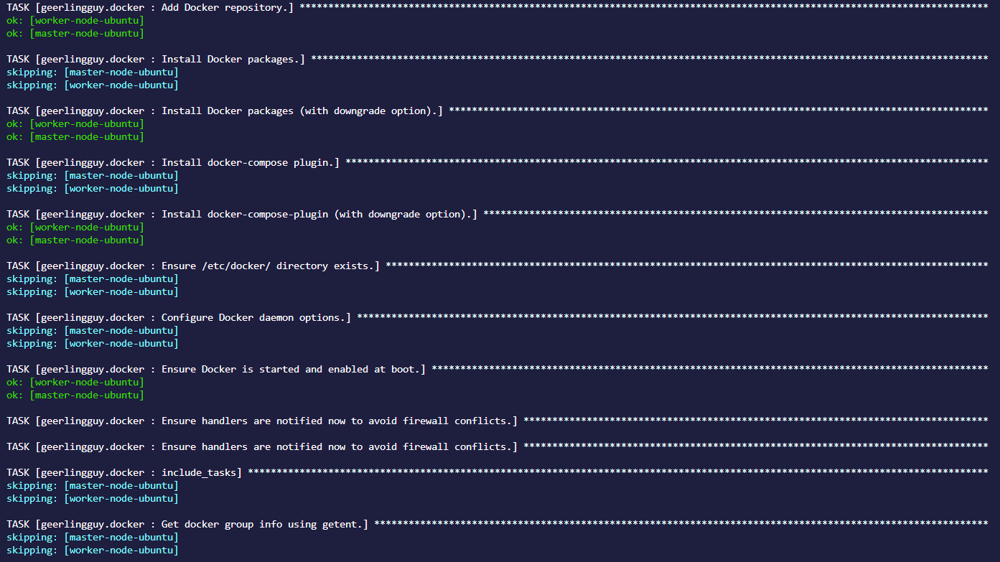


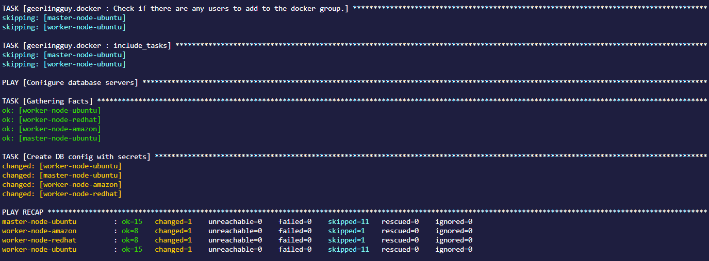


**Verify:** SSH into the db server and check `/etc/db-config.env`. Are the secrets rendered correctly? Is the file permission `600`?


**Answer:**


.png)


---

## Hints
- Templates use `.j2` extension by convention (Jinja2)
- In templates, `{{ variable }}` renders a value, `` is a conditional, `` is a loop
- `| default(value)` is a Jinja2 filter that provides a fallback if the variable is undefined
- Role `defaults/` has the lowest priority -- callers can easily override these values
- Role `vars/` has high priority -- use it for values that should not be overridden
- `ansible-galaxy init` creates the full skeleton, but you can delete directories you don't use
- Vault-encrypted files are normal YAML after decryption -- Ansible handles it transparently
- Never commit `.vault_pass` to Git -- always add it to `.gitignore`
- Use `ansible-vault encrypt_string` to encrypt a single value inline instead of a whole file

---

